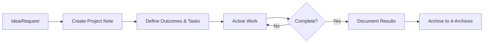

---
tags:
  - "#meta"
  - "#readme"
  - "#projects"
created: 2025-12-23
---

# 1-Projects - Active, Time-Bound Work

## Purpose

Projects are **finite endeavors** with clear outcomes and deadlines. Each project has a defined goal, specific deliverables, and an end date.

**Key Principle:** If it has an end date and specific outcomes, it's a project.

---

## What Goes Here

### Examples of Projects:
- Workshop preparation and delivery
- Specific learning goals (e.g., "Master RAG implementation by March")
- Content creation projects (e.g., "Write AI engineering guide")
- Tool evaluation and selection
- Research initiatives with defined scope
- Building specific applications or prototypes

### What's NOT a Project:
- Ongoing responsibilities → Those go in [[2-Areas/README|2-Areas]]
- General learning → That's an Area
- Permanent reference material → Goes in [[3-Resources/README|3-Resources]]

---

## Structure

Each project should have:
```
1-Projects/
└── Project-Name/
    ├── Project-Name.md (main overview using project template)
    ├── tasks/
    ├── notes/
    ├── resources/
    └── outputs/
```

Or simply:
```
1-Projects/
└── Project-Name.md (simpler approach for smaller projects)
```

---

## Guidelines

**Creating a Project:**
1. Use the project template: `5-Meta/Templates/project-template.md`
2. Define clear objective and outcomes
3. Set a realistic deadline
4. List key tasks and deliverables
5. Link to relevant resources from 3-Resources

**Managing a Project:**
- Review weekly during weekly review
- Update task list regularly
- Track progress and blockers
- Link to related areas and resources
- Document insights and learnings

**Completing a Project:**
1. Mark all tasks as complete
2. Update status to "completed"
3. Document outcomes and lessons learned
4. Move to `4-Archives/projects/[year]/`
5. Link from relevant Areas if ongoing value

---

## Active Projects

**Current Projects:** [List active projects here or use dataview query]

---

## Project Lifecycle



---

## Review Schedule

**Weekly:**
- Update task lists
- Check progress toward deadlines
- Identify blockers
- Adjust timelines if needed

**Monthly:**
- Review all active projects
- Archive completed ones
- Re-prioritize if needed
- Consider starting new projects from backlog

---

## Related

- [[2-Areas/README]] - Ongoing areas of responsibility
- [[5-Meta/Templates/project-template]] - Template for new projects
- [[4-Archives/README]] - Where completed projects go
- [[5-Meta/Guidelines/Processing-Workflow]] - Weekly review process

---

**Remember:** Projects have endings. If it's ongoing forever, it's probably an Area, not a Project.
