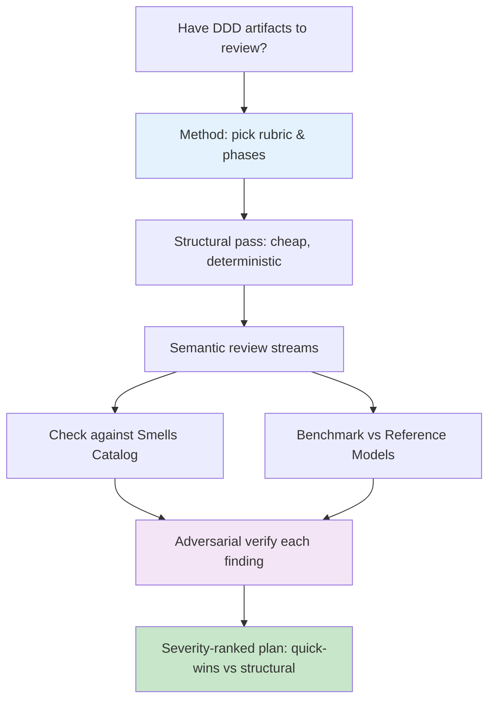

---
tags:
  - "#domain-driven-design"
  - "#ddd"
  - "#architecture"
  - "#overview"
date: 2026-07-01
status: published
last_updated: 2026-07-01
---

# Domain-Driven Design — Evaluation & Modeling Know-How

Reusable, framework-grounded methodology for **evaluating and improving Domain-Driven Design artifacts** — bounded contexts, context maps, and logical domain models — plus the recurring smells and modeling patterns that surface when you do.

> **Provenance:** Distilled from a real AI-assisted DDD evaluation of a regulatory-governance platform (2026). The methodology, rubric, smell catalog, and patterns here are generalized and domain-neutral; all client specifics were deliberately excluded. The evaluation *pipeline* that produced these findings lives in [[3-Resources/techniques/agents/adversarial-multi-stream-evaluation|Adversarial Multi-Stream Evaluation]].

---

## Why this cluster exists

DDD artifacts fail in two very different ways, and a clean structural check (IDs resolve, xrefs mirror, no illegal pattern combos) will happily pass a model that is semantically wrong. The single most valuable feedback — *wrong boundary, mis-scoped invariant, missing concept* — only a domain-literate reviewer (human or AI) finds. This cluster captures **how to review for that**, **what defects to expect**, and **how to anchor a model to external reality** so you are not inventing structure that a standard already defines.

---

## The notes

### [[3-Resources/domain-driven-design/ddd-evaluation-method|DDD Evaluation Method]]
A repeatable method for evaluating a bounded-context set + context map (strategic DDD) and a logical domain model (tactical DDD). Two-altitude split, a scoring rubric where every dimension traces to an authoritative principle, a phased review pipeline, and a gate vocabulary that never hides deferred blockers. **Start here.**

### [[3-Resources/domain-driven-design/ddd-smells-catalog|DDD Smells Catalog]]
The concrete strategic and tactical anti-patterns that recur in real models — single-emitter violations, undeclared load-bearing types, synchronous cross-aggregate invariants without a saga, over-applied Shared Kernel, inverted ACL direction, distributed-monolith edges. Each with the signal, why it's wrong, and the fix.

### [[3-Resources/domain-driven-design/reference-model-anchoring|Reference-Model Anchoring]]
The technique of searching for externally-existing, widely-accepted reference models/standards to **adopt** (lift into the model), **align to** (impose structure), or **mine** (learn from, don't adopt) — instead of designing everything in-house. When there is no off-the-shelf model, this tells you what still constrains your core.

### [[3-Resources/domain-driven-design/modeling-patterns|Reusable Modeling Patterns]]
Two domain-neutral patterns extracted from the work: **profile-based case-type stratification with decision gates** (any multi-actor regulated workflow) and **layered document decomposition** (metadata / normative / analysis lenses over one source document with version-diff synchronization).

---

## How to use it

Run it as an AI-assisted workflow via [[3-Resources/techniques/agents/adversarial-multi-stream-evaluation|Adversarial Multi-Stream Evaluation]].

---

## Related

- [[5-Meta/MOCs/AI-Assisted-Architecture-MOC|AI-Assisted Architecture MOC]] — navigation hub for this and the evaluation pipeline
- [[3-Resources/techniques/agents/adversarial-multi-stream-evaluation|Adversarial Multi-Stream Evaluation]] — the AI workflow that operationalizes the method
- [[3-Resources/techniques/README|AI/LLM Engineering Techniques]]
- [[3-Resources/techniques/context-engineering/context-engineering|Context Engineering]] — multi-agent context isolation used by the pipeline

---

**Last Updated:** 2026-07-01
**Status:** Published
**Part of:** AI/LLM Engineering Knowledge Vault
