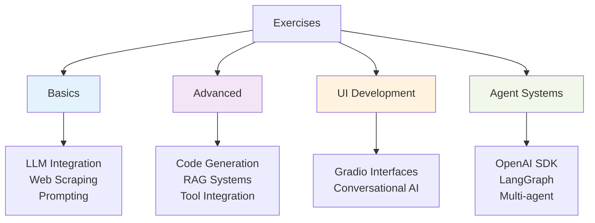
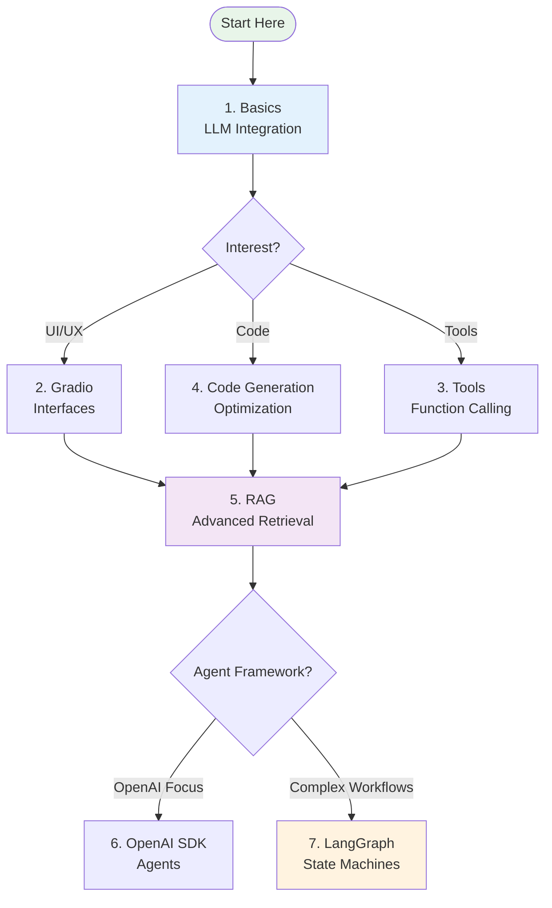

---
tags:
  - "#exercises"
  - "#practical"
  - "#workshops"
---

# Practical Exercises - AI/LLM Engineering

Hands-on exercises and projects for learning AI/LLM development, from basics to advanced agent systems.

---

## Exercise Categories



---

## Core LLM Engineering

### 1. [[LLM Engineering - Basics]]

**File:** `llm_engineering-basics.ipynb`
**Level:** Beginner
**Duration:** 2-3 hours

**Overview:**
Introduction to LLM engineering covering multiple providers and practical applications.

**Key Content:**
- **LLM Connections**: OpenAI, Claude, Gemini, Ollama (local)
- **Web Summarizer**: BeautifulSoup scraping + LLM summarization
- **Brochure Generator**: Multi-page scraping, structured JSON output
- **Streaming Responses**: Real-time content generation

**Learning Outcomes:**
- Connect to multiple LLM providers
- Build web scraping + LLM pipelines
- Structure prompts effectively
- Handle streaming responses

**Technologies:**
- Python, OpenAI API, Anthropic API, Google AI
- BeautifulSoup, requests, dotenv
- Jupyter notebooks

---

### 2. [[LLM Engineering - Gradio]]

**File:** `llm_engineering-gradio.ipynb`
**Level:** Beginner-Intermediate
**Duration:** 2 hours

**Overview:**
Create conversational AI interfaces using Gradio with advanced prompt engineering.

**Key Content:**
- Gradio chat interfaces
- Context-aware chatbots
- Conversation memory management
- Custom tone control
- Business application UI

**Learning Outcomes:**
- Build interactive chat interfaces
- Manage conversation state
- Deploy web-based AI apps
- Design user-friendly AI experiences

**Technologies:**
- Gradio, Python
- OpenAI/Claude APIs
- Web deployment

---

### 3. [[LLM Engineering - Tools]]

**File:** `llm_engineering-tools.ipynb`
**Level:** Intermediate
**Duration:** 3-4 hours

**Overview:**
Multi-modal airline assistant with function calling, DALL-E, and text-to-speech.

**Key Content:**
- Function calling / tool use
- DALL-E image generation
- Text-to-speech integration
- Agent-based architecture
- Tool orchestration

**Learning Outcomes:**
- Implement function calling
- Integrate multiple AI modalities
- Build tool-using agents
- Orchestrate complex workflows

**Technologies:**
- OpenAI Functions
- DALL-E API
- TTS APIs
- Agent patterns

---

### 4. [[LLM Engineering - Code Generation]]

**File:** `llm_engineering-code.ipynb`
**Level:** Intermediate-Advanced
**Duration:** 3 hours

**Overview:**
High-performance code optimization using frontier LLMs to convert Python to C++.

**Key Content:**
- Python to C++ conversion
- Performance benchmarking (~40-64x speedups achieved)
- GPT-4o vs Claude Sonnet 4 comparison
- M1 Mac optimization
- Streaming code generation
- Gradio interactive interface

**Learning Outcomes:**
- LLM-assisted code optimization
- Cross-language performance analysis
- Compiler optimization techniques
- Production code generation pipelines

**Technologies:**
- OpenAI GPT-4o, Claude Sonnet 4
- C++17, clang++ compiler
- Python subprocess, Gradio

---

## Advanced Topics

### 5. [[LLM Engineering - RAG]]

**File:** `llm_engineering-rag.ipynb`
**Level:** Advanced
**Duration:** 4-5 hours

**Overview:**
Enterprise-grade RAG system for insurance company knowledge base.

**Key Content:**
- Vector embeddings and databases
- Document processing and chunking
- Similarity search
- Conversational memory
- Accuracy optimization
- Cost management

**Learning Outcomes:**
- Build production RAG systems
- Optimize retrieval quality
- Implement conversational RAG
- Balance accuracy and cost

**Technologies:**
- ChromaDB, FAISS, or Pinecone
- LangChain (optional)
- OpenAI embeddings
- Vector similarity search

**Related:** [[RAG|RAG Theory]]

---

## Agent Frameworks

### 6. [[Agents - OpenAI SDK]]

**File:** `agents-openai.ipynb`
**Level:** Advanced
**Duration:** 4 hours

**Overview:**
Multi-agent research system using OpenAI's native SDK with web search and automation.

**Key Content:**
- OpenAI native agent implementation
- Multi-agent coordination
- Web search integration
- Structured outputs
- Automated email reporting
- Production agentic workflows

**Learning Outcomes:**
- Build agents with OpenAI SDK
- Coordinate multiple agents
- Implement tool-using agents
- Production deployment patterns

**Technologies:**
- OpenAI Agents SDK
- Swarm (multi-agent)
- Web search APIs
- Email integration

**Related:** [[tools/frameworks/README|Agent Frameworks]]

---

### 7. [[Agents - LangGraph]]

**File:** `agents-langgraph.ipynb`
**Level:** Advanced
**Duration:** 5-6 hours

**Overview:**
State-based agent architecture with persistent memory and complex orchestration.

**Key Content:**
- Graph-based agent design
- State management
- Checkpointing and persistence
- Tool integration
- Complex workflow orchestration
- Database persistence

**Learning Outcomes:**
- Design graph-based agent systems
- Implement stateful workflows
- Build production-grade agents
- Debug and monitor agent behavior

**Technologies:**
- LangGraph
- PostgreSQL or SQLite (persistence)
- LangSmith (debugging)
- Custom tools

**Related:** [[tools/frameworks/README|LangGraph Framework]]

---

## Exercise Progression

### Recommended Learning Path



**Beginner Path:**
1. Basics → 2. Gradio → 3. Tools → 5. RAG

**Advanced Path:**
1. Basics → 4. Code Generation → 5. RAG → 7. LangGraph

**Agent-Focused Path:**
1. Basics → 3. Tools → 6. OpenAI SDK → 7. LangGraph

---

## Prerequisites

### All Exercises

**Required:**
- Python 3.8+ installed
- Jupyter notebook environment
- API keys (OpenAI, Anthropic, Google)
- Basic Python knowledge

**Recommended:**
- Virtual environment (venv or conda)
- Git for version control
- Code editor (VS Code recommended)

### Exercise-Specific

**Code Generation (Exercise 4):**
- C++ compiler (clang++ or g++)
- macOS (for M1 optimization) or Linux

**RAG (Exercise 5):**
- Vector database setup (ChromaDB easiest)
- More compute resources

**Agents (Exercises 6-7):**
- Database for persistence (PostgreSQL or SQLite)
- More API budget (multiple LLM calls)

---

## Setup Instructions

### 1. Create Environment

```bash
# Create virtual environment
python -m venv ai-exercises
source ai-exercises/bin/activate  # macOS/Linux
# or
ai-exercises\Scripts\activate  # Windows

# Install dependencies
pip install jupyter notebook openai anthropic google-generativeai
pip install beautifulsoup4 requests python-dotenv
pip install gradio  # for UI exercises
pip install chromadb langchain  # for RAG
pip install langgraph  # for agent exercises
```

### 2. Configure API Keys

```bash
# Create .env file
echo "OPENAI_API_KEY=your_key_here" > .env
echo "ANTHROPIC_API_KEY=your_key_here" >> .env
echo "GOOGLE_API_KEY=your_key_here" >> .env
```

### 3. Launch Jupyter

```bash
jupyter notebook
```

---

## Exercise Completion Checklist

For each exercise, ensure you:

- [ ] Read through the entire notebook first
- [ ] Set up required API keys
- [ ] Install dependencies
- [ ] Run cells sequentially
- [ ] Experiment with modifications
- [ ] Complete the challenge sections
- [ ] Document your learnings
- [ ] (Optional) Share your results

---

## Additional Challenges

### Extend the Basics
- Connect to additional LLM providers (Cohere, Together AI)
- Build a comparison tool for model outputs
- Add caching for API responses

### Enhance the UI
- Create multi-page Gradio apps
- Add authentication
- Deploy to Hugging Face Spaces

### Advanced RAG
- Implement hybrid search (keyword + semantic)
- Add re-ranking
- Multi-hop reasoning

### Complex Agents
- Build custom agent tools
- Implement human-in-the-loop
- Create multi-agent collaboration

---

## Resources

**Documentation:**
- [OpenAI Python SDK](https://github.com/openai/openai-python)
- [Anthropic Python SDK](https://github.com/anthropics/anthropic-sdk-python)
- [Gradio Docs](https://www.gradio.app/docs)
- [LangChain Docs](https://python.langchain.com/)
- [LangGraph Docs](https://langchain-ai.github.io/langgraph/)

**Related Vault Content:**
- [[llm engineering/LLM engineering|LLM Engineering Overview]]
- [[RAG|RAG Concepts]]
- [[tools/frameworks/README|Agent Frameworks]]
- [[workshops/Coding Assistants Workshop - Plan|Coding Assistants Workshop]]

**Community:**
- [OpenAI Community](https://community.openai.com/)
- [LangChain Discord](https://discord.gg/langchain)
- [r/LangChain Subreddit](https://reddit.com/r/LangChain)

---

## Tips for Success

**1. Start Small**
- Don't skip the basics
- Master fundamentals before advanced topics
- Build incrementally

**2. Experiment Freely**
- Modify prompts and parameters
- Try different models
- Break things and fix them

**3. Track Costs**
- Monitor API usage
- Use smaller models for testing
- Cache when possible

**4. Document Learning**
- Keep notes in notebooks
- Save interesting prompts
- Record what worked and what didn't

**5. Join Community**
- Ask questions
- Share solutions
- Learn from others

---

**Last Updated:** 2025-11-30
**Exercise Count:** 7 core exercises
**Total Learning Time:** ~25-30 hours

*Progress through these exercises at your own pace. The skills build on each other, leading to production-ready AI development capabilities.*
