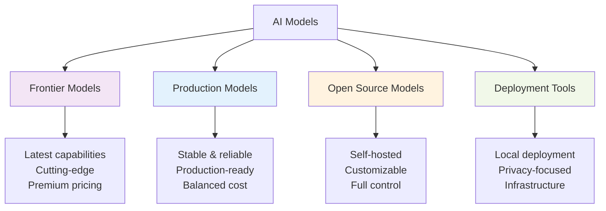
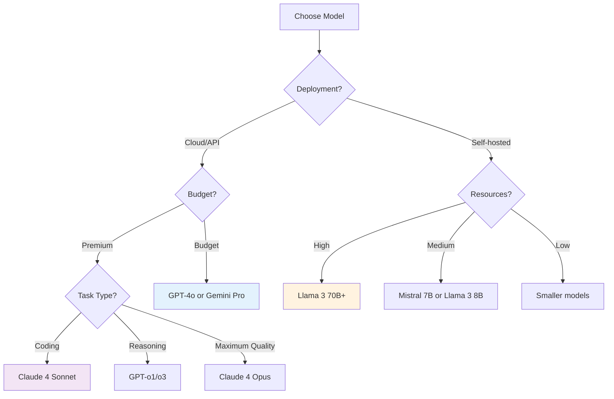
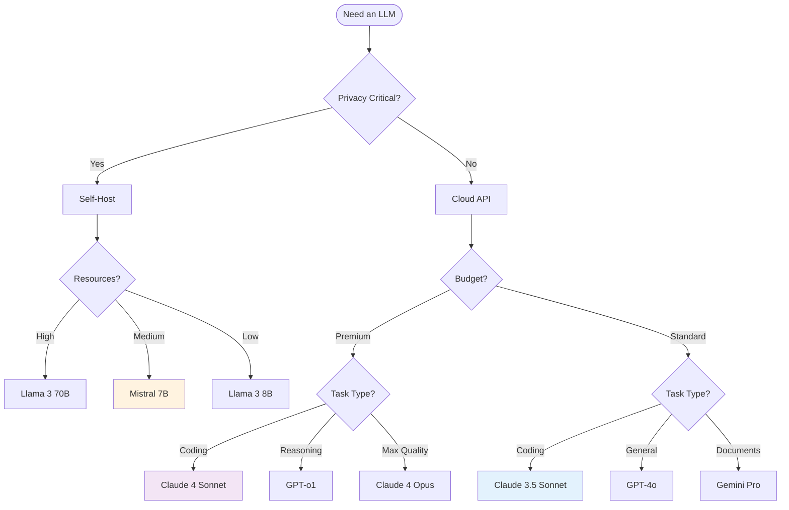

---
tags:
  - "#models"
  - "#overview"
  - "#comparison"
---

# AI Models - Overview & Comparison

Comprehensive guide to Large Language Models (LLMs) used in AI development, coding assistants, and agent frameworks.

---

## Model Categories

---

## Quick Comparison Matrix

### Frontier Models (Latest, Cutting-Edge)

| Model | Developer | Context | Strengths | Pricing | Best For |
|-------|-----------|---------|-----------|---------|----------|
| [[frontier/Claude 4 Sonnet]] | Anthropic | 1M tokens | Coding, reasoning, balance | $3/$15 per M | Complex coding, analysis |
| [[frontier/Claude 4 Opus]] | Anthropic | 1M tokens | Maximum capability | $15/$75 per M | Hardest tasks, research |
| [[frontier/GPT-o1]] | OpenAI | 200k | Reasoning, math | Higher | Problem-solving |
| [[frontier/GPT-o3]] | OpenAI | 200k | Advanced reasoning | Premium | Complex reasoning |
| [[frontier/DeepSeek-R1]] | DeepSeek | 64k | Open reasoning | Open source | Local reasoning |
| [[frontier/Qwen3]] | Alibaba | 128k | Multilingual | Open source | International apps |

### Production Models (Stable, Reliable)

| Model | Developer | Context | Strengths | Pricing | Best For |
|-------|-----------|---------|-----------|---------|----------|
| [[production/Claude 3.5 Sonnet]] | Anthropic | 200k | Balance, coding | $3/$15 per M | General development |
| [[production/GPT-4o]] | OpenAI | 128k | Multimodal, fast | $2.50/$10 per M | Production apps |
| [[production/Gemini Pro]] | Google | 2M | Long context | $1.25/$5 per M | Document processing |

### Open Source Models

| Model | Developer | Parameters | Context | Best For |
|-------|-----------|------------|---------|----------|
| [[open-source/Llama 3]] | Meta | 8B-70B | 8k-128k | General purpose |
| [[open-source/Mistral 7B]] | Mistral AI | 7B | 32k | Efficient inference |
| [[open-source/Code Llama]] | Meta | 7B-34B | 16k | Code generation |
| [[frontier/Qwen3]] | Alibaba | 0.5B-235B | 128k | Multilingual |

---

## Detailed Model Profiles

### Frontier Models

#### [[frontier/Claude 4 Sonnet]]
**Released:** May 2025
**Philosophy:** Hybrid reasoning - instant or extended thinking

**Key Features:**
- 1M token context window
- Hybrid reasoning modes
- 72.7% on SWE-bench (state-of-the-art coding)
- Enhanced steerability
- Massive context processing (75,000+ lines of code)

**Use Cases:**
- Complex coding tasks
- Large codebase analysis
- Multi-file refactoring
- Extended reasoning problems

**Pricing:** $3 input / $15 output per million tokens

**Adoption:**
- GitHub Copilot (with Opus 4.5)
- Cursor
- Replit
- Claude Code

---

#### [[frontier/Claude 4 Opus]]
**Released:** 2025
**Philosophy:** Maximum capability for hardest tasks

**Key Features:**
- Highest performance across benchmarks
- 1M token context
- Superior reasoning
- Best-in-class coding

**Use Cases:**
- Research-level problems
- Most complex coding tasks
- When quality > cost
- High-stakes applications

**Pricing:** $15 input / $75 output per million tokens

**Available In:**
- GitHub Copilot (Nov 2025)
- Claude.ai (Pro/Max)
- API

---

#### [[frontier/GPT-o1]] & [[frontier/GPT-o3]]
**Developer:** OpenAI
**Philosophy:** Chain-of-thought reasoning models

**Key Features:**
- Built-in reasoning capabilities
- Excels at math, science, coding
- Extended thinking time
- Transparent reasoning process

**Use Cases:**
- Complex problem-solving
- Mathematical proofs
- Scientific reasoning
- Algorithm design

**Pricing:** Premium tier

---

### Production Models

#### [[production/Claude 3.5 Sonnet]]
**Released:** June 2024
**Status:** Stable, production-ready

**Key Features:**
- 200k context window
- Excellent coding performance
- Balanced speed/quality
- Reliable outputs

**Use Cases:**
- Production applications
- Daily development
- Cost-conscious projects
- General-purpose LLM tasks

**Pricing:** $3 input / $15 output per million tokens

---

#### [[production/GPT-4o]]
**Developer:** OpenAI
**Released:** 2024

**Key Features:**
- Multimodal (text, image, audio)
- 128k context
- Fast inference
- Wide adoption

**Use Cases:**
- Production chatbots
- Multimodal applications
- Real-time responses
- OpenAI ecosystem

**Pricing:** $2.50 input / $10 output per million tokens

---

#### [[production/Gemini Pro]]
**Developer:** Google
**Released:** 2024

**Key Features:**
- 2M token context (largest)
- Multimodal
- Google integration
- Long document processing

**Use Cases:**
- Document analysis
- Long-context tasks
- Google Cloud deployments
- Research papers processing

**Pricing:** $1.25 input / $5 output per million tokens

---

### Open Source Models

#### [[open-source/Llama 3]]
**Developer:** Meta
**Sizes:** 8B, 70B, 405B parameters

**Key Features:**
- Open weights
- Commercial use allowed
- Multiple sizes
- Strong community

**Use Cases:**
- Self-hosted applications
- Fine-tuning for specific domains
- Privacy-critical applications
- Cost optimization

---

#### [[open-source/Mistral 7B]]
**Developer:** Mistral AI
**Size:** 7B parameters

**Key Features:**
- Efficient inference
- Outperforms Llama 2 13B
- Open source
- Low resource requirements

**Use Cases:**
- Resource-constrained environments
- Edge deployment
- Local development

---

#### [[open-source/Code Llama]]
**Developer:** Meta
**Specialized:** Code generation

**Key Features:**
- Code-specific training
- Multiple sizes (7B, 13B, 34B)
- Strong coding performance
- Open source

**Use Cases:**
- Local coding assistants
- Code completion
- Custom tooling

---

## Model Selection Guide

### By Use Case

| Use Case | First Choice | Alternative | Budget Option |
|----------|--------------|-------------|---------------|
| **Complex Coding** | Claude 4 Sonnet | GPT-4o | Claude 3.5 Sonnet |
| **Reasoning Problems** | GPT-o1 | Claude 4 Opus | DeepSeek-R1 (local) |
| **Long Documents** | Gemini Pro (2M) | Claude 4 Sonnet (1M) | Llama 3 fine-tuned |
| **Production Apps** | Claude 3.5 Sonnet | GPT-4o | Gemini Pro |
| **Local/Private** | Llama 3 70B | Mistral 7B | Code Llama |
| **Multimodal** | GPT-4o | Gemini Pro | - |
| **Cost-Effective** | Gemini Pro | Claude 3.5 Sonnet | Llama 3 (self-hosted) |

---

## Context Window Comparison

| Model | Context Window | Effective Use | Notes |
|-------|----------------|---------------|-------|
| **Claude 4 Sonnet/Opus** | 1M tokens | 75,000+ lines code | Largest for coding |
| **Gemini Pro** | 2M tokens | Huge documents | Best for documents |
| **GPT-o1/o3** | 200k tokens | Complex reasoning | Optimized for thinking |
| **Claude 3.5 Sonnet** | 200k tokens | 20,000+ lines code | Production standard |
| **GPT-4o** | 128k tokens | Standard apps | Good balance |
| **Llama 3** | 8k-128k | Varies by size | Depends on model |

---

## Performance Benchmarks

### Coding Performance (SWE-bench)

| Model | SWE-bench Score | Notes |
|-------|----------------|-------|
| **Claude 4 Sonnet** | 72.7% | State-of-the-art |
| **Claude 4 Opus** | ~75% | Highest performance |
| **GPT-4o** | ~65% | Strong performance |
| **Claude 3.5 Sonnet** | ~65% | Production baseline |

### Reasoning (GPQA, MATH)

| Model | Strength | Use Case |
|-------|----------|----------|
| **GPT-o1/o3** | ⭐⭐⭐⭐⭐ | Mathematical reasoning |
| **Claude 4 Opus** | ⭐⭐⭐⭐⭐ | Complex analysis |
| **DeepSeek-R1** | ⭐⭐⭐⭐ | Open reasoning |

---

## Deployment Options

### Cloud APIs

**Anthropic (Claude):**
- claude.ai (web interface)
- Anthropic API
- AWS Bedrock
- Google Cloud Vertex AI

**OpenAI (GPT):**
- ChatGPT (web interface)
- OpenAI API
- Azure OpenAI

**Google (Gemini):**
- Google AI Studio
- Vertex AI
- Gemini API

### Self-Hosted (Open Source)

**Deployment Tools:**
- [[local deployment tools/Ollama|Ollama]] - Simplest
- [[local deployment tools/LM Studio|LM Studio]] - GUI
- [[local deployment tools/Open WebUI|Open WebUI]] - Web interface
- [[local deployment tools/vLLM|vLLM]] - Production serving
- [[local deployment tools/LocalAI|LocalAI]] - OpenAI-compatible

**See:** [[local deployment tools/]] for detailed guides

---

## Cost Comparison

### API Pricing (per million tokens)

| Model | Input | Output | Ratio | Cost Level |
|-------|-------|--------|-------|------------|
| **Gemini Pro** | $1.25 | $5 | 1:4 | ⭐⭐⭐⭐⭐ Lowest |
| **GPT-4o** | $2.50 | $10 | 1:4 | ⭐⭐⭐⭐ Low |
| **Claude 3.5/4 Sonnet** | $3 | $15 | 1:5 | ⭐⭐⭐ Medium |
| **Claude 4 Opus** | $15 | $75 | 1:5 | ⭐⭐ High |
| **GPT-o1** | Higher | Higher | - | ⭐ Premium |

### Self-Hosted Costs

**Factors:**
- GPU requirements (A100, H100, etc.)
- Infrastructure costs
- Maintenance overhead
- Electricity

**When Self-Hosting Makes Sense:**
- High volume (> $10k/month API costs)
- Privacy requirements
- Custom fine-tuning
- Offline operation needed

---

## Latest Developments (November 2025)

**Claude 4 Sonnet in GitHub Copilot:**
- Now available for Copilot users
- Agentic workflow capabilities
- 50% token reduction

**MCP Adoption:**
- All major models supporting MCP
- Standardized tool integration
- Enhanced capabilities

**Open Source Progress:**
- DeepSeek-R1 open reasoning
- Qwen3 multilingual improvements
- Llama 4 rumors

**See:** [[resources/news/2025-11-updates|November 2025 Updates]]

---

## Model Selection Flowchart

---

## Resources

**Model Documentation:**
- [Claude Models](https://docs.anthropic.com/en/docs/models)
- [OpenAI Models](https://platform.openai.com/docs/models)
- [Gemini Models](https://ai.google.dev/models)
- [Llama Models](https://llama.meta.com/)

**Benchmarks:**
- [SWE-bench](https://www.swebench.com/)
- [LMSYS Chatbot Arena](https://chat.lmsys.org/)
- [Artificial Analysis](https://artificialanalysis.ai/)

**Comparisons:**
- [[tools/coding-assistants/README|Coding Assistants]] - Models in practice
- [[llm engineering/models|LLM Engineering Models]]

---

## Related Concepts

- [[llm engineering/LLM engineering|LLM Engineering Overview]]
- [[tools/coding-assistants/README|Coding Assistants]]
- [[tools/frameworks/README|Agent Frameworks]]
- [[local deployment tools/|Local Deployment]]

---

**Last Updated:** 2025-11-30
**Next Review:** Monthly (model landscape changes rapidly)

*Choose your model based on requirements: Claude for coding, GPT-o1 for reasoning, Gemini for long context, Llama for self-hosting.*
