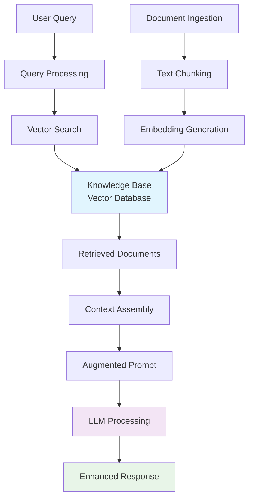
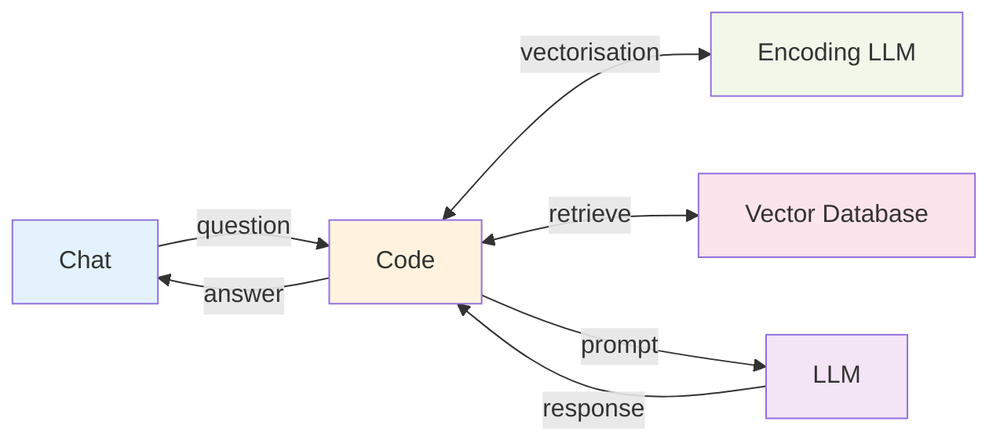

---
tags:
  - "#technique"
  - "#rag"
  - "#retrieval"
  - "#vector-database"
aliases:
  - Retrieval Augmented Generation
  - RAG System
---

# RAG (Retrieval Augmented Generation)

## Overview

RAG is a technique that enhances Large Language Models by providing them with access to external knowledge through a retrieval system. Instead of relying solely on the model's training data, RAG dynamically retrieves relevant information from a knowledge base to inform the model's response.

## Core Concepts

### The Problem RAG Solves
- **Knowledge Cutoff** - LLMs have training data cutoffs and can't access recent information
- **Hallucination** - Models may generate plausible but incorrect information
- **Domain Specificity** - General models lack specialized knowledge for specific domains
- **Context Limitations** - Limited context window prevents including all relevant information

### How RAG Works



### Simplified RAG Flow


## RAG Architecture Components

### 1. Document Processing Pipeline
- **Document Ingestion** - Loading various file formats (PDF, MD, TXT, etc.)
- **Text Chunking** - Breaking documents into manageable pieces (typically 500-1000 tokens)
- **Overlap Strategy** - Maintaining context between chunks (100-200 character overlap)
- **Metadata Enrichment** - Adding document type, source, date, etc.

### 2. Embedding System
- **Vector Embeddings** - Converting text chunks into high-dimensional vectors
- **Semantic Similarity** - Vectors capture meaning, enabling semantic search
- **Embedding Models** - OpenAI text-embedding-ada-002, Sentence Transformers, etc.
- **Dimensionality** - Typically 768-1536 dimensions

### 3. Vector Database
- **Storage** - Efficient storage and retrieval of embeddings
- **Similarity Search** - Cosine similarity, dot product, or Euclidean distance
- **Popular Options** - Chroma, Pinecone, Weaviate, FAISS
- **Indexing** - Optimized for fast similarity searches

### 4. Retrieval Strategy
- **Top-K Retrieval** - Retrieve most similar chunks (k=3-10 typical)
- **Similarity Threshold** - Filter results below relevance threshold
- **Re-ranking** - Secondary scoring for better relevance
- **Hybrid Search** - Combining semantic and keyword search

### 5. Context Assembly
- **Prompt Construction** - Assembling retrieved context with user query
- **Context Ordering** - Most relevant first or chronological
- **Token Management** - Fitting within model's context window
- **Source Attribution** - Tracking which documents inform the response

## RAG Workflow Steps

### Indexing Phase (Offline)
1. **Document Collection** - Gather knowledge base materials
2. **Preprocessing** - Clean, format, and structure documents
3. **Chunking** - Split into retrievable segments
4. **Embedding** - Generate vector representations
5. **Storage** - Index in vector database

### Query Phase (Real-time)
1. **Query Processing** - Clean and prepare user input
2. **Query Embedding** - Convert query to vector space
3. **Similarity Search** - Find relevant chunks in vector database
4. **Context Retrieval** - Extract relevant document segments
5. **Prompt Assembly** - Combine query + retrieved context
6. **LLM Generation** - Generate response with augmented context
7. **Response Post-processing** - Format and return final answer

## Implementation Patterns

### Basic RAG
```python
# Simple RAG pipeline
def rag_pipeline(query, vector_store, llm):
    # Retrieve relevant documents
    relevant_docs = vector_store.similarity_search(query, k=5)
    
    # Assemble context
    context = "\n".join([doc.page_content for doc in relevant_docs])
    
    # Create augmented prompt
    prompt = f"Context: {context}\n\nQuestion: {query}\n\nAnswer:"
    
    # Generate response
    response = llm.invoke(prompt)
    return response
```

### Conversational RAG
- **Memory Integration** - Maintain conversation history
- **Context Awareness** - Reference previous exchanges
- **Follow-up Handling** - Understand pronouns and references
- **Multi-turn Optimization** - Efficient context management

## Types of RAG Systems

### 1. Naive RAG
- Direct similarity search and retrieval
- Simple prompt augmentation
- Basic implementation for proof of concepts

### 2. Advanced RAG
- **Pre-retrieval** - Query optimization and expansion
- **Retrieval** - Multi-stage retrieval with re-ranking
- **Post-retrieval** - Context compression and filtering

### 3. Modular RAG
- **Specialized Components** - Domain-specific retrievers
- **Pipeline Flexibility** - Configurable processing stages
- **A/B Testing** - Component performance comparison

## Evaluation Metrics

### Retrieval Quality
- **Precision@K** - Relevant documents in top-K results
- **Recall@K** - Coverage of relevant documents
- **Mean Reciprocal Rank (MRR)** - Position of first relevant result

### Generation Quality
- **Faithfulness** - Response accuracy to retrieved context
- **Answer Relevance** - Response relevance to user query
- **Context Precision** - Relevance of retrieved context

### End-to-End Metrics
- **RAGAS** - Comprehensive RAG evaluation framework
- **Human Evaluation** - Expert assessment of response quality
- **A/B Testing** - Comparative performance analysis

## Common Challenges & Solutions

### Challenge: Poor Retrieval Quality
**Solutions:**
- Improve chunking strategy
- Use hybrid search (semantic + keyword)
- Implement re-ranking models
- Fine-tune embedding models

### Challenge: Context Window Limitations
**Solutions:**
- Hierarchical retrieval (summary → detail)
- Context compression techniques
- Multi-turn conversation strategies
- Selective context inclusion

### Challenge: Hallucination Despite Context
**Solutions:**
- Explicit source citation requirements
- Confidence scoring
- Fact-checking post-processing
- Conservative response generation

## Best Practices

### Document Preparation
- **Consistent Formatting** - Standardize document structure
- **Quality Content** - Curate high-quality source materials
- **Regular Updates** - Keep knowledge base current
- **Metadata Rich** - Include comprehensive document metadata

### Retrieval Optimization
- **Chunk Size Tuning** - Optimize for domain and use case
- **Overlap Strategy** - Maintain context between chunks
- **Embedding Model Selection** - Choose domain-appropriate models
- **Index Maintenance** - Regular reindexing for performance

### Production Considerations
- **Scalability** - Design for growing knowledge bases
- **Latency** - Optimize for real-time response requirements
- **Cost Management** - Balance retrieval quality with API costs
- **Monitoring** - Track retrieval and generation performance

## Related Concepts
- **[[Vector Databases]]** - Storage and retrieval systems
- **[[Embeddings]]** - Vector representation techniques  
- **[[Semantic Search]]** - Meaning-based information retrieval
- **[[LLM Engineering - RAG]]** - Practical implementation exercise
- **[[Fine-tuning]]** - Alternative knowledge integration approach
