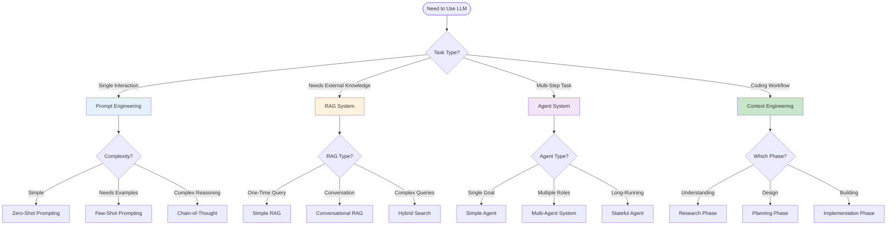
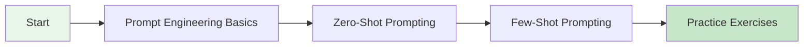
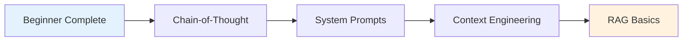
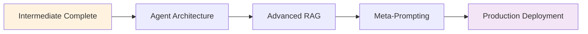
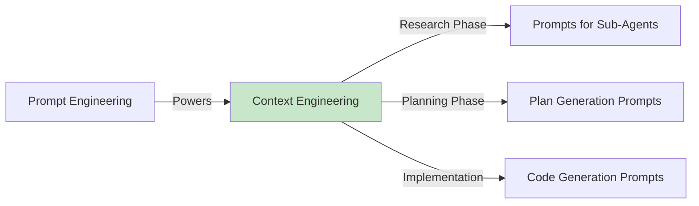
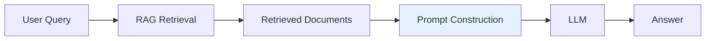
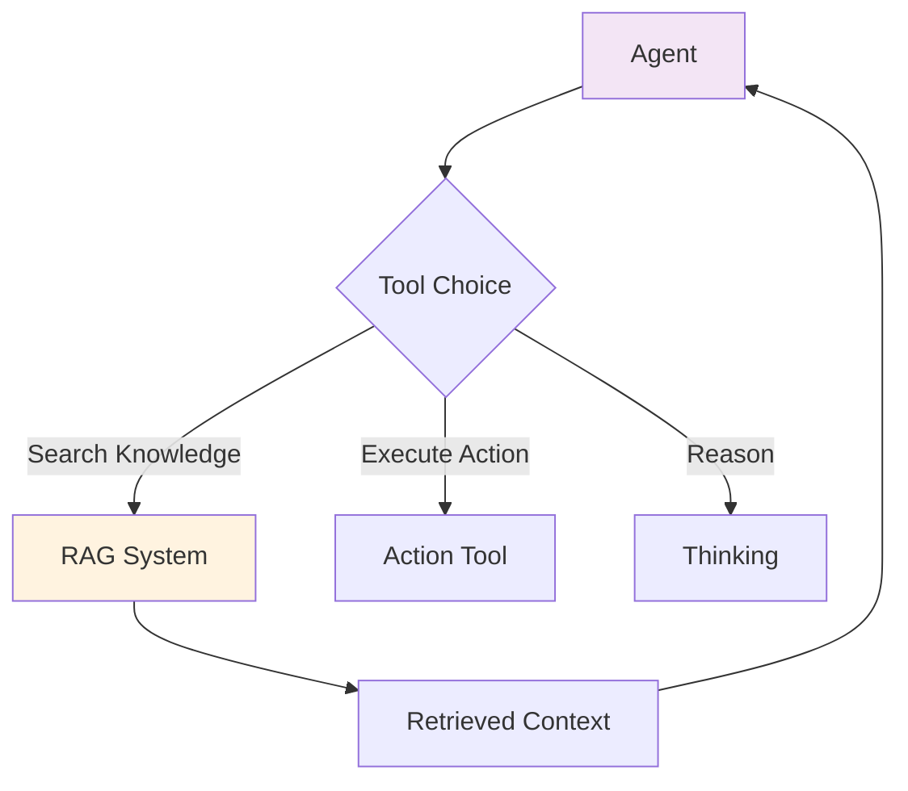
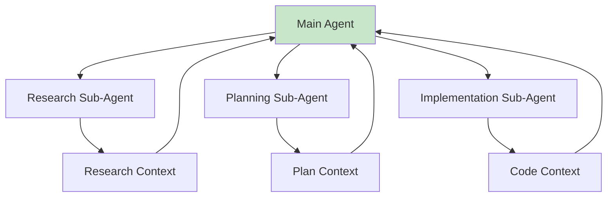

---
tags:
  - "#techniques"
  - "#overview"
  - "#ai-engineering"
date: 2025-12-01
status: published
last_updated: 2025-12-01
---

# AI/LLM Engineering Techniques

Advanced techniques and methodologies for building effective AI systems, from prompt engineering to autonomous agents.

---

## 📚 Core Techniques

### [[prompting/README|Prompt Engineering]]
The foundation of effective LLM interaction - designing inputs that guide models toward desired outputs.

**Key Topics:**
- [[prompting/basics|Basics]] - Fundamentals and core principles
- [[prompting/zero-shot-prompting|Zero-Shot]] - No examples, pure instructions
- [[prompting/few-shot-prompting|Few-Shot]] - Learning from examples
- [[prompting/chain-of-thought|Chain-of-Thought]] - Step-by-step reasoning
- [[prompting/meta-prompting|Meta-Prompting]] - Optimizing prompts with AI
- [[prompting/system-prompts|System Prompts]] - Persistent behavior configuration

### [[context-engineering|Context Engineering]]
The systematic discipline of designing and optimizing information provided to LLMs for maximum effectiveness.

**Documentation:**
- [[context-engineering|Context Engineering Overview]] - Core concepts and principles
- [[context-engineering-techniques|Practical Techniques]] - Implementation patterns and code examples
- [[context-engineering-coding-agents|For Coding Agents]] - Specialized workflow from BoundaryML podcast

**Key Concepts:**
- Information selection and structuring
- Context window management and optimization
- RAG integration and memory systems
- Multi-agent architectures for context isolation
- Workflows over single calls

**Why It Matters:** Most agent failures are context failures, not model failures. Effective context engineering enables production-grade AI systems.

### [[RAG|RAG (Retrieval-Augmented Generation)]]
Enhance LLM capabilities by integrating external knowledge sources through vector search and retrieval.

**Key Topics:**
- Vector embeddings and databases
- Document chunking strategies
- Similarity search optimization
- Conversational RAG patterns
- Production deployment considerations

### [[agents - agentisation|Agents & Agentisation]]
Design autonomous AI systems that can plan, execute, and adapt to achieve complex goals.

**Key Topics:**
- Agent architecture patterns
- Tool use and function calling
- Multi-agent coordination
- Planning and execution loops
- State management

---

## 🎯 Technique Selection Guide



---

## 📊 Technique Comparison

| Technique | Complexity | Setup Time | Best For | When NOT to Use |
|-----------|-----------|------------|----------|-----------------|
| **[[prompting/README\|Prompt Engineering]]** | Low | Minutes | Single interactions, formatting | Multi-step tasks, external data |
| **[[context-engineering\|Context Engineering]]** | Medium | Days | Coding agents, complex features | Simple scripts, one-off tasks |
| **[[RAG\|RAG]]** | Medium-High | Hours-Days | Knowledge queries, documents | Real-time data, simple Q&A |
| **[[agents - agentisation\|Agents]]** | High | Days-Weeks | Complex workflows, automation | Single interactions, simple tasks |

---

## 🎓 Learning Paths

### Beginner Path: Getting Started



1. **[[prompting/basics|Prompt Engineering Basics]]** (1-2 hours)
   - Understand prompt anatomy
   - Learn core principles
   - Avoid common mistakes

2. **[[prompting/zero-shot-prompting|Zero-Shot Prompting]]** (30 min)
   - Start with simplest approach
   - Practice clear instructions
   - Know when to upgrade

3. **[[prompting/few-shot-prompting|Few-Shot Prompting]]** (1 hour)
   - Learn from examples
   - Maintain consistency
   - Select good examples

4. **[[../exercises/README|Practice Exercises]]** (ongoing)
   - Apply to real problems
   - Build intuition
   - Iterate and improve

### Intermediate Path: Building Systems



1. **[[prompting/chain-of-thought|Chain-of-Thought]]** (2 hours)
   - Enable complex reasoning
   - Understand when to use
   - Practice with examples

2. **[[prompting/system-prompts|System Prompts]]** (1 hour)
   - Configure persistent behavior
   - Model-specific optimization
   - Best practices

3. **[[context-engineering|Context Engineering]]** (4-8 hours)
   - Learn three-phase workflow
   - Master sub-agents
   - Practice with coding tasks

4. **[[RAG|RAG Fundamentals]]** (4-6 hours)
   - Understand vector search
   - Build simple RAG system
   - Optimize retrieval quality

### Advanced Path: Production Systems



1. **[[agents - agentisation|Agent Systems]]** (1-2 weeks)
   - Design agent architectures
   - Implement tool use
   - Multi-agent coordination

2. **Advanced RAG Patterns** (1 week)
   - Hybrid search
   - Re-ranking
   - Multi-hop reasoning

3. **[[prompting/meta-prompting|Meta-Prompting]]** (ongoing)
   - Systematic optimization
   - Prompt generation
   - Build libraries

4. **Production Deployment**
   - Monitoring and observability
   - Cost optimization
   - Error handling

---

## 🔗 Integration Patterns

### Prompting + Context Engineering



**Use Case:** AI-assisted software development

**Pattern:** Use prompt engineering principles within context engineering workflow

### Prompting + RAG



**Use Case:** Knowledge base Q&A systems

**Pattern:** Retrieve relevant docs, then prompt engineer the query + context

### RAG + Agents



**Use Case:** Research assistants, complex analysis

**Pattern:** Agent decides when to retrieve knowledge vs. reason vs. act

### Context Engineering + Agents



**Use Case:** Complex software features

**Pattern:** Context engineering workflow implemented as multi-agent system

---

## 💡 Best Practices Across Techniques

### 1. Start Simple, Add Complexity

```markdown
Simple → Complex Progression:
1. Zero-shot prompting
2. Few-shot prompting
3. Chain-of-thought
4. RAG integration
5. Agent systems
6. Multi-agent orchestration
```

**Why:** Each layer adds overhead - only add what you need

### 2. Measure and Iterate

**Key Metrics:**
- **Prompting:** Accuracy, consistency, token cost
- **Context Engineering:** PRs shipped, bugs found, time to completion
- **RAG:** Retrieval precision, answer relevance, latency
- **Agents:** Task success rate, tool call efficiency, cost per task

### 3. Human in the Loop

**Critical Checkpoints:**
- Review prompts before production
- Validate RAG retrieval quality
- Approve agent plans before execution
- Monitor agent actions in real-time

### 4. Version Control Everything

```markdown
Track:
- Prompt versions
- RAG chunk strategies
- Agent system prompts
- Context engineering workflows
- What works and what doesn't
```

### 5. Build Domain-Specific Patterns

**Create Libraries:**
- Successful prompt templates
- RAG configurations per domain
- Agent architectures for use cases
- Context engineering workflows

---

## 🛠️ Tools and Frameworks

### Prompt Engineering
- **[[../tools/frameworks/Fabric|Fabric]]** - 300+ curated prompt patterns
- Claude Code / ChatGPT / Gemini - Direct interaction
- [[../tools/coding-assistants/README|Coding Assistants]] - Specialized prompting

### Context Engineering
- **[[../tools/coding-assistants/Claude Code|Claude Code]]** - Built for context engineering
- **Cursor** - Hybrid coding assistant
- **Aider** - Terminal-based AI pair programming

### RAG Systems
- **Vector Databases:** ChromaDB, Pinecone, Weaviate, FAISS
- **Frameworks:** LangChain, LlamaIndex
- **Embeddings:** OpenAI, Cohere, Sentence Transformers

### Agent Systems
- **[[../tools/frameworks/README|LangGraph]]** - State-based agents
- **AutoGen** - Multi-agent conversations
- **CrewAI** - Role-based teams
- **OpenAI Agents SDK** - Native agent implementation

---

## 📚 Learning Resources

### Within This Vault

**Concepts:**
- [[../llm engineering/LLM engineering|LLM Engineering Overview]]
- [[../llm engineering/techniques|Techniques Overview]]
- [[../models/README|Model Selection Guide]]

**Tools:**
- [[../tools/coding-assistants/README|Coding Assistants Comparison]]
- [[../tools/frameworks/README|Framework Comparison]]
- [[../tools/protocols/MCP|Model Context Protocol]]

**Practice:**
- [[../exercises/README|Hands-On Exercises]]
- [[../workshops/|Workshop Materials]]

### External Resources

**Prompt Engineering:**
- [Prompting Guide](https://www.promptingguide.ai/)
- [OpenAI Prompt Engineering](https://platform.openai.com/docs/guides/prompt-engineering)
- [Anthropic Prompt Engineering](https://docs.anthropic.com/en/docs/build-with-claude/prompt-engineering/overview)

**Context Engineering:**
- [BoundaryML Podcast #17](https://boundaryml.com/podcast/2025-08-05-advanced-context-engineering-for-coding-agents)
- [Claude Code Best Practices](https://www.anthropic.com/engineering/claude-code-best-practices)

**RAG:**
- [LlamaIndex Documentation](https://docs.llamaindex.ai/)
- [LangChain RAG Guide](https://python.langchain.com/docs/use_cases/question_answering/)

**Agents:**
- [LangGraph Tutorials](https://langchain-ai.github.io/langgraph/)
- [AutoGen Documentation](https://microsoft.github.io/autogen/)

---

## 🎯 Quick Decision Matrix

### Choose Your Technique

| Your Goal | Use This | Read This First |
|-----------|----------|----------------|
| Format text/data | [[prompting/zero-shot-prompting\|Zero-Shot Prompting]] | [[prompting/basics\|Basics]] |
| Consistent output patterns | [[prompting/few-shot-prompting\|Few-Shot Prompting]] | [[prompting/basics\|Basics]] |
| Complex reasoning | [[prompting/chain-of-thought\|Chain-of-Thought]] | [[prompting/basics\|Basics]] |
| Ship features with AI | [[context-engineering\|Context Engineering]] | [[../tools/coding-assistants/Claude Code\|Claude Code]] |
| Answer from documents | [[RAG\|RAG]] | [[../llm engineering/techniques\|Overview]] |
| Multi-step automation | [[agents - agentisation\|Agents]] | [[../tools/frameworks/README\|Frameworks]] |
| Optimize prompts | [[prompting/meta-prompting\|Meta-Prompting]] | [[prompting/basics\|Basics]] |

---

## 🔑 Key Takeaways

### Universal Principles

1. **Clarity Over Cleverness** - Works for all techniques
2. **Start Simple** - Add complexity only when needed
3. **Test Systematically** - Measure everything
4. **Iterate Based on Data** - Let results guide you
5. **Human Oversight** - AI augments, doesn't replace judgment
6. **Document Successes** - Build institutional knowledge
7. **Context Matters** - Provide relevant information
8. **Format Explicitly** - Always specify structure
9. **Version Control** - Track what works
10. **Share Knowledge** - Team collaboration multiplies effectiveness

### Technique-Specific Insights

**Prompting:**
> "Most failures come from ambiguity, not model limitations" - [[prompting/basics]]

**Context Engineering:**
> "Context engineering isn't cramming; it's deliberate structuring" - [[context-engineering]]

**RAG:**
> "Retrieval quality matters more than model size" - [[RAG]]

**Agents:**
> "Agent reliability requires robust tool use and error handling" - [[agents - agentisation]]

---

**Last Updated:** 2025-12-01
**Part of:** AI/LLM Engineering Knowledge Vault
**Next Review:** 2026-03-01

*These techniques represent current best practices as of December 2025. The field evolves rapidly - stay updated through the resources linked above.*
