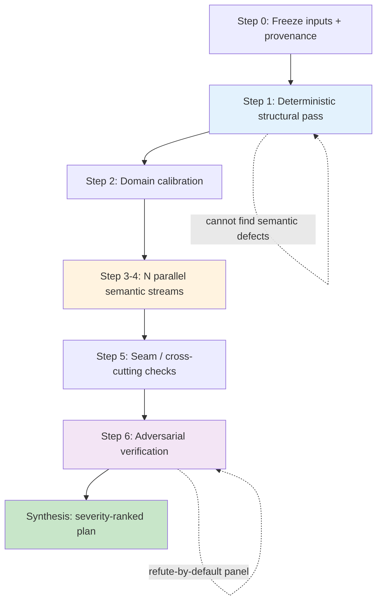

---
tags:
  - "#techniques"
  - "#agents"
  - "#evaluation"
  - "#ai-engineering"
  - "#multi-agent"
date: 2026-07-01
status: published
last_updated: 2026-07-01
---

# Adversarial Multi-Stream Evaluation

An AI-assisted workflow for producing **high-confidence, semantically valid evaluations** of a large, structured artifact — a domain model, an architecture, a spec, a codebase, a research corpus. It fuses a cheap deterministic pass with many parallel semantic review streams, then subjects every load-bearing finding to an adversarial, refute-by-default verification panel before anything is reported.

> Generalized from a real DDD evaluation of a regulatory platform (the domain-specific rubric lives in [[3-Resources/domain-driven-design/ddd-evaluation-method|DDD Evaluation Method]]). This note is the **domain-agnostic AI pattern** — it applies wherever you'd otherwise trust a single LLM pass to "review" something important.

---

## The problem it solves

A single LLM review of a big artifact is **plausible but unreliable**: it hallucinates findings, misses whole classes of defect, can't hold the artifact in one context window, and gives you no way to tell a real finding from a confident-sounding wrong one. Worse, a *structural* checker (schema valid, links resolve, tests compile) passes right over the semantic defects that matter most. In the source case, the deterministic validator returned **0 violations while the semantic critics found defects in 10/10 components.**

The workflow answers three failure modes directly:
- **Coverage** — fan out into many independent streams so no single blind spot dominates.
- **Truth** — adversarially verify each finding so plausible-but-wrong ones die before they're reported.
- **Context** — isolate each stream in its own context so a huge artifact fits.

---

## The pipeline

**Step 0 — Freeze inputs & provenance.** Pin the exact snapshot (file hashes, date). Living artifacts evolve externally; without a pin, findings drift onto stale elements and you waste a verification pass proving a "defect" that was already fixed.

**Step 1 — Deterministic structural pass** (cheap, no model judgement). Reference integrity, count reconciliation, schema/rule legality. Output a defect list — **and explicitly label that a structural PASS is not a clean bill of health**, so nobody mistakes it for the semantic verdict.

**Step 2 — Domain calibration.** Load the reviewers with the domain and the external reference standards the artifact should be judged against. This is what makes "completeness vs the domain" — the highest-value dimension — judgeable rather than guessed.

**Step 3–4 — N parallel semantic streams.** Fan out one stream per dimension / component / lens. Each stream:
- runs in its **own isolated context** (a sub-agent) so the big artifact fits and streams don't cross-contaminate;
- scores against **named dimensions with authoritative anchors**, not vibes;
- returns **structured findings** (element ID + severity + concrete fix), not prose.

**Step 5 — Seam & cross-cutting checks.** The defects that matter most hide *between* components — the strategic↔tactical seam, cross-references, traceability with no orphans. Dedicated streams for the joins.

**Step 6 — Adversarial verification.** Every load-bearing finding goes to an **independent verifier whose job is to refute it** against the source at line level. Default the verifier to skepticism. A finding is `confirmed` only if it survives; otherwise `softened` or `refuted`. For high-stakes findings, use a **panel of N skeptics** and require a majority to confirm.

**Synthesis.** Confirmed findings → a **severity-ranked, ID-anchored plan split quick-wins vs structural**. Use a gate vocabulary of **{PASS, PASS-WITH-DEFERRAL, WAIVED, FAIL}** — never a flat PASS that hides deferred blockers.

---

## The load-bearing principles

1. **Structural validation ≠ semantic validation.** Run both; never let the structural pass stand in for the semantic one, and say so in the output.
2. **Refute-by-default verification.** The single strongest property. A second reviewer prompted to *disprove* the claim kills the plausible-but-wrong findings that a confirm-oriented reviewer waves through.
3. **Score against named dimensions, not vibes.** Each dimension traces to an authoritative source; a 1–5 with a one-line justification beats an impression.
4. **Provenance & count-drift honesty.** Regenerate headline counts per document; surface stale/superseded inputs explicitly rather than silently absorbing them.
5. **Independent lenses, then triangulate.** Convergence of ≥2 independent lenses on the same candidate = high confidence; divergence = a flag for human adjudication, not an auto-resolve.
6. **Effort tiering.** Deepest scrutiny on the core/highest-impact components; lighter touch elsewhere — but still run the cheap structural pass on everything.

---

## Method evolution (a real lesson)

The source ran the pipeline twice, two days apart:
- **v1** — 14 streams, cross-stream synthesis, verifier verdicts, heavy count-drift reconciliation.
- **v2** — 12 streams, **confirmed-findings-only** reporting, deeper per-component, and it surfaced *new* defect classes v1 never reached.

The takeaway: **shift from cross-stream synthesis toward finding-level, confirmed-only reporting as the artifact stabilizes** — and expect a second deeper pass to find things the first structurally-focused pass could not.

---

## Implementing it with Claude Code / an agent SDK

This maps cleanly onto a multi-agent orchestration:
- **Structural pass** → a deterministic script / tool call (no model), or a docs-as-code traceability engine that makes broken links & count-drift *build-time errors*.
- **Semantic streams** → parallel sub-agents, one per dimension, each with a schema-constrained structured output (element ID, severity, fix).
- **Verification** → a second wave of sub-agents, each fed one finding + the source, prompted to refute; majority vote for high-severity items.
- **Synthesis** → a final agent that dedupes, ranks by severity, and splits quick-wins vs structural.

See [[3-Resources/techniques/context-engineering/context-engineering|Context Engineering]] for the sub-agent context-isolation rationale and [[3-Resources/techniques/agents/agents - agentisation|Agents & Agentisation]] for orchestration patterns. This is a concrete instance of the vault's recurring theme: **workflows over single calls, and multi-agent context isolation for reliability.**

---

## Where else it applies

Anywhere a single LLM "review" is too unreliable to trust:
- Architecture / domain-model review ([[3-Resources/domain-driven-design/ddd-evaluation-method|the origin use case]])
- Security / code review at scale (dimensions = bug classes; verify = adversarial repro)
- Research synthesis & fact-checking (streams = search modalities; verify = source-check each claim)
- Spec / requirements audits (traceability + completeness streams)
- Any LLM-as-judge task where a confident wrong answer is expensive

---

## Related Concepts

- [[3-Resources/domain-driven-design/ddd-evaluation-method|DDD Evaluation Method]] — the domain rubric this pipeline runs
- [[3-Resources/domain-driven-design/ddd-smells-catalog|DDD Smells Catalog]] — the defect classes the streams hunt for
- [[3-Resources/techniques/context-engineering/context-engineering|Context Engineering]] — sub-agent context isolation
- [[3-Resources/techniques/agents/agents - agentisation|Agents & Agentisation]] — multi-agent orchestration
- [[5-Meta/MOCs/AI-Assisted-Architecture-MOC|AI-Assisted Architecture MOC]]

---

**Last Updated:** 2026-07-01
**Status:** Published
**Part of:** AI/LLM Engineering Knowledge Vault
