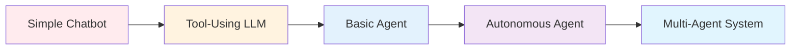
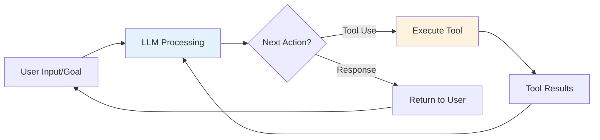
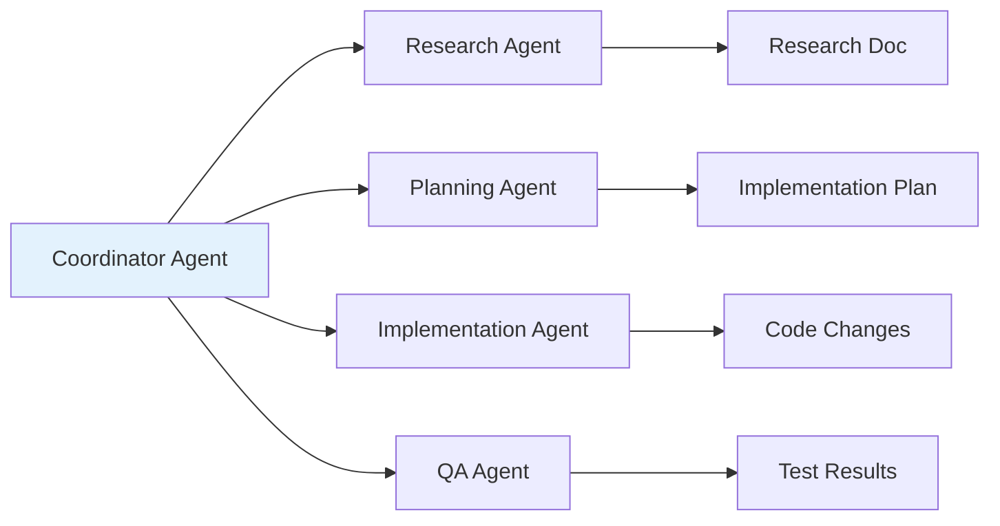
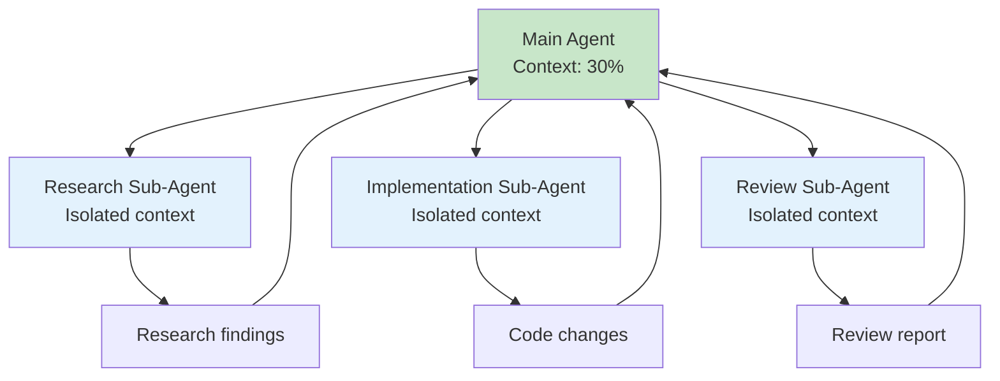
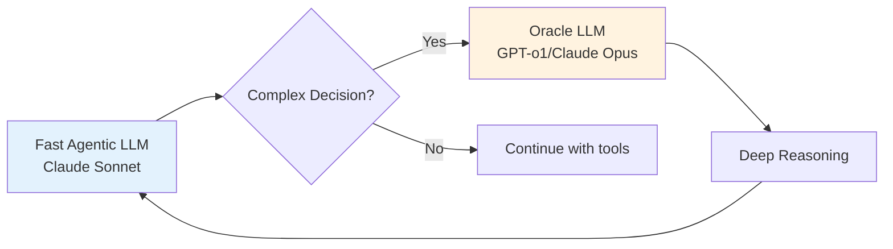

---
tags:
  - "#technique"
  - "#agents"
  - "#agentic-ai"
  - "#ai-engineering"
date: 2025-12-01
status: published
last_updated: 2025-12-01
---

# Agents & Agentisation

Software entities that can autonomously perform tasks using LLMs, tools, and iterative problem-solving patterns.

---

## What is an Agent?

An **agent** is a software system that uses an LLM to autonomously accomplish goals through iterative tool use and decision-making.

### Common Characteristics of Agents

**Core Traits:**
- **Autonomous** - Can operate with minimal human intervention
- **Goal-oriented** - Works toward specific objectives
- **Task-specific** - Designed for particular problem domains

**Advanced Capabilities:**
- **Memory/Persistence** - Retains information across sessions
- **Decision-making/Orchestration** - Chooses appropriate actions
- **Planning Capabilities** - Breaks complex tasks into steps
- **Tool Use** - Connects to databases, APIs, file systems, etc.

---

## The Agentic AI Spectrum



**Progression:**
1. **Chatbot** - Text in, text out
2. **Tool-Using LLM** - Can request tool execution
3. **Basic Agent** - Iterative tool use, goal pursuit
4. **Autonomous Agent** - Planning, memory, complex workflows
5. **Multi-Agent** - Specialized agents collaborating

---

## Core Agent Architecture

### The Fundamental Loop

**The "Emperor Has No Clothes" Truth:**
> "It's an LLM, a loop, and enough tokens. There isn't a secret." - [[../../tools/coding-assistants/Amp|Amp]] Team



**Key Components:**
1. **LLM** - Makes decisions, generates responses
2. **Loop** - Iterates until goal achieved
3. **Tools** - Extend capabilities beyond text generation
4. **Context** - Maintains conversation and state

**Insight:** Modern coding agents (Claude Code, Cursor, Amp) use this exact architecture. Complexity comes from refinement, not novel algorithms.

---

## Agentisation Techniques

The term **'Agentic AI'** and **Agentisation** refers to a collection of techniques:

### 1. Task Decomposition

**Breaking complex problems into smaller steps** with multiple LLMs carrying out specialized tasks.

**Example:**
```
Complex Goal: "Add authentication to API"

Decomposition:
├─ Research: Find existing auth patterns
├─ Plan: Design JWT middleware approach
├─ Implement: Write auth middleware
├─ Test: Create test suite
└─ Integrate: Update routes
```

**Pattern:** Research → Plan → Implement → Verify

See: [[context-engineering-coding-agents#three-phase-workflow|Three-Phase Workflow]]

### 2. Tool Use

**LLMs using tools** to gain additional capabilities beyond text generation.

**The Five Fundamental Tools for Coding Agents:**
1. **Read** - Import file contents
2. **List** - Navigate file systems
3. **Edit** - Modify files
4. **Bash** - Execute commands
5. **Search** - Find patterns

**Key Insight:** By 2025, frontier models (Claude 3.7+, GPT-4+) understand when to use tools without explicit prompting.

See: [[building-coding-agents#the-five-agent-primitives|Agent Primitives]]

### 3. Agent Environment

**Collaborative spaces** where multiple agents work together.

**Patterns:**
- **Parallel Development:** Multiple agents on different components
- **Specialized Roles:** Research, planning, implementation, QA agents
- **Verification Chain:** Implementation agent → Review agent → Test agent

**Example Multi-Agent Workflow:**


See: [[context-engineering-coding-agents#sub-agents-for-context-control|Sub-Agents]]

### 4. Planning & Orchestration

**LLM as planner**, dividing bigger tasks into smaller ones for specialist agents.

**Example:**
```
User: "Implement user notifications feature"

Planner Agent:
├─ Phase 1: Database schema for notifications
├─ Phase 2: Backend API endpoints
├─ Phase 3: Frontend notification UI
├─ Phase 4: Real-time updates via WebSocket
└─ Phase 5: Email notification integration

[Assigns each phase to specialized agents]
```

**Pattern:** Coordinator delegates to specialists, aggregates results.

### 5. Memory & Persistence

**Agents with memory** maintain context beyond single prompts.

**Types:**
- **Conversation Memory** - Full chat history (short-term)
- **Session Memory** - Persists during work session
- **Long-term Memory** - Stored between sessions
- **Semantic Memory** - Understanding of codebase structure

**Implementation:**
```json
{
  "conversation": [...messages],
  "session_context": {
    "current_branch": "feature/auth",
    "working_files": ["src/auth.ts", "tests/auth.test.ts"],
    "recent_commands": ["npm test", "npm run lint"]
  },
  "long_term": {
    "project_patterns": "Uses dependency injection",
    "naming_conventions": "snake_case for functions",
    "user_preferences": "Prefer TypeScript over JavaScript"
  }
}
```

---

## Agent Architectures

### ReAct Pattern (Reason + Act)

**Most common coding agent pattern:**

```
Thought: I need to understand the current auth implementation
Action: read_file("src/auth/middleware.ts")
Observation: [file contents]

Thought: I see it uses JWT. I need to find where tokens are validated
Action: search("validateToken")
Observation: Found in src/auth/jwt.ts:45

Thought: Now I can add the new validation rule
Action: edit_file(...)
Observation: File updated successfully

Thought: I should test this
Action: bash("npm test auth")
Observation: All tests passing

[Goal achieved]
```

**Key:** Alternates between thinking and acting until goal is met.

### Sub-Agent Pattern

**Specialized agents for isolated tasks:**



**Benefits:**
- **Context isolation** - Sub-agent's exploration doesn't pollute main context
- **Parallel execution** - Multiple sub-agents work simultaneously
- **Specialization** - Each sub-agent optimized for specific role

See: [[context-engineering-coding-agents#sub-agents-for-context-control|Sub-Agent Implementation]]

### Oracle Pattern

**Use slower, more thoughtful models as tools:**



**Use Case:** Complex architectural decisions, security analysis, algorithm design.

**Example:**
```
Sonnet Agent: Needs to design authentication architecture
↓
Calls Oracle Tool (GPT-o1): "Think deeply about OAuth vs JWT..."
↓
Oracle: [Extended reasoning about trade-offs]
↓
Sonnet Agent: Implements based on Oracle's recommendation
```

See: [[../../workshops/building-coding-agents-workshop#the-oracle-pattern|Oracle Pattern Workshop]]

---

## Building Your First Agent

### Minimal Viable Agent (~400 lines)

**Core Components:**
1. LLM API client (Anthropic, OpenAI)
2. Message accumulation
3. Tool definitions (JSON schemas)
4. Tool execution functions
5. Main loop

**Tutorial:** [[building-coding-agents|Building Coding Agents from Scratch]]

**Workshop:** [[../../workshops/building-coding-agents-workshop|Hands-On Workshop]]

---

## Production Agent Examples

### Coding Assistants

**Terminal-Based:**
- [[../../tools/coding-assistants/Claude Code|Claude Code]] - Anthropic's agentic CLI
- [[../../tools/coding-assistants/Amp|Amp]] - Open source, transparent architecture
- [[../../tools/coding-assistants/Aider|Aider]] - Git-centric Python agent

**IDE-Integrated:**
- Cursor - VS Code fork with agent modes
- Windsurf - Fast agentic coding with SWE-1.5 model
- GitHub Copilot - Autocomplete + agentic features (Opus 4.5)

### General Purpose

- **AutoGPT** - Autonomous task execution
- **BabyAGI** - Task-driven autonomous agent
- **AgentGPT** - Web-based autonomous agents

---

## Key Insights for Agent Developers

### 1. Simplicity Over Sophistication

**Truth:** Modern LLMs handle complexity. Your job is tools + context management.

**Anti-pattern:** Complex algorithms, sophisticated orchestration
**Better:** Simple loop, good tools, clear goals

### 2. Context is King

**Performance degrades at >50% context utilization.**

**Strategies:**
- Use sub-agents for exploration
- Compress progress to markdown
- Clear context between phases
- See [[context-engineering-coding-agents|Context Engineering]]

### 3. Modern LLMs "Get It"

By 2025, frontier models understand:
- They don't know everything
- Tools provide capabilities
- When to ask for help

**Implication:** Minimal prompting needed for tool use.

### 4. Test-Driven Development is Critical

> "TDD is the only way to write AI-generated code." - Dexter, BoundaryML

**Why:**
- Clear success criteria
- Prevents implementation bias
- Better edge case coverage
- Verifiable correctness

### 5. There Is No Moat

**From [[../../tools/coding-assistants/Amp|Amp]] philosophy:**

Agent sophistication comes from:
- Capable LLMs (commodity)
- Simple tool loops (not complex)
- Engineering refinement (not magic)

**Implication:** Agent development is accessible to all developers.

---

## Learning Resources

### Tutorials
- [[building-coding-agents|Building Coding Agents from Scratch]] - Step-by-step guide
- [[../../workshops/building-coding-agents-workshop|Building Coding Agents Workshop]] - Hands-on exercises
- [[context-engineering-coding-agents|Context Engineering Guide]] - Advanced optimization

### Tools to Study
- [[../../tools/coding-assistants/Amp|Amp]] - Transparent, educational
- [[../../tools/coding-assistants/Aider|Aider]] - Git-centric patterns
- [[../../tools/coding-assistants/Claude Code|Claude Code]] - Production polish

### Research
- [ReAct Pattern Paper](https://arxiv.org/abs/2210.03629) - Reason + Act
- [Anthropic Tool Use Guide](https://docs.anthropic.com/en/docs/tool-use)
- [Building Agents with Claude SDK](https://www.anthropic.com/engineering/building-agents-with-the-claude-agent-sdk)

### Community
- [BoundaryML Podcast](https://boundaryml.com/podcast) - Agent engineering discussions
- [How to Build an Agent - Amp](https://ampcode.com/how-to-build-an-agent) - Demystification tutorial
- [Geoffrey Huntley's Workshop](https://ghuntley.com/agent/) - Conference materials

---

## Related Concepts

- [[building-coding-agents|Building Coding Agents]] - Practical implementation
- [[context-engineering-coding-agents|Context Engineering]] - Optimization techniques
- [[../../tools/coding-assistants/README|Coding Assistants Comparison]] - Production tools
- [[../../tools/protocols/MCP|Model Context Protocol]] - Standardized tool integration
- [[../prompting/system-prompts|System Prompts]] - Prompt engineering for agents

---

**Last Updated:** 2025-12-01
**Next Review:** 2026-06-01
**Status:** Living Document

*Agentic AI represents a fundamental shift from passive chatbots to autonomous problem-solvers. The barrier to entry is lower than ever - any developer can build agent systems with modern LLMs and simple tool loops.*