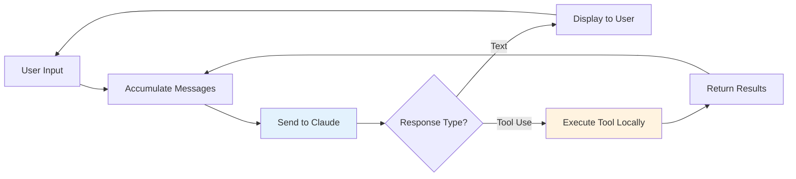

---
tags:
  - "#technique"
  - "#agents"
  - "#tutorial"
  - "#coding-agents"
  - "#implementation"
date: 2025-12-01
status: published
last_updated: 2025-12-01
---

# Building Coding Agents from Scratch

A practical guide to understanding and implementing coding agents. Learn how to build a functioning code-editing agent with surprisingly minimal complexity.

> **Philosophy:** "It's an LLM, a loop, and enough tokens. There isn't a secret." - Amp Team
> **See Also:** [[3-Resources/videos/Podcasts/boundary-podcast-context-engineering|Context Engineering Podcast]] - Advanced patterns for using coding agents effectively in production

---

## Overview

This guide demystifies coding agent architecture by demonstrating that impressive functionality requires remarkably little code. You'll learn:

- Core agent architecture patterns
- Tool system implementation
- Feedback loops and iterative refinement
- Practical implementation in ~400 lines of code

**Key Insight:** Modern coding assistants like [[tools/coding-assistants/Claude Code|Claude Code]], [[tools/coding-assistants/Amp|Amp]], Cursor, and Windsurf are fundamentally built on these same simple principles plus "practical engineering and elbow grease."

---

## The "Emperor Has No Clothes" Truth

### What Makes an Agent Work?

The sophistication of coding agents comes from:
1. **An LLM** - Preferably a capable model like Claude 3.7+ Sonnet
2. **A processing loop** - Accumulate messages, send to LLM, handle responses
3. **Enough tokens** - Sufficient context window for conversation history
4. **Tool execution** - Local handling of tool requests

**That's it.** No novel algorithms, no cutting-edge research, no secret sauce.

### Modern LLM Capabilities (2025)

By 2025, frontier models have gained intrinsic understanding that:
- They don't have omniscient knowledge
- Tools can provide additional information
- Tool usage helps solve problems
- When to request tools vs. when to generate responses

This means minimal explicit prompting is needed - the model recognizes tool opportunities independently.

---

## Core Architecture

### The Basic Loop



**Processing Flow:**
1. Collect user messages into conversation history
2. Send entire conversation context to Claude
3. Receive response (text or tool_use request)
4. If tool_use: execute locally, add result to conversation, loop back
5. If text: display to user, wait for next input

### Conversation State

The agent maintains conversation history locally:

```json
{
  "messages": [
    {"role": "user", "content": "List files in src/"},
    {"role": "assistant", "content": [{"type": "tool_use", "name": "list_files", "input": {"path": "src/"}}]},
    {"role": "user", "content": [{"type": "tool_result", "tool_use_id": "...", "content": "auth.rs\nserver.rs"}]},
    {"role": "assistant", "content": "I found two files: auth.rs and server.rs. Would you like me to read one?"}
  ]
}
```

**Key Points:**
- Complete conversation sent with each inference request
- Tool results appear as user messages with `tool_result` type
- Claude maintains context across tool executions

---

## The Five Agent Primitives

These five tools form the foundation of a functional coding agent:

### 1. Read Tool

**Purpose:** Import file contents into context

**Interface:**
```json
{
  "name": "read_file",
  "description": "Reads the contents of a file at the given relative path",
  "input_schema": {
    "type": "object",
    "properties": {
      "path": {
        "type": "string",
        "description": "Relative path to the file"
      }
    },
    "required": ["path"]
  }
}
```

**Implementation Considerations:**
- Use relative paths for portability
- Return raw file contents
- Handle errors gracefully (file not found, permissions)
- Consider line number annotations for large files

### 2. List Tool

**Purpose:** Enumerate files and directories

**Interface:**
```json
{
  "name": "list_files",
  "description": "Lists files and directories at the given path. Directories are indicated with a trailing /",
  "input_schema": {
    "type": "object",
    "properties": {
      "path": {
        "type": "string",
        "description": "Directory path to list (defaults to current directory)"
      }
    }
  }
}
```

**Output Format:**
```
src/
  auth.rs
  server.rs
  models/
  utils/
tests/
README.md
```

**Why It Matters:** Allows the agent to navigate and discover code structure autonomously.

### 3. Bash Tool

**Purpose:** Execute shell commands

**Interface:**
```json
{
  "name": "bash",
  "description": "Executes a bash command and returns output",
  "input_schema": {
    "type": "object",
    "properties": {
      "command": {
        "type": "string",
        "description": "The command to execute"
      }
    },
    "required": ["command"]
  }
}
```

**Critical Capabilities:**
- Run tests: `cargo test`, `npm test`
- Build projects: `cargo build`, `npm run build`
- Git operations: `git status`, `git diff`
- Search: `grep`, `rg`

**Security Considerations:**
- Sanitize inputs
- Consider allowlist of safe commands
- Run in sandboxed environment if possible

### 4. Edit Tool

**Purpose:** Modify file contents

**Interface:**
```json
{
  "name": "edit_file",
  "description": "Edits a file by replacing old_str with new_str",
  "input_schema": {
    "type": "object",
    "properties": {
      "path": {"type": "string"},
      "old_str": {"type": "string", "description": "String to find and replace"},
      "new_str": {"type": "string", "description": "Replacement string"}
    },
    "required": ["path", "old_str", "new_str"]
  }
}
```

**Implementation Note:** Simple string replacement works surprisingly well. No need for complex AST parsing - "anything goes as long as Claude can make sense of it."

**Why Simple Works:**
- Claude understands code structure from reading
- Can provide precise old_str from context
- Failures are obvious and recoverable

### 5. Search Tool

**Purpose:** Find patterns across codebase

**Interface:**
```json
{
  "name": "search",
  "description": "Searches for patterns using ripgrep",
  "input_schema": {
    "type": "object",
    "properties": {
      "pattern": {"type": "string", "description": "Regex pattern to search"},
      "path": {"type": "string", "description": "Path to search in"}
    },
    "required": ["pattern"]
  }
}
```

**Implementation:** Use `ripgrep` (rg) for fast, accurate results

**Output Considerations:**
- Include file paths and line numbers
- Limit results to avoid context pollution
- Consider filtering options (file type, case sensitivity)

---

## Implementation Example: Go Agent

Based on the Amp team's tutorial, here's the core implementation structure:

### Dependencies

```go
import (
    "github.com/anthropics/anthropic-sdk-go"
    "github.com/invopop/jsonschema"
)
```

### Tool Definition Pattern

```go
type Tool struct {
    Name        string
    Description string
    InputSchema interface{}
    Execute     func(input map[string]interface{}) (string, error)
}

func defineTools() []anthropic.ToolParam {
    tools := []Tool{
        {
            Name:        "read_file",
            Description: "Reads the contents of a file",
            InputSchema: ReadFileInput{},
            Execute:     executeReadFile,
        },
        // ... other tools
    }

    return convertToAnthropicTools(tools)
}
```

### Main Agent Loop

```go
func runAgent() {
    client := anthropic.NewClient()
    messages := []anthropic.MessageParam{}

    for {
        // Get user input
        userInput := readUserInput()
        messages = append(messages, anthropic.NewUserMessage(userInput))

        // Call Claude
        response := client.Messages.New(context.Background(), anthropic.MessageNewParams{
            Model:    anthropic.ModelClaude3_7SonnetLatest,
            Messages: messages,
            Tools:    defineTools(),
            MaxTokens: 4096,
        })

        // Process response
        for _, block := range response.Content {
            switch block.Type {
            case "text":
                fmt.Println(block.Text)
            case "tool_use":
                result := executeTool(block.Name, block.Input)
                messages = append(messages, anthropic.NewToolResultMessage(
                    block.ID,
                    result,
                ))
                // Continue loop to get next response
            }
        }
    }
}
```

### Tool Execution

```go
func executeTool(name string, input map[string]interface{}) string {
    switch name {
    case "read_file":
        path := input["path"].(string)
        content, err := os.ReadFile(path)
        if err != nil {
            return fmt.Sprintf("Error: %v", err)
        }
        return string(content)

    case "list_files":
        path := input["path"].(string)
        entries, _ := os.ReadDir(path)
        var result strings.Builder
        for _, entry := range entries {
            name := entry.Name()
            if entry.IsDir() {
                name += "/"
            }
            result.WriteString(name + "\n")
        }
        return result.String()

    case "edit_file":
        path := input["path"].(string)
        oldStr := input["old_str"].(string)
        newStr := input["new_str"].(string)

        content, _ := os.ReadFile(path)
        updated := strings.ReplaceAll(string(content), oldStr, newStr)
        os.WriteFile(path, []byte(updated), 0644)
        return "File updated successfully"
    }

    return "Unknown tool"
}
```

**Total Code:** ~400 lines including error handling, JSON schema generation, and user interface.

---

## How Claude Uses Tools Naturally

### Discovery Pattern

When asked "What Go files exist?", Claude will:

1. **Use list_files** to see directory structure
2. **Filter results** mentally for .go files
3. **Read relevant files** if needed for deeper understanding

**No explicit prompting needed** - the model chains tools naturally because it recognizes this mirrors human investigative approaches.

### Example Interaction

```
User: "What Go files do we have?"

Claude: [Uses list_files tool]
Tool Result: src/, tests/, main.go, config.go

Claude: "You have several Go files:
- main.go (likely entry point)
- config.go (configuration)
- Files in src/ and tests/ directories

Would you like me to explore the src/ directory?"

User: "Yes"

Claude: [Uses list_files on src/]
Tool Result: auth.go, server.go, handlers.go

Claude: "In src/, you have:
- auth.go - likely authentication logic
- server.go - HTTP server setup
- handlers.go - request handlers

Would you like me to read any of these?"
```

**Natural Flow:** The model explores progressively, just like a developer would.

---

## Tool Design Principles

### 1. Descriptions Matter

Tool descriptions guide when Claude uses tools. Clear descriptions = better tool selection.

**Good:**
```json
{
  "name": "search",
  "description": "Searches for regex patterns in files. Use when looking for specific code patterns, function names, or text across multiple files."
}
```

**Poor:**
```json
{
  "name": "search",
  "description": "Searches files"
}
```

### 2. Format Flexibility

**Key Insight:** No fixed output format required. Choose what makes sense for:
- Token efficiency
- Human readability
- Claude's comprehension

**Example - File Listing:**

Option A (Compact):
```
auth.rs
server.rs
models/
utils/
```

Option B (Detailed):
```json
[
  {"name": "auth.rs", "type": "file", "size": 1234},
  {"name": "server.rs", "type": "file", "size": 5678}
]
```

Both work! Use Option A unless you need the metadata.

### 3. Error Handling

Return errors as strings:
```
Error: File not found: src/missing.rs
```

Claude understands natural language errors and can:
- Explain the issue to the user
- Try alternative approaches
- Ask for clarification

### 4. Simplicity Over Sophistication

**Resist the urge to over-engineer:**
- String replacement beats AST parsing for edits
- Simple directory listing beats complex metadata
- Clear errors beat structured error codes

**Why:** Claude adapts to simple tools easily. Complex tools add token overhead and maintenance burden.

---

## Extending the Basic Agent

### Adding Context Window Management

See [[context-engineering-coding-agents|Context Engineering for Coding Agents]] for advanced techniques:

- **Compaction:** Summarize conversation history to free tokens
- **Sub-agents:** Isolate exploration from main conversation
- **Checkpointing:** Save progress to markdown, start fresh sessions

### Adding Verification Tools

```json
{
  "name": "get_ide_diagnostics",
  "description": "Gets type errors, linter warnings from IDE language server"
}
```

Enables the agent to:
- Check type errors without running compiler
- See linter issues in real-time
- Fix issues before running tests

### Adding Project Management

```json
{
  "name": "gh",
  "description": "GitHub CLI operations - create issues, PRs, review code"
}
```

**Capabilities:**
- Create issues from bugs found
- Open pull requests
- Fetch PR context for reviews
- Manage labels and milestones

### Adding Memory/Persistence

```json
{
  "name": "memory",
  "description": "Save and retrieve information across sessions"
}
```

**Use Cases:**
- Remember project structure
- Track ongoing work
- Store user preferences
- Maintain task lists

---

## Iterative Problem-Solving

### Tool Chaining Example

**Problem:** "Add input validation to the user registration endpoint"

**Agent's Approach:**

1. **Search** for registration endpoint
   ```
   Tool: search
   Pattern: "register.*user|user.*registration"
   Result: Found in src/handlers.go:45
   ```

2. **Read** the handler code
   ```
   Tool: read_file
   Path: src/handlers.go
   Result: [Full file contents]
   ```

3. **Search** for existing validation patterns
   ```
   Tool: search
   Pattern: "validate|validation"
   Result: Found validation functions in src/validators.go
   ```

4. **Read** validation utilities
   ```
   Tool: read_file
   Path: src/validators.go
   Result: [Validation helper functions]
   ```

5. **Edit** handler to add validation
   ```
   Tool: edit_file
   Path: src/handlers.go
   Old: func RegisterUser(w http.ResponseWriter, r *http.Request) {
            // Parse request...
   New: func RegisterUser(w http.ResponseWriter, r *http.Request) {
            // Validate input
            if err := validators.ValidateRegistration(input); err != nil {
                http.Error(w, err.Error(), 400)
                return
            }
            // Parse request...
   ```

6. **Run** tests to verify
   ```
   Tool: bash
   Command: go test ./...
   Result: PASS
   ```

**Natural Progression:** Each tool use builds on previous results, mirroring human developer workflow.

---

## Comparison with Production Tools

### Basic Agent (400 lines)
- ✅ Core functionality
- ✅ Tool execution
- ✅ Basic conversation loop
- ❌ Editor integration
- ❌ Advanced context management
- ❌ Optimized prompts
- ❌ User experience polish

### Production Tools (Amp, Claude Code, Aider)

**Additional Features:**
- **System Prompts:** Carefully crafted for specific behaviors
- **Editor Integration:** LSP support, diagnostics, inline errors
- **Context Optimization:** Automatic compaction, sub-agents, checkpointing
- **User Experience:** Progress indicators, checkpoints, rollback
- **Safety:** Sandboxing, permission management, hooks
- **Performance:** Caching, streaming, parallel execution

**Key Insight:** The core architecture is identical. Production readiness comes from engineering refinement, not algorithmic innovation.

---

## Practical Implementation Guide

### Step 1: Choose Your Stack

**Language Options:**
- **Go:** Anthropic SDK available, fast, compiled
- **Python:** Rich ecosystem, rapid prototyping
- **TypeScript:** Node.js integration, web compatibility
- **Rust:** Performance, safety, growing AI tooling

**SDK Options:**
- Official Anthropic SDKs: Go, Python, TypeScript
- LangChain: Multi-model support, rich tooling
- Direct API: Maximum control, any language

### Step 2: Minimal Viable Agent

Start with 3 tools:
1. **read_file** - View code
2. **list_files** - Navigate
3. **bash** - Run commands

**Goal:** ~100 lines of code, basic conversation loop

### Step 3: Add Editing

Implement **edit_file** with simple string replacement:
- Read file
- Replace old_str with new_str
- Write back

**Goal:** Agent can now modify code

### Step 4: Add Search

Integrate `ripgrep`:
- Spawn rg process
- Capture output
- Return to agent

**Goal:** Agent can find patterns across codebase

### Step 5: Add Project Context

Create **CLAUDE.md** (or equivalent):
- Tech stack
- Common commands
- Naming conventions
- Testing approach

See [[../context-engineering/context-engineering-coding-agents#essential-claudemd-structure|CLAUDE.md Structure]] for details.

### Step 6: Iterate on Prompts

**System Prompt Template:**
```
You are a coding assistant with access to tools for reading, editing, and running code.

When asked to implement features:
1. Read existing code to understand patterns
2. Search for similar implementations
3. Write tests first
4. Implement to pass tests
5. Run verification commands

Project context: [contents of CLAUDE.md]
```

### Step 7: Add Advanced Features

**Optional Enhancements:**
- Git integration (status, diff, commit)
- IDE diagnostics (LSP)
- Sub-agents for parallel work
- Memory/persistence
- GitHub integration

---

## Testing Your Agent

### Manual Testing

**Basic Capabilities:**
```bash
# Navigation
"List files in the project"
"Show me the main entry point"

# Reading
"Read the authentication module"
"What does the server.go file do?"

# Search
"Find all functions that handle HTTP requests"
"Where is the database connection configured?"

# Editing
"Add error handling to the login function"
"Refactor getUserById to use the new query builder"

# Execution
"Run the test suite"
"Build the project and show any errors"
```

### Progressive Complexity

**Level 1: Navigation**
- List files correctly
- Read files accurately
- Basic conversation

**Level 2: Understanding**
- Answer questions about code
- Explain architecture
- Find related code

**Level 3: Simple Changes**
- Fix typos
- Update strings
- Add comments

**Level 4: Logic Changes**
- Add validation
- Implement features
- Refactor code

**Level 5: Complex Tasks**
- Multi-file changes
- Test-driven development
- Debugging issues

### Automated Testing

```go
func TestAgentCanReadFiles(t *testing.T) {
    agent := NewAgent()
    response := agent.ProcessMessage("Read src/main.go")

    assert.Contains(t, response, "package main")
}

func TestAgentCanEdit(t *testing.T) {
    // Create temp file
    // Ask agent to edit
    // Verify changes
}
```

---

## Common Pitfalls

### 1. Context Overflow

**Problem:** Conversation grows too large, agent performance degrades

**Solutions:**
- Implement context compaction
- Use sub-agents for exploration
- Clear history periodically
- See [[context-engineering-coding-agents|Context Engineering]] for advanced strategies

### 2. Tool Call Explosion

**Problem:** Agent makes many irrelevant tool calls

**Solutions:**
- Better tool descriptions
- More specific user prompts
- Sub-agents for open-ended research
- Limit search result counts

### 3. Incorrect Edits

**Problem:** Agent replaces wrong code or breaks syntax

**Solutions:**
- Always read before editing
- Include context in old_str
- Run tests after changes
- Consider diff-based editing

### 4. Unclear Tool Results

**Problem:** Tool output is too verbose or unclear

**Solutions:**
- Format output for readability
- Limit result sizes
- Highlight key information
- Use structured formats when helpful

### 5. Lost User Intent

**Problem:** Agent goes off-track from original request

**Solutions:**
- Clear initial prompts
- Break complex tasks into phases
- Use planning before implementation
- Regular check-ins with user

---

## Real-World Examples

### Example 1: Adding Feature

**User:** "Add JWT authentication to the API"

**Agent Process:**

1. **Research Phase**
   - Search for existing auth code
   - Read current middleware
   - Find test patterns

2. **Planning**
   - Identify files to modify
   - Design token validation flow
   - Plan test cases

3. **Implementation**
   - Add JWT library to dependencies
   - Create auth middleware
   - Update route handlers
   - Write tests

4. **Verification**
   - Run tests
   - Check for type errors
   - Verify endpoints work

### Example 2: Debugging

**User:** "The server crashes when handling large file uploads"

**Agent Process:**

1. **Investigation**
   - Read upload handler code
   - Search for file size limits
   - Check error logs (if provided)

2. **Hypothesis**
   - Identifies missing size validation
   - Finds buffer allocation issue

3. **Fix**
   - Add max size check
   - Implement streaming upload
   - Add error handling

4. **Testing**
   - Create test with large file
   - Verify graceful handling
   - Run full test suite

### Example 3: Refactoring

**User:** "Refactor the user service to use dependency injection"

**Agent Process:**

1. **Analysis**
   - Read current user service
   - Find all dependencies
   - Search for DI patterns in codebase

2. **Design**
   - Plan interface definitions
   - Identify injection points
   - Consider backward compatibility

3. **Execution**
   - Extract interfaces
   - Update constructors
   - Modify callers
   - Update tests

4. **Validation**
   - All tests pass
   - No compilation errors
   - Verify behavior unchanged

---

## Learning Resources

### Hands-On Practice

**Workshop:** [[../../workshops/building-coding-agents-workshop|Building Coding Agents Workshop]]
- Live coding exercises
- Progressive complexity
- Real implementations

**Exercises:**
- Build a minimal agent (100 lines)
- Add tool execution
- Implement file editing
- Create multi-step workflows

### Implementation Examples

**Open Source Agents:**
- [[../../tools/coding-assistants/Amp|Amp]] - Small team, transparent architecture
- [[../../tools/coding-assistants/Aider|Aider]] - Python, git-focused
- Mini-SWE-Agent - Minimal reference implementation

**Code Repositories:**
- [Amp on GitHub](https://github.com/amp)
- [Aider on GitHub](https://github.com/paul-gauthier/aider)
- Example agents in various languages

### Advanced Topics

**Context Engineering:**
[[context-engineering-coding-agents|Advanced Context Engineering for Coding Agents]]
- Context window optimization
- Sub-agent patterns
- Research-Plan-Implement workflow
- Production-grade practices

**Agent Patterns:**
[[agents - agentisation|Agents & Agentisation]]
- Agent architectures
- Multi-agent collaboration
- Memory and persistence
- Planning capabilities

---

## Key Takeaways

### 1. Simplicity is Powerful
Modern LLMs handle complexity. Your job is providing tools and managing context, not implementing sophisticated algorithms.

### 2. Tools Over Templates
5 well-designed tools > 50 specialized functions. Let Claude figure out how to combine them.

### 3. Natural Language Works
Error messages, tool descriptions, output formats - readable text beats structured data for most use cases.

### 4. Iteration is Natural
Claude chains tool calls naturally. Don't force single-shot solutions; embrace multi-step problem solving.

### 5. Production = Refinement
The 400-line agent and production tools share core architecture. Differences are UX polish and optimization, not fundamental design.

### 6. Start Small, Learn Fast
Build the minimal version first. Understand the core loop. Then add features based on real needs.

---

## Next Steps

1. **Build Your First Agent**
   - Start with [[../../workshops/building-coding-agents-workshop|the workshop]]
   - Implement the 5 primitives
   - Test on simple tasks

2. **Study Production Tools**
   - Try [[../../tools/coding-assistants/Claude Code|Claude Code]] or [[../../tools/coding-assistants/Amp|Amp]]
   - Observe tool usage patterns
   - Notice how they handle context

3. **Learn Context Engineering**
   - Study [[context-engineering-coding-agents|advanced techniques]]
   - Implement sub-agents
   - Practice research-plan-implement workflow

4. **Iterate and Improve**
   - Get lots of reps
   - Build intuition through practice
   - Refine based on real usage

---

## Resources

**Official Documentation:**
- [Anthropic Tool Use Guide](https://docs.anthropic.com/en/docs/tool-use)
- [Claude Code Documentation](https://docs.claude.com/claude-code)
- [Building Agents with Claude SDK](https://www.anthropic.com/engineering/building-agents-with-the-claude-agent-sdk)

**Implementation Guides:**
- [How to Build an Agent - Amp](https://ampcode.com/how-to-build-an-agent) - Original tutorial
- [Building Coding Agents Workshop](https://ghuntley.com/agent/) - Geoffrey Huntley's conference workshop

**Tools and SDKs:**
- [Anthropic Go SDK](https://github.com/anthropics/anthropic-sdk-go)
- [Anthropic Python SDK](https://github.com/anthropics/anthropic-sdk-python)
- [Anthropic TypeScript SDK](https://github.com/anthropics/anthropic-sdk-typescript)

**Related Content:**
- [[agents - agentisation|Agents & Agentisation]] - Agent architecture concepts
- [[context-engineering-coding-agents|Context Engineering]] - Advanced optimization
- [[../../tools/coding-assistants/README|Coding Assistants Comparison]] - Production tool comparison
- [[../../workshops/building-coding-agents-workshop|Hands-On Workshop]] - Practical exercises

---

**Last Updated:** 2025-12-01
**Next Review:** 2026-06-01
**Skill Level:** Intermediate to Advanced
**Estimated Time:** 4-6 hours for basic implementation

*Agent architecture is straightforward but requires hands-on practice to build intuition. The best way to learn is by building.*
