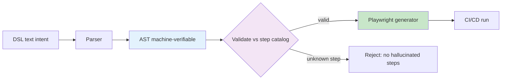

---
tags:
  - "#techniques"
  - "#testing"
  - "#ai-engineering"
  - "#automation"
date: 2026-07-01
status: published
last_updated: 2026-07-01
---

# AI-Assisted Test Automation

A coherent, vendor-neutral strategy for using LLMs to author and maintain automated tests **without** giving up determinism, reviewability, or Git-friendliness. Three parts: lightweight DSL authoring, platform-fit evaluation, and a deterministic DSL→AST→generator pipeline with AI in draft-mode behind a human gate.

> Extracted from PoC research notes. Fully domain-neutral. Pairs naturally with the vault's [[3-Resources/techniques/context-engineering/context-engineering-coding-agents|coding-agent workflow]] — AI drafts, humans gate, pipelines stay deterministic.

---

## Part 1 — AI-assisted test-case generation ("vibe coding," done responsibly)

**The loop:** human writes *intent* (natural language or a lightweight DSL) → AI generates a test skeleton → human reviews → executable test. The output must be **diff-friendly** (text/DSL in Git), never GUI-only recordings.

**Minimal governance that keeps it maintainable:**
- **Step catalog** — a registry of reusable, named steps; tests compose from it rather than inventing ad-hoc actions.
- **Stable selectors** — a `data-testid` contract between app and tests, so refactors don't shatter suites.
- **Test-data isolation** — seed + idempotent reset; each test owns its data.
- **Flaky management** — quarantine tags, not silent retries.
- **Screenplay Pattern** (e.g. Serenity/JS) — reusable Tasks/Interactions capture *domain language* in tests → tests double as business-readable **living documentation**.

**Baseline stack:** Playwright (UI + API) + a DSL/Gherkin layer + an LLM API (or Copilot) + CI/CD (GitHub Actions / GitLab / Jenkins) + JUnit/HTML reporting.

---

## Part 2 — Choosing a platform (a 6-criteria fit matrix)

Evaluate test-automation platforms on **six explicit criteria**, separating raw capability from lock-in and ecosystem health:

| Criterion | Ask |
|---|---|
| **Test generation** | AI-assisted authoring? How much human review is needed? |
| **Web** | Robust cross-browser UI automation? |
| **API** | First-class API testing, not bolted on? |
| **Performance / load** | Real VUs/RPS/latency — or just "performance checks"? (see note below) |
| **Reporting** | Machine-readable + human dashboards; exportable? |
| **CI/CD** | A real CLI/runner + machine-readable output — not GUI-only? |

Score each `Yes / Partial / No / Unverified`, then weigh **vendor lock-in vs open ecosystem**.

**Performance testing means three different things** — disambiguate before comparing: (a) **load/perf** (VUs/RPS/latency via JMeter/Gatling/k6), (b) **real-user simulation**, (c) **performance checks during a UI crawl**. Vendors blur these.

**Guardrails before you commit:** verify *real* CI/CD integration (CLI/runner, machine-readable reports), export accessibility, and test-data handling. Rank by fit-to-context (enterprise/on-prem vs pragmatic SaaS vs cost-effective/free-tier), not by feature-count.

---

## Part 3 — The deterministic pipeline: DSL → AST → generator

The architecture that lets AI help **without** injecting non-determinism into CI:

- **DSL as executable specification** — intent in controlled text/Gherkin, parsed into an **AST** for deterministic validation (syntax, step-catalog membership, coverage).
- **AST as the verification checkpoint** — it validates every step against the registry *before* the generator runs, so **AI can't hallucinate a non-existent step** into a passing suite.
- **AsciiDoc as source-of-truth** — store DSL in `[source,dsl]` blocks inside `.adoc` docs; the parser extracts DSL → generates tests → documentation stays in sync without separate versioning.
- **AI in draft-mode behind a human gate** — AI generates `.adoc`/DSL drafts in a *separate PR/branch*; a human reviews; only then does the deterministic pipeline run. **No AI auto-merge.**
- **Parser/codegen tooling:** Langium (DSL + language server), ANTLR (formal grammar), Chevrotain / Peggy / Nearley (JS parsers); `ts-morph` for TypeScript AST codegen.
- **Guardrails:** strict vocabulary (step catalog), linting, review diffs (not replays), human gate.

**Why it works:** AI accelerates *authoring* (the slow, creative part) while a deterministic pipeline owns *execution* (the part that must be reproducible). The AST is the seam that keeps LLM creativity out of the trust boundary.

---

## The unifying idea

All three parts encode the same principle the vault repeats for coding agents: **let the LLM draft, keep humans and deterministic tooling on the gate.** Lightweight DSL authoring (Part 1), the platform that supports it (Part 2), and the AST-verified pipeline (Part 3) together give **cost-effective, maintainable, vendor-neutral AI-assisted QA** with living documentation as a side effect.

---

## Related Concepts

- [[3-Resources/techniques/context-engineering/context-engineering-coding-agents|Context Engineering for Coding Agents]] — same draft/gate discipline
- [[3-Resources/techniques/agents/adversarial-multi-stream-evaluation|Adversarial Multi-Stream Evaluation]] — AST-verification is a structural gate; adversarial verify is its semantic sibling
- [[3-Resources/techniques/agents/building-coding-agents|Building Coding Agents]]
- [[3-Resources/techniques/README|AI/LLM Engineering Techniques]]

---

**Last Updated:** 2026-07-01
**Status:** Published
**Part of:** AI/LLM Engineering Knowledge Vault
