---
tags:
  - "#technique"
  - "#context-engineering"
  - "#coding-agents"
  - "#claude-code"
  - "#advanced"
date: 2025-12-01
status: published
last_updated: 2025-12-01
---

# Context Engineering for Coding Agents

Advanced techniques for structuring, compacting, and aligning context to make AI coding agents more effective partners in software development.

> **Source:** [BoundaryML Podcast #17 - Advanced Context Engineering](https://boundaryml.com/podcast/2025-08-05-advanced-context-engineering-for-coding-agents)
> **Video:** [YouTube Discussion](https://www.youtube.com/watch?v=42AzKZRNhsk)
> **📹 Full Podcast Notes:** [[3-Resources/videos/Podcasts/boundary-podcast-context-engineering|Detailed transcript with quotes and insights]]
> **Contributors:** Dexter (coined "context engineering" in April 2025), Vibhav (BAML creator)

---

## Core Definition

**Context Engineering:**
> "Context engineering isn't just about cramming more stuff into the prompt; it's a deliberate practice of structuring, compacting, and aligning information to make your AI agent a more effective partner."

Context engineering is the discipline of optimizing what information enters an AI agent's context window, when it enters, and how it's structured to maximize agent performance on complex coding tasks.

---

## Why Context Engineering Matters

### The Context Window Problem


**Key Issues:**
- Every tool call adds to context and dilutes information density
- Irrelevant search results pollute context permanently (until compaction)
- Context grows with each iteration, reducing focus
- At 80%+ utilization, agent performance degrades significantly

**Performance Target:** Keep context utilization under 50% for optimal results

---

## The Five Principles

### 1. Decompose with Sub-Agents

Break complex work into specialized agents handling distinct subtasks (planning, file identification, code generation).

**Purpose:** Context isolation and parallel execution

### 2. Intentional Compaction

Actively manage and reduce context to maintain focus on what truly matters.

**Strategy:** Manual compression > automatic compaction

### 3. Naming Consistency

Use uniform naming conventions across codebases so AI can understand relationships.

**Anti-pattern:** Multiple names for same concept (e.g., "attribute" vs "field annotation" vs "decorator")

### 4. Pre-Implementation Review

Examine research and planning artifacts as markdown before coding begins.

**Benefit:** Catch misalignments early, build shared understanding

### 5. Exploratory Coding

Work alongside agents to develop intuition about strengths and limitations.

**Goal:** Build empirical understanding through repetition

---

## Three-Phase Workflow

The structured pipeline that prioritizes human effort strategically:


### Phase 1: Research

**Goal:** Understand problems and existing systems

**Output:** Markdown document with:
- File paths and line numbers
- Data flow analysis
- Architecture overview
- Relevant code locations

**Tools:** Sub-agents for parallel codebase exploration

**Example Research Prompt (300 lines):**
```markdown
Find everywhere in [codebase] relevant to solving [issue].
Figure out how information flows through the system.

Use sub-agents to:
- Search for related patterns
- Identify test locations
- Map data transformations
- Find similar implementations

Document:
- File paths with line numbers
- Key functions and their relationships
- Test coverage locations
- Potential gotchas
```

**Target Length:** 150-400 lines of markdown

### Phase 2: Planning

**Goal:** Create step-by-step outline of required changes

**Output:** Phase-by-phase implementation plan

**Structure:**
```markdown
# Implementation Plan: [Feature Name]

## Phase 1: Write Failing Tests
- Test file: path/to/test.rs:line_number
- Test cases to add:
  1. Happy path: ...
  2. Edge case: ...
  3. Error case: ...

## Phase 2: Core Implementation
- File: path/to/file.rs:line_number
- Changes:
  1. Add validation logic
  2. Update error messages
  3. Handle edge cases

## Phase 3: Integration
- Files to update: [list]
- Integration points: [describe]

## Out of Scope
- Feature X (defer to later)
- Refactoring Y (not needed)

## Automated Verification
After each phase:
1. Run: cargo test
2. Check: cargo clippy
3. Verify: cargo check
```

**Target Length:** 200-300 lines of markdown

### Phase 3: Implementation

**Goal:** Execute the plan while remaining adaptable

**Approach:**
- Test-Driven Development (TDD) required
- Write failing test first
- Implement to pass tests
- Verify with automated checks

**Checkpoint Pattern:**


---

## Context Control Techniques

### The Naive Approach (Anti-Pattern)


**Problem:** Unbounded context growth with no intentional management

### Intentional Compaction


**Benefits:**
- Fresh context with essential information
- No irrelevant tool call history
- Explicit control over what's included
- Human-readable checkpoint

**Key Insight:** Manual compaction > automatic compaction because you control what's preserved and the trajectory matters, not just information.

### Sub-Agents for Context Control


**What Sub-Agents Are:**
- Specialized, autonomous assistants
- Own system prompt and tool permissions
- Isolated context window
- **Purpose:** Context control (not anthropomorphization)

**When to Use Sub-Agents:**

✅ **Good Use Cases:**
- Parallel development (frontend + backend simultaneously)
- Verification without context pollution
- Specialized tasks (code review, testing, documentation)
- Research without losing main conversation context
- Complex workflows requiring separation of concerns

❌ **Not Ideal For:**
- Simple, single-file changes
- Quick fixes
- Tasks requiring shared context
- Rapidly iterating on same code

**How to Use Effectively:**

```markdown
# In your prompt:
"Use a sub-agent to find where user authentication happens.
Prompt it: Search for auth middleware, session handling, and
token validation. Return file paths with line numbers."
```

**Sub-Agent Return Format:**
```markdown
Found authentication in:
- src/middleware/auth.rs:45-120 (JWT validation)
- src/services/session.rs:23-67 (session management)
- src/models/user.rs:89 (User auth methods)
```

---

## Advanced Patterns

### Pattern 1: Parallel Development


**Use Case:** Full-stack feature development

**Benefit:** 3x faster than sequential, no context pollution

### Pattern 2: Verification Chain


**Use Case:** Security reviews, performance audits

**Benefit:** Fresh perspective without bias from implementation context

### Pattern 3: Specialized Roles Pipeline


**Use Case:** Complex features requiring multiple perspectives

**Benefit:** Each stage optimized for specific task

### Pattern 4: Research Without Context Loss

```markdown
# Early in main conversation
User: "Use a sub-agent to explore how authentication
is currently implemented. Return a summary with file paths."

[Sub-agent investigates and returns summary]

# Main agent retains context for implementation
# without pollution from exploration
```

---

## Workflow Architecture

### The Team Workflow (Production Pattern)


**Key Insight:** More time reviewing research and plans than code

**Human Attention Hierarchy:**
1. **Highest Leverage:** Core prompts and workflows (100,000 bad lines of code)
2. **High Leverage:** Research documents (1,000 bad lines of code)
3. **Medium Leverage:** Implementation plans (100 bad lines of code)
4. **Low Leverage:** Individual lines of code (1 bad line)

**Implication:** Focus human review on research and planning phases

### Explore-Plan-Code-Commit Pattern


**Phase Details:**

**1. Explore:**
```markdown
"Read the authentication module and explain how it works"
[No code changes - just understanding]
```

**2. Plan:**
```markdown
"Think hard about how to add OAuth support. Create detailed plan."
[Use extended thinking mode]

Thinking levels:
- "think" - Basic extended thinking
- "think hard" - More computation time
- "think harder" - Even more thinking
- "ultrathink" - Maximum thinking budget
```

**3. Code:**
```markdown
"Implement the OAuth plan from above"
[Claude writes code following plan]
```

**4. Commit:**
```markdown
"Commit these changes with a good commit message"
[Claude creates commit]
```

### Test-Driven Development with Agents


**Benefits:**
- Clear success criteria
- Better test coverage
- Prevents implementation bias
- Forces thinking about edge cases

**Why TDD with Agents:**
> "TDD is the only way to write AI-generated code. I have a very strong opinion on it." - Dexter

**Key Requirement:** Make running individual tests trivial for the LLM

```bash
# Good: Obvious test command
cargo test test_multiple_invalid_attributes

# Bad: Complex test runner requiring context
./scripts/run_specific_test.sh --filter "multi" --suite validation
```

---

## Practical Implementation Tips

### 1. Naming Conventions Matter More Than Ever


**Why It Matters:**
- LLMs rely on naming to understand relationships
- Inconsistent names = confusion for models AND humans
- Common nomenclature enables better research and planning

**Example from BAML:**
- Concept: "field and block attributes"
- Used consistently: `field_attribute`, `block_attribute`, `parse_attribute`
- Never called: `decorator`, `annotation`, `metadata`

**Action:** Audit your codebase for naming inconsistencies

### 2. File Structure Optimization

```bash
# Anti-pattern: Next.js with all page.tsx
app/
├── dashboard/page.tsx
├── settings/page.tsx
├── profile/page.tsx
└── admin/page.tsx

# Problem: Tree view shows identical filenames
# Makes agent navigation harder
```

**Solutions:**
- Use descriptive directory names
- Alphabetically separate important files
- Consider alternative structure for better discoverability

### 3. Tool and Build System Design

**Make It Easy for Agents:**

```bash
# Good: Standard, simple commands
npm test                    # Run all tests
npm run test:unit          # Run unit tests
npm run lint               # Run linter
npm run build              # Build project

# Bad: Complex, custom commands
./scripts/test_runner.py --config ./configs/test.yaml --env dev
```

**Monorepo Optimization:**
```json
// package.json with Turbo
{
  "scripts": {
    "test": "turbo run test",
    "build": "turbo run build",
    "lint": "turbo run lint"
  }
}
```

**Benefits:**
- Agent doesn't need to understand complex build systems
- Clear, consistent commands across workspace
- Easier for new humans AND AI to onboard

### 4. LSP and Type Checking

**Enable Language Server Protocol Errors:**

1. **VS Code:** Open Claude Code in integrated terminal
2. **Install Extension:** Claude Code VS Code extension
3. **Tool Available:** `get_ide_diagnostics` appears in tools

**Python-Specific:**
```python
# Enable type checking in VS Code
# settings.json
{
  "python.analysis.typeCheckingMode": "basic",  // or "strict"
  "python.linting.enabled": true
}
```

**TypeScript-Specific:**
- Select correct interpreter in VS Code
- Ensure tsconfig.json is properly configured
- Use consistent package manager (npm, yarn, pnpm, bun)

### 5. Claude Code Hooks and Validation

**Add to CLAUDE.md:**
```markdown
## Automated Verification

After every file change, run:
1. `npm run lint` - Check style
2. `npm test -- --bail` - Run tests, stop on first failure
3. `tsc --noEmit` - Type check without building

If any fail, fix before continuing.
```

**In Implementation Plans:**
```markdown
## Phase 1: Add Validation
- File: src/validator.ts
- Changes: [describe]

### Automated Verification
```bash
npm run lint
npm test validator.test.ts
tsc --noEmit
```
```

### 6. Context Optimization for MCP Tools

**Problem:** MCP tools dump verbose JSON into context

```json
// Linear MCP response - 500+ lines of JSON
{
  "issue": {
    "id": "...",
    "title": "...",
    "description": "...",
    "comments": [
      { "id": "...", "body": "...", "createdAt": "...", "user": {...} },
      // ... 50 more comments with full user objects
    ],
    "labels": [...],
    "assignee": {...},
    // ... tons of metadata
  }
}
```

**Solution:** Build custom MCP wrapper

```typescript
// Custom linear-to-markdown tool
async function getLinearTicketOptimized(ticketId: string): string {
  const ticket = await linearClient.issue(ticketId);

  return `# ${ticket.title}

## Description
${ticket.description}

## Comments
${ticket.comments.map(c => `- ${c.user.name}: ${c.body}`).join('\n')}

## Status
${ticket.state.name} | Assigned to: ${ticket.assignee?.name || 'Unassigned'}
`;
}
```

**Compression Achieved:** 500 lines JSON → 50 lines markdown

### 7. Multi-Claude Workflows


**Git Worktree Setup:**
```bash
# Main checkout
cd ~/projects/myapp

# Add worktrees for different features
git worktree add ../myapp-auth feature/auth
git worktree add ../myapp-payments feature/payments
git worktree add ../myapp-bugfix bugfix/cache

# Each worktree = independent Claude session
cd ../myapp-auth && claude-code
cd ../myapp-payments && claude-code
```

**Benefits:**
- Independent contexts = fresh perspectives
- Parallel work = faster completion
- Separation of concerns
- Easy cleanup: `git worktree remove`

---

## The Research Prompt Pattern

Real-world example (300 lines from BoundaryML team):

```markdown
# Research Command Template

## Goal
Understand [specific feature/bug] in [codebase area]

## Sub-Agents to Launch

### Sub-Agent 1: File Discovery
Prompt: "Search for all files related to [feature]. Return file paths only."
Tools: Glob, Grep (read-only)

### Sub-Agent 2: Data Flow Analysis
Prompt: "Trace how [data] flows through the system from [entry point] to [exit point]."
Tools: Read, Grep (read-only)

### Sub-Agent 3: Test Coverage
Prompt: "Find all tests for [feature]. List test files and what they cover."
Tools: Glob, Read (read-only)

## Output Format

```markdown
# Research: [Feature Name]

## Overview
[2-3 sentence summary]

## Key Files
- path/to/file1.rs:45-67 - [what it does]
- path/to/file2.rs:123 - [what it does]

## Data Flow
1. Entry: [file:line]
2. Processing: [file:line]
3. Exit: [file:line]

## Test Coverage
- [test file] covers [scenarios]
- Missing: [gaps in testing]

## Potential Gotchas
- [Issue 1]
- [Issue 2]
```
```

**Key Elements:**
- Specific sub-agent instructions
- Read-only tools (no bash, no writes)
- Structured output format
- File paths with line numbers
- Explicit goals for each sub-task

---

## The Planning Prompt Pattern

```markdown
# Planning Command Template

## Input
- Research document: research/[feature].md
- Issue description: [link or paste]

## Planning Process

### Phase 1: Understand Constraints
Review research and identify:
- Files that MUST be changed
- Files that SHOULD NOT be changed
- Breaking changes to avoid
- Testing requirements

### Phase 2: Design Phases
Create 3-5 implementation phases:
1. Write failing tests
2. Core implementation
3. Integration
4. Documentation
5. (Optional) Refactoring

Each phase should be completable in < 30 min

### Phase 3: Specify Automated Checks
For each phase, specify:
- Commands to run
- Expected output
- How to verify correctness

## Output Format

```markdown
# Implementation Plan: [Feature]

## Phase 1: Write Failing Tests
**Files:**
- tests/feature_test.rs

**Changes:**
1. Add test case: happy path
2. Add test case: edge case (empty input)
3. Add test case: error (invalid input)

**Verification:**
```bash
cargo test feature_test
# Should fail with: "not yet implemented"
```

## Phase 2: Core Implementation
**Files:**
- src/feature.rs:45-67

**Changes:**
1. Add validation function
2. Implement core logic
3. Add error handling

**Verification:**
```bash
cargo test feature_test
cargo clippy
```

## What We're NOT Doing
- Refactoring old code (defer)
- Adding UI (separate ticket)
- Performance optimization (not needed yet)

## Automated Verification Steps
```bash
# After each phase:
cargo test
cargo clippy
cargo check
```
```
```

---

## Common Pitfalls and Solutions

### Pitfall 1: "The Scope Creep"

**Problem:** Agent keeps adding features because context is already loaded

```mermaid
graph LR
    F1[Fix Bug] --> F2[Also Fix Related Bug]
    F2 --> F3[Refactor This Too]
    F3 --> F4[Add New Feature]
    F4 --> F5[Optimize Everything]
    F5 --> Chaos[3000 Line PR 😱]

    style Chaos fill:#ffebee
```



**Solution:** Intentional checkpoints

```markdown
# In your plan:
## Out of Scope
- Refactoring X (separate PR)
- Feature Y (not needed now)
- Optimization Z (premature)

## Boundaries
Only touch files listed in Phase 1-3.
If you need to modify other files, STOP and ask.
```

### Pitfall 2: "The Research Black Hole"

**Problem:** Research returns "no bug found" or incorrect analysis

**Solution:** Validate research before planning

```markdown
# Validation checklist:
1. Read the research document
2. Verify file paths exist and are correct
3. Check if analysis matches known behavior
4. If wrong, prompt: "Here's a failing test case.
   Research again focusing on why this fails."
```

**Real Example:**
```markdown
# First research: "Feature works correctly, no bug"
# [WRONG - Delete this research]

# User adds failing test case to issue

# Second research prompt:
"This test case fails. Research why it fails.
Focus on: parsing, validation, error handling."

# Second research: "Parser accepts both syntaxes but
# validation only checks one. File: validator.rs:123"
# [CORRECT - Use this]
```

### Pitfall 3: "The Tool Call Explosion"

**Problem:** 80% context used by irrelevant tool calls

```mermaid
graph TB
    A[Search 'auth'] --> B[50 results]
    B --> C[Read file 1<br/>irrelevant]
    C --> D[Read file 2<br/>irrelevant]
    D --> E[Read file 3<br/>maybe relevant]
    E --> F[Search again]
    F --> G[Context: 75% 😰]

    style G fill:#ffebee
```



**Solution:** Use sub-agents for exploration

```markdown
"Use a sub-agent to find authentication code.
Prompt it: Search for 'auth' AND 'middleware'.
Return only the most relevant 3 file paths."

# Sub-agent's context pollution stays isolated
# Main agent receives clean summary
```

### Pitfall 4: "The Page.tsx Problem"

**Problem:** All files named identically (Next.js app router)

```bash
app/
├── dashboard/page.tsx
├── profile/page.tsx
├── settings/page.tsx

# Agent sees: page.tsx, page.tsx, page.tsx
# Which one is which? 🤷
```

**Solutions:**
1. Use descriptive file names when possible
2. Add comments at top of files
3. Leverage directory context in prompts

```markdown
# Better prompt:
"Find the user profile page.
Look in: app/profile/page.tsx"

# Not:
"Find page.tsx for user profile"
```

### Pitfall 5: "Trusting Without Verification"

**Problem:** Assuming agent output is correct

**Solution:** Progressive verification


**Review Checklist:**

**Research Review:**
- [ ] File paths exist and are correct
- [ ] Analysis matches expected behavior
- [ ] All relevant code locations identified
- [ ] No obvious gaps in understanding

**Plan Review:**
- [ ] Phases are logical and sequential
- [ ] Tests specified before implementation
- [ ] Verification steps are concrete
- [ ] Out-of-scope items are documented
- [ ] Error messages are user-friendly

**Code Review (Automated):**
- [ ] All tests pass
- [ ] No linter errors
- [ ] Type checking passes
- [ ] Edge cases handled

---

## Tools and Infrastructure

### Essential CLAUDE.md Structure

```markdown
# Project: [Your Project]

## Tech Stack
- Language: [Rust/TypeScript/Python]
- Framework: [Next.js/Express/etc]
- Testing: [Jest/pytest/cargo test]
- Build: [Turbo/cargo/npm]

## Code Style
- Naming: snake_case for Rust, camelCase for TS
- Architecture: [describe key patterns]
- Error handling: [your approach]

## Testing Requirements
**Run tests:** `npm test`
**Run specific:** `npm test -- file.test.ts`
**Coverage:** `npm run test:coverage`

⚠️ All tests must pass before commits

## Common Commands
- Test: `npm test`
- Lint: `npm run lint`
- Type check: `tsc --noEmit`
- Build: `npm run build`

## File Organization
- Components: src/components/
- Utils: src/utils/
- Tests: src/**/__tests__/
- Types: src/types/

## Naming Conventions
[List your key domain concepts and their names]
Example:
- User authentication: "auth" (not "authentication", "authz", "login")
- Field attributes: "field_attribute" (not "annotation", "decorator")
```

### Custom Slash Commands

**Location:** `.claude/commands/`

**Research Command** (`.claude/commands/research.md`):
```markdown
Research [TOPIC] in the codebase.

Use sub-agents to:
1. Find relevant files (glob + grep)
2. Trace data flow (read + analysis)
3. Identify test coverage

Output to: research/[topic]-$(date +%Y%m%d).md

Format:
- File paths with line numbers
- Data flow diagram (text)
- Test coverage summary
- Potential issues
```

**Plan Command** (`.claude/commands/plan.md`):
```markdown
Create implementation plan for [FEATURE].

Requirements:
1. Read research document if exists
2. Break into 3-5 phases
3. Each phase: tests first, then implementation
4. Specify verification commands
5. List out-of-scope items

Output to: plans/[feature]-$(date +%Y%m%d).md
```

**Test Command** (`.claude/commands/test.md`):
```markdown
Write comprehensive tests for $ARGUMENTS

Requirements:
- Use [testing framework from CLAUDE.md]
- Cover happy path
- Cover edge cases
- Cover error conditions
- Follow AAA pattern (Arrange, Act, Assert)
- Descriptive test names

Run tests after writing to verify they fail.
```

### Sub-Agent Configuration

**Location:** `.claude/agents/`

**Code Reviewer Agent** (`.claude/agents/reviewer.md`):
```markdown
Name: code-reviewer
Description: Security and quality review

System Prompt:
You are a senior code reviewer focusing on:
- Security vulnerabilities (OWASP Top 10)
- Error handling completeness
- Edge cases
- Performance implications
- Test coverage

Provide specific line numbers and actionable feedback.

Tools: Read, Grep, Glob (read-only)
```

**Tester Agent** (`.claude/agents/tester.md`):
```markdown
Name: test-writer
Description: Writes comprehensive test suites

System Prompt:
You write thorough tests covering:
- Happy paths
- Edge cases
- Error conditions
- Integration points

Use TDD: Write failing tests first.

Tools: Read, Write, Bash
Allowed Commands: [test command], [coverage command]
```

### Multi-Directory Support

```json
// .claude/settings.json
{
  "additionalDirectories": [
    "/path/to/backend-repo",
    "/path/to/shared-lib"
  ],
  "allowedTools": ["Read", "Write", "Bash", "Grep", "Glob"],
  "allowedCommands": [
    "npm test",
    "npm run build",
    "cargo test",
    "cargo check"
  ],
  "blockedPaths": [
    ".env",
    "credentials/*",
    "secrets.json"
  ]
}
```

---

## Metrics and Validation

### How to Know It's Working

**Research Quality Metrics:**
- File paths are accurate (100% exist)
- Analysis matches reality (validate with humans who know codebase)
- Line numbers are precise
- No obvious gaps in coverage

**Plan Quality Metrics:**
- Can be implemented in estimated time
- Phases are independently testable
- Verification steps catch issues
- Out-of-scope items prevent creep

**Implementation Quality Metrics:**
- All tests pass
- No linter errors
- Type checking clean
- Edge cases handled
- Error messages are clear

**Team Velocity:**


### Real-World Results (BoundaryML Team)

**Developer Experience:**
- "Shipping 2,000 lines of Go code every day"
- "Shipped six PRs last Thursday"
- "Haven't opened a non-markdown file in over a month"

**Code Quality:**
- Tests pass before merge (automated)
- Architecture reviews on schedule
- Research reviewed by whole team
- Plans reviewed before implementation

**Bug Example:**
- Issue open since December 2024
- Fixed in one session using context engineering workflow
- Auto-merged after tests passed

---

## Advanced Topics

### Extended Thinking Modes

**Trigger Words in Prompts:**
```markdown
"think" - Basic extended thinking
"think hard" - More computation time
"think harder" - Even more thinking
"ultrathink" - Maximum thinking budget
```

**When to Use:**
- Complex architectural decisions
- Security-critical code
- Performance optimization planning
- Debugging subtle issues

**When NOT to Use:**
- Simple CRUD operations
- Routine refactoring
- Following established patterns

**Pitfall:** Ultra-think can over-focus on early context
```markdown
# Problem:
"ultrathink about architecture"
[Makes decision]
User: "Actually, let's use approach B"
[Ultra-think strongly biased toward original decision]

# Solution:
Use normal thinking for iterative discussions
Save ultra-think for final implementation
```

### Headless Mode & Automation

**Non-Interactive Execution:**
```bash
# One-shot command
claude-code -p "Fix the linter errors in src/"

# Piped input
cat error.log | claude-code -p "Analyze and suggest fixes"

# Structured output
claude-code -p "Review changes" --output-format stream-json
```

**Pre-Commit Hook:**
```bash
#!/bin/bash
# .git/hooks/pre-commit

staged_files=$(git diff --cached --name-only --diff-filter=ACM)

claude-code -p "Quick review for obvious issues: $staged_files" \
  --output-format json > .review.json

# Parse and fail if critical issues found
```

**CI Integration:**
```yaml
# .github/workflows/ai-review.yml
- name: AI Code Review
  run: |
    git diff origin/main | \
      claude-code -p "Review for security and style" > review.md

    # Post review as PR comment
    gh pr comment --body-file review.md
```

### GitHub Integration

```bash
# Install GitHub CLI
brew install gh
gh auth login

# Claude can now:
# - Create issues
# - Open pull requests
# - Review PRs
# - Manage repository
```

**Example Workflow:**
```markdown
User: "Create a GitHub issue for adding dark mode"
Claude: [Creates issue with proper labels and description]

User: "Create a PR for this feature branch"
Claude: [Creates PR with generated description from commits]

User: "Review PR #123"
Claude: [Fetches PR, analyzes changes, provides review]
```

**GitHub PR Integration (Beta):**
```markdown
# In PR comment:
@claude-code Please fix the failing tests mentioned in the CI output

# Claude will:
# 1. Read PR context
# 2. Analyze CI failures
# 3. Fix issues
# 4. Push commits
# 5. Respond to comment
```

---

## Key Insights from Practitioners

### On Process Over Tools

> "The goal isn't to review code anymore. The goal is to review research and plans. If those are good, the code will be good." - Dexter

### On Learning

> "Get lots of reps. The more reps you get, the better your intuition for what works and what doesn't." - Dexter

> "It's like learning any instrument. You need to practice. If you can't do it at work, find time outside of work." - Jeff from Amp

### On Team Transformation

> "We did a transformation over 8 weeks. Now we focus on specifications, writeups, requirements, and implementation plans - not code review." - Dexter

### On Test-Driven Development

> "TDD is the only way to write AI-generated code. I have a very strong opinion on it." - Dexter

### On Context Window Management

> "If you're not thinking about how these systems are working, it's really hard to engineer them and hack them to do what you want." - Vibhav

### On Building for Builders

> "If you make it really abstract for how your tools work, you're making life harder for your users. Transparency enables optimization." - Vibhav

### On Naming

> "If you have a codebase that randomly renamed things and only renamed half of it, you're fucking yourself. Models can't do the right thing with seven different names for the same concept." - Vibhav

---

## Checklist for Adopting Context Engineering

### Phase 1: Foundation (Week 1)

- [ ] Create comprehensive CLAUDE.md with:
  - [ ] Common commands
  - [ ] Testing requirements
  - [ ] Naming conventions
  - [ ] File organization
- [ ] Audit codebase for naming inconsistencies
- [ ] Set up testing infrastructure for easy LLM use
- [ ] Enable LSP/type checking in IDE
- [ ] Document your domain concepts and their names

### Phase 2: Workflow Setup (Week 2)

- [ ] Create research prompt template
- [ ] Create planning prompt template
- [ ] Set up project board with stages:
  - [ ] Research in Progress / Review
  - [ ] Plan in Progress / Review
  - [ ] In Dev / Code Review
- [ ] Define review criteria for research
- [ ] Define review criteria for plans

### Phase 3: Sub-Agent Configuration (Week 3)

- [ ] Create code reviewer sub-agent
- [ ] Create test writer sub-agent
- [ ] Create research sub-agent
- [ ] Configure tool permissions
- [ ] Test sub-agents on small tasks

### Phase 4: Practice and Iteration (Weeks 4-8)

- [ ] Start with small features using full workflow
- [ ] Review research documents as a team
- [ ] Refine prompts based on results
- [ ] Build intuition through repetition
- [ ] Document what works and what doesn't
- [ ] Iterate on process weekly

### Phase 5: Scale and Optimize (Ongoing)

- [ ] Track metrics (PRs/week, test coverage, bug rate)
- [ ] Optimize high-friction areas
- [ ] Create custom MCP wrappers for verbose tools
- [ ] Build team knowledge base of patterns
- [ ] Regular architecture reviews
- [ ] Continuous prompt refinement

---

## Resources

**Official Sources:**
- [BoundaryML Podcast Episode #17](https://boundaryml.com/podcast/2025-08-05-advanced-context-engineering-for-coding-agents)
- [YouTube Discussion](https://www.youtube.com/watch?v=42AzKZRNhsk)
- [Claude Code Documentation](https://docs.claude.com/en/docs/claude-code)
- [Claude Code Best Practices - Anthropic](https://www.anthropic.com/engineering/claude-code-best-practices)

**Tools Mentioned:**
- [BAML](https://github.com/BoundaryML/baml) - Programming language for LLM functions
- [Human Layer](https://github.com/humanlayer/humanlayer) - Terminal UI for managing multiple Claude Code sessions
- [Amp](https://github.com/amp) - AI-augmented coding CLI

**Related Concepts:**
- [[tools/coding-assistants/Claude Code|Claude Code Overview]]
- [[tools/coding-assistants/Claude Code Best Practices|Claude Code Best Practices]]
- [[techniques/prompting/README|Prompt Engineering]]
- [[tools/protocols/MCP|Model Context Protocol]]

**Learning Resources:**
- [12 Factor Agents](https://www.boundaryml.com/blog) - BoundaryML blog on agent architecture
- [Jeff's Article: Coding with LLMs is Like Learning an Instrument](https://jeff.cloud/blog/coding-with-llms-like-learning-instrument)

---

## Related Vault Content

- [[techniques/prompting/system-prompts|System Prompts]] - Core prompting techniques
- [[agents - agentisation|Agents & Agentisation]] - Agent architecture patterns
- [[tools/coding-assistants/README|Coding Assistants Comparison]]
- [[tools/frameworks/README|Agent Frameworks]]

---

**Last Updated:** 2025-12-01
**Next Review:** 2026-03-01 (context engineering practices evolve rapidly)
**Contributors:** Dexter (coined term), Vibhav (BAML), Roman (documentation)

*Context engineering is an emerging discipline. These practices represent current best practices and will evolve as coding agents advance.*
