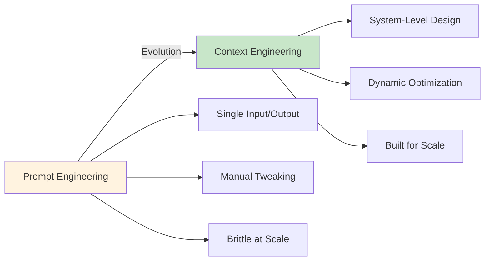
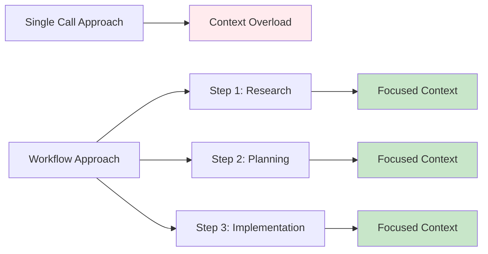

---
tags:
  - "#technique"
  - "#context-engineering"
  - "#llm"
  - "#ai-engineering"
  - "#fundamentals"
date: 2025-12-01
status: published
last_updated: 2025-12-01
---

# Context Engineering

The systematic discipline of designing, structuring, and optimizing the information provided to Large Language Models (LLMs) to maximize their effectiveness and reliability in performing tasks.

> "Context Engineering is the discipline of designing and building dynamic systems that provide the right information and tools, in the right format, at the right time, to give an LLM everything it needs to accomplish a task." — Phil Schmid

---

## What is Context Engineering?

**Context engineering** is the evolution beyond simple prompt engineering. Rather than focusing solely on crafting individual instructions, context engineering encompasses the entire information ecosystem that an AI model perceives when generating responses.

As Phil Schmid emphasizes: "Context Engineering is the discipline of designing and building dynamic systems that provides the right information and tools, in the right format, at the right time."

### The Broader Scope

While **prompt engineering** operates within a single input-output pair, **context engineering** handles everything the model sees:

- System prompts and instructions
- Conversation history (short-term memory)
- Long-term memory storage and retrieval
- Retrieved information from knowledge bases (RAG)
- Available tools and functions
- Structured output formats
- Real-time contextual information

**Key Insight:** Most agent failures are not model failures — they are context failures. The quality of context determines whether an AI system succeeds or fails.

---

## Why Context Engineering Matters

### The Context Window Challenge

Modern LLMs have large but finite context windows (typically 128k-200k tokens). Every piece of information competes for this limited space:

- System prompts: ~10-15%
- Tools/functions: ~10-15%
- User messages: ~20-30%
- Tool call history: ~20-40%
- Retrieved information: Variable

**Critical Threshold:** Performance degrades significantly when context utilization exceeds 80%. Optimal performance requires staying under 50% utilization.

### From Prompts to Systems



**Scalability:** Prompt engineering falls apart with more users and edge cases. Context engineering is designed for consistency and reuse from the start.

---

## Core Principles

### 1. Information Selection

**Challenge:** What information should enter the context window?

**Strategies:**
- **Retrieval-Augmented Generation (RAG):** Dynamically fetch relevant information
- **Semantic search:** Find contextually relevant content using embeddings
- **Metadata filtering:** Use structured filters to narrow results
- **Relevance scoring:** Rank and prioritize information by importance

**Goal:** The smallest possible set of high-signal tokens that maximize desired outcomes.

### 2. Context Structuring

**Challenge:** How should information be organized?

**Best Practices:**
- Use clear section markers (XML tags, Markdown headers)
- Separate instructions from data
- Place critical information strategically (beginning or end)
- Use consistent formatting across interactions
- Employ hierarchical organization for complex data

**Example:**
```markdown
<system_instructions>
You are a data analyst assistant...
</system_instructions>

<context>
## Dataset Overview
[Summary of dataset]

## Relevant Columns
[Column descriptions]
</context>

<user_query>
What are the trends in sales data?
</user_query>
```

### 3. Context Optimization

**Challenge:** How to maximize signal while minimizing noise?

**Techniques:**
- **Compression:** Summarize verbose information
- **Deduplication:** Remove redundant content
- **Truncation:** Trim less critical details
- **Chunking:** Break large documents into focused segments
- **Prioritization:** Keep high-value information, discard low-value

### 4. Dynamic Context Management

**Challenge:** How to maintain relevance across long conversations?

**Approaches:**
- **Windowing:** Keep only recent N messages
- **Summarization:** Compress older conversations
- **Selective retention:** Save critical information, discard noise
- **External memory:** Store and retrieve from external databases
- **Context isolation:** Use separate contexts for different subtasks

---

## Context Engineering vs. Prompt Engineering

| Aspect | Prompt Engineering | Context Engineering |
|--------|-------------------|---------------------|
| **Scope** | Single instruction/response | Entire information system |
| **Focus** | Phrasing and structure | Information architecture |
| **Approach** | Manual crafting | Systematic design |
| **Scalability** | Requires constant tweaking | Built for consistency |
| **Components** | Text instructions | Prompts + memory + RAG + tools |
| **Maturity** | Tactical technique | Engineering discipline |

**Relationship:** Prompt engineering is a subset of context engineering, not the other way around.

---

## Key Components of Context

### 1. System Prompts

**Purpose:** Define the model's role, capabilities, and constraints

**Best Practices:**
- Be specific about the role and expertise
- Define clear boundaries and limitations
- Specify output format and style
- Include ethical guidelines and safety constraints

### 2. Memory Systems

**Short-term Memory (Conversation History):**
- Recent exchanges in the conversation
- Maintains continuity and coherence
- Typically windowed to recent N messages

**Long-term Memory:**
- Persistent information across sessions
- User preferences and facts
- Historical interactions and patterns
- External storage (databases, vector stores)

### 3. Retrieved Information (RAG)

**When to Use:**
- Dynamic, frequently-changing information
- Large knowledge bases that exceed context limits
- Domain-specific facts and data
- User-specific or personalized content

**Implementation:**
- Vector databases (Pinecone, Weaviate, Chroma)
- Semantic search with embeddings
- Hybrid search (keyword + semantic)
- Re-ranking for relevance

### 4. Tools and Functions

**Purpose:** Extend model capabilities beyond text generation

**Examples:**
- API calls to external services
- Database queries
- File operations
- Calculations and data processing
- Web searches

### 5. Structured Outputs

**Purpose:** Ensure consistent, parseable responses

**Techniques:**
- JSON schemas
- XML templates
- Function calling formats
- Pydantic models (Python)
- Type definitions (TypeScript)

---

## Context Engineering Strategies

### Strategy 1: Workflows Over Single Calls

**Problem:** Cramming everything into one LLM call leads to context overload

**Solution:** Break complex tasks into focused steps, each with optimized context



**Benefits:**
- Each step has clean, focused context
- Easier to debug and refine
- Better control over information flow
- Reduces context pollution

### Strategy 2: Multi-Agent Architectures

**Concept:** Use specialized agents with isolated contexts for different subtasks

**When to Use:**
- Complex, multi-faceted problems
- Parallel processing opportunities
- Need for fresh perspectives (review, verification)
- Specialized expertise requirements

**Example Pattern:**
```
Main Orchestrator Agent
├── Research Agent (read-only tools)
├── Planning Agent (think-heavy)
├── Implementation Agent (write tools)
└── Review Agent (verification)
```

**Benefits:**
- Context isolation prevents pollution
- Parallel execution saves time
- Specialized system prompts for each role
- Internal context doesn't leak to main agent

### Strategy 3: Intentional Compaction

**Concept:** Actively manage and compress context rather than relying on automatic truncation

**Manual Compaction Workflow:**
1. Perform extensive research/exploration
2. Extract key findings to structured document
3. Clear conversation or start fresh session
4. Load compressed findings
5. Continue with clean context

**Why Manual > Automatic:**
- You control what's preserved
- Can add human insights and corrections
- Removes irrelevant tool call history
- Creates human-readable checkpoints

### Strategy 4: Writing (External Memory)

**Concept:** Offload information to external storage to free context window

**Techniques:**
- Save research findings to markdown files
- Maintain running notes during long tasks
- Use structured logs for state tracking
- Persist important decisions and rationale

**When to Write:**
- After research phases
- Before context reaches 60% utilization
- When switching between subtasks
- For audit trails and documentation

### Strategy 5: Selecting (Relevant Retrieval)

**Concept:** Fetch only the most relevant information from knowledge bases

**Implementation:**
- Use semantic search with quality embeddings
- Apply metadata filters (date, type, source)
- Re-rank results by relevance
- Limit retrieved chunks (e.g., top 5)
- Include context around retrieved passages

**Optimization:**
```python
# Instead of:
retrieve_top_50_chunks()

# Do:
retrieve_top_5_chunks(
    query=user_query,
    filters={"date_range": "last_3_months", "type": "technical_doc"},
    rerank=True
)
```

### Strategy 6: Compressing

**Concept:** Reduce information density while preserving critical details

**Methods:**
- **Summarization:** LLM-based or extractive summaries
- **Trimming:** Remove verbose examples, redundant explanations
- **Abstraction:** Replace detailed data with summaries
- **Symbolic references:** Use IDs/keys instead of full objects

**Example:**
```markdown
# Before (500 tokens):
{
  "user": {
    "id": 12345,
    "name": "John Doe",
    "email": "john@example.com",
    "preferences": {...},
    "history": [...]
  }
}

# After (50 tokens):
User #12345 (John Doe)
- Active subscription
- Prefers technical documentation
- Recent activity: API documentation
```

### Strategy 7: Isolating (Compartmentalized Workflows)

**Concept:** Keep different concerns in separate context spaces

**Patterns:**
- Research in isolated agent (doesn't pollute main context)
- Verification in fresh session (unbiased review)
- Parallel development in separate agents
- Experimentation in throwaway contexts

---

## Practical Implementation Patterns

### Pattern 1: RAG + Prompt Hybrid

**Use Case:** Knowledge-intensive tasks with dynamic information

**Structure:**
```markdown
<system_prompt>
You are a technical documentation assistant...
</system_prompt>

<retrieved_context>
[Top 3 most relevant documentation chunks]
</retrieved_context>

<user_query>
How do I configure authentication?
</user_query>
```

**Best Practice:** Use RAG for facts, prompts for behavior and reasoning logic.

### Pattern 2: Stepwise Refinement

**Use Case:** Complex tasks requiring multiple iterations

**Workflow:**
1. **Initial exploration** → Save findings
2. **Load findings + plan** → Save plan
3. **Load plan + implement** → Save code
4. **Load code + review** → Final output

**Each step has minimal, focused context.**

### Pattern 3: Memory-Augmented Conversations

**Use Case:** Personalized, long-running interactions

**Architecture:**
```
User Input
    ↓
Retrieve from Long-term Memory
    ↓
Build Context: Recent History + Retrieved Facts + System Prompt
    ↓
LLM Processing
    ↓
Store important info in Long-term Memory
    ↓
Response
```

### Pattern 4: Tool-Heavy Applications

**Use Case:** Agents that need many tools/functions

**Strategy:**
- Don't load all tools at once
- Dynamically select relevant tools based on task
- Group related tools into namespaces
- Provide minimal tool descriptions in main context
- Store detailed docs externally, fetch when needed

---

## Common Pitfalls

### 1. Context Overload

**Symptom:** Performance degrades, responses become generic or confused

**Cause:** Too much information in context window

**Solution:**
- Monitor context utilization
- Implement compaction strategies
- Use selective retrieval
- Break into smaller workflows

### 2. Context Confusion

**Symptom:** Model responds to wrong information or mixes concepts

**Cause:** Surplus, contradictory, or poorly organized information

**Solution:**
- Deduplicate information
- Use clear section markers
- Remove irrelevant context
- Test with "sharding" analysis (provide info across turns vs. single turn)

### 3. Irrelevant Retrieval

**Symptom:** RAG returns unhelpful documents

**Cause:** Poor embedding quality, weak query formulation, insufficient filtering

**Solution:**
- Use high-quality embedding models
- Implement query rewriting/expansion
- Add metadata filtering
- Re-rank results
- Evaluate retrieval quality metrics

### 4. Memory Leakage

**Symptom:** Sensitive or outdated information persists inappropriately

**Cause:** Inadequate memory management and retention policies

**Solution:**
- Implement time-based expiration
- Allow user-controlled deletion
- Separate sensitive vs. general memory
- Audit memory contents regularly

### 5. Scope Creep

**Symptom:** Tasks expand beyond original intent

**Cause:** Rich context encourages model to "help more"

**Solution:**
- Define clear task boundaries in prompts
- Specify out-of-scope items explicitly
- Use checkpoints and approvals
- Implement strict workflow stages

---

## Evaluation and Metrics

### Context Quality Metrics

**Relevance:**
- Percentage of context used in response
- Annotation-based relevance scoring

**Efficiency:**
- Context utilization percentage
- Token-to-value ratio
- Retrieval precision and recall

**Effectiveness:**
- Task success rate
- Response quality (human evaluation)
- Hallucination rate

### Testing Context Strategies

**A/B Testing:**
- Compare different context organization approaches
- Measure task success rates
- Track user satisfaction

**Ablation Studies:**
- Remove components to test necessity
- Identify minimal viable context

**Benchmark Suites:**
- Test across diverse task types
- Measure consistency and reliability

---

## Tools and Frameworks

### RAG Frameworks
- **LangChain:** Comprehensive orchestration framework
- **LlamaIndex:** Specialized for RAG and indexing
- **Haystack:** Production-ready NLP pipelines

### Vector Databases
- **Pinecone:** Managed vector database
- **Weaviate:** Open-source vector search
- **Chroma:** Lightweight embedding database
- **Qdrant:** High-performance vector search

### Memory Systems
- **Mem0:** Personalized AI memory layer
- **Zep:** Long-term memory for LLM applications
- **Redis:** For caching and short-term memory

### Context Management
- **Anthropic Claude:** Extended context windows (200k tokens)
- **LangChain Memory:** Built-in conversation memory
- **Context Compressors:** Libraries for summarization and compression

---

## Future Directions

### Emerging Trends (2025 and Beyond)

**1. Automated Context Optimization:**
- AI systems that learn optimal context configurations
- Self-tuning retrieval strategies
- Dynamic context allocation

**2. Hybrid Memory Architectures:**
- Combining in-context, RAG, and fine-tuned knowledge
- Multi-tier memory systems (hot/warm/cold storage)
- Intelligent memory routing

**3. Context-Aware Models:**
- Models trained to handle context engineering patterns
- Better intrinsic understanding of context structure
- Improved long-context reasoning

**4. Standardization:**
- Common formats for context specification
- Reusable context templates
- Best practice libraries and patterns

**5. Context Security:**
- Privacy-preserving context handling
- Secure multi-party computation for sensitive context
- Context access control and audit

---

## Related Concepts

- [[techniques/prompting/README|Prompt Engineering]] - Foundation of context engineering
- [[RAG|Retrieval-Augmented Generation]] - Dynamic information retrieval
- [[agents - agentisation|Agents & Agentisation]] - Multi-agent architectures
- [[context-engineering-coding-agents|Context Engineering for Coding Agents]] - Specialized application
- [[context-engineering-techniques|Context Engineering Techniques]] - Practical implementation patterns

---

## Resources

### Official Documentation
- [Anthropic: Effective Context Engineering for AI Agents](https://www.anthropic.com/engineering/effective-context-engineering-for-ai-agents)
- [Prompt Engineering Guide: Context Engineering](https://www.promptingguide.ai/guides/context-engineering-guide)
- [LlamaIndex: Context Engineering Overview](https://www.llamaindex.ai/blog/context-engineering-what-it-is-and-techniques-to-consider)

### Research & Articles
- [ArXiv: A Survey of Context Engineering for Large Language Models](https://arxiv.org/abs/2507.13334)
- [LangChain: Context Engineering for Agents](https://blog.langchain.com/context-engineering-for-agents/)
- [The New Stack: Context Engineering Beyond RAG](https://thenewstack.io/context-engineering-going-beyond-prompt-engineering-and-rag/)
- [Phil Schmid: The New Skill in AI is Context Engineering](https://www.philschmid.de/context-engineering) - Philipp Schmid, June 30, 2025 - Foundational article defining the discipline and its seven core components
- [Medium: Context Engineering vs Prompt Engineering](https://medium.com/data-science-in-your-pocket/context-engineering-vs-prompt-engineering-379e9622e19d)

### Tutorials & Guides
- [DataCamp: Context Engineering Guide with Examples](https://www.datacamp.com/blog/context-engineering)
- [FlowHunt: Context Engineering 2025 Guide](https://www.flowhunt.io/blog/context-engineering/)
- [Kubiya: Context Engineering Best Practices 2025](https://www.kubiya.ai/blog/context-engineering-best-practices)
- [Elastic: Context Engineering Overview](https://www.elastic.co/search-labs/blog/context-engineering-overview)

**Last Accessed:** 2025-12-01

---

**Last Updated:** 2025-12-01
**Next Review:** 2025-06-01 (bi-annual review recommended)
**Status:** Current as of December 2025

*Context engineering is a rapidly evolving discipline. This document represents current best practices and will be updated as the field advances.*
