# Prompt Engineering Techniques

Comprehensive guide to prompt engineering - the practice of designing effective inputs to guide AI models toward desired outputs. Master these techniques to unlock the full potential of Large Language Models.

---

## 📚 Contents

### 🌟 Core Fundamentals
- **[[basics]]** - Start here: Prompt engineering fundamentals, anatomy of good prompts, and core principles
- **[[system-prompts]]** - Configure model behavior, role, and guidelines at the system level

### 🎯 Shot-Based Techniques
- **[[zero-shot-prompting]]** - Most efficient approach - no examples, just clear instructions
- **[[few-shot-prompting]]** - Provide 2-5 examples to demonstrate desired patterns
- **One-shot prompting** - Single example demonstration (covered in few-shot)

### 🧠 Advanced Reasoning
- **[[chain-of-thought]]** - Enable complex reasoning through step-by-step thinking
- **[[meta-prompting]]** - Optimize prompts themselves using AI-assisted refinement
- **[[verbalized-sampling]]** - ⭐ NEW - Unlock output diversity by requesting probability distributions (1.6-2.1× improvement)

### 📖 Legacy Documentation
- **[[prompt]]** - Original prompting notes (historical reference)
- **[[system prompt]]** - Original system prompt notes (historical reference)

---

## 🎯 What is Prompt Engineering?

Prompt engineering is the practice of designing effective inputs (prompts) to guide AI models toward desired outputs. It combines:

- **Clear instruction design** - Articulating what you want the model to do
- **Context provision** - Supplying relevant background information
- **Output formatting** - Specifying how results should be structured
- **Iterative refinement** - Testing and improving prompts based on results

**Key Insight**: Most prompt failures come from ambiguity, not model limitations. Clear structure and context matter more than clever wording.

---

## 🗺️ Learning Path

### 🌱 Beginner Path (Start Here)

1. **[[basics]]** - Understand prompt anatomy and core principles
   - What makes a good prompt
   - Common mistakes to avoid
   - Basic patterns and structures

2. **[[zero-shot-prompting]]** - Learn the simplest approach
   - No examples needed
   - Most token-efficient
   - When to use vs. when to upgrade

3. **[[system-prompts]]** - Configure persistent behavior
   - Set role and guidelines
   - Model-specific optimizations
   - Best practices for system-level prompts

**Practice**: Create prompts for simple tasks (translation, summarization, classification)

### 🌿 Intermediate Path

4. **[[few-shot-prompting]]** - Teach through examples
   - When examples help vs. instructions
   - Selecting representative examples
   - Structured output patterns

5. **[[chain-of-thought]]** - Enable reasoning
   - Zero-shot CoT with "Let's think step by step"
   - Few-shot CoT with reasoning examples
   - When reasoning improves accuracy

**Practice**: Complex classifications, multi-step transformations, pattern-based generation

### 🌳 Advanced Path

6. **[[meta-prompting]]** - Optimize prompt creation itself
   - Prompt generation and refinement
   - Systematic optimization frameworks
   - Building prompt libraries

7. **Integration Techniques**
   - Combine with **[[RAG]]** for knowledge augmentation
   - Use with **[[agents - agentisation]]** for autonomous systems
   - Apply in **[[../../tools/coding-assistants/README|Coding Assistants]]**

**Practice**: Domain-specific optimizations, multi-model strategies, prompt automation

---

## 🔑 Technique Comparison

| Technique | Examples | Setup Time | Token Cost | Best For | Accuracy |
|-----------|----------|------------|------------|----------|----------|
| **[[zero-shot-prompting\|Zero-Shot]]** | 0 | Fastest | Lowest | Common tasks, prototyping | Good |
| **[[few-shot-prompting\|Few-Shot]]** | 2-5 | Moderate | Medium | Patterns, consistency | Very Good |
| **[[chain-of-thought\|Chain-of-Thought]]** | 0-5 | Moderate | Medium-High | Complex reasoning, math | Excellent |
| **[[verbalized-sampling\|Verbalized Sampling]]** ⭐ | 0 | Fast | Medium | Creative tasks, diversity | Very Good |
| **[[meta-prompting\|Meta-Prompting]]** | Varies | High | Varies | Optimization, systems | N/A |

---

## 🎨 Quick Start Guide

### Just Getting Started?

1. **Read [[basics]]** first - understand the fundamentals
2. **Try [[zero-shot-prompting]]** - start with the simplest approach
3. **When zero-shot isn't enough**, move to **[[few-shot-prompting]]**
4. **For complex reasoning**, add **[[chain-of-thought]]**
5. **To optimize at scale**, explore **[[meta-prompting]]**

### Decision Tree


---

## 💡 Best Practices (2025 Edition)

### ✅ Do

1. **Start Simple** - Always try [[zero-shot-prompting|zero-shot]] first
2. **Be Explicit** - Clear instructions > clever wording
3. **Specify Format** - Define exactly how output should look
4. **Provide Context** - Give relevant background information
5. **Test Systematically** - Use consistent test cases
6. **Version Control** - Track what works and what doesn't
7. **Use Examples Wisely** - Quality over quantity in [[few-shot-prompting|few-shot]]
8. **Show Reasoning** - Use [[chain-of-thought|CoT]] for complex tasks
9. **Leverage System Prompts** - Set persistent behavior once
10. **Iterate** - Refine based on actual results

### ❌ Avoid

1. **Vague Instructions** - "Make it better" tells the model nothing
2. **Assuming Context** - Model doesn't know what you haven't told it
3. **Overly Complex Prompts** - Break into steps or use [[chain-of-thought|CoT]]
4. **Inconsistent Examples** - Keep format identical across [[few-shot-prompting|few-shot]] examples
5. **Ignoring Output Format** - Always specify structure
6. **Using Too Many Examples** - 3-5 is usually enough
7. **Skipping Testing** - Always validate on real inputs
8. **One-Size-Fits-All** - Different models respond to different styles
9. **Forgetting Edge Cases** - Include in [[few-shot-prompting|examples]] or instructions
10. **No Documentation** - Save successful prompts for reuse

---

## 🎯 Prompting for Different Use Cases

### Code Generation & Review
```
Best practices:
- Use [[system-prompts]] to set expertise level
- Specify language, framework, style guidelines
- Use [[few-shot-prompting]] for code patterns
- Add [[chain-of-thought]] for complex algorithms
```

### Data Analysis
```
Best practices:
- Use [[chain-of-thought]] for multi-step analysis
- Specify output format (tables, JSON, markdown)
- Provide data context and constraints
- Use [[few-shot-prompting]] for consistent structure
```

### Content Creation
```
Best practices:
- Use [[system-prompts]] for tone and style
- Provide [[few-shot-prompting]] examples for brand voice
- Specify length, format, audience
- Use [[zero-shot-prompting]] for straightforward tasks
```

### Classification & Extraction
```
Best practices:
- Start with [[zero-shot-prompting]] for simple cases
- Use [[few-shot-prompting]] for consistent categories
- Add [[chain-of-thought]] for nuanced decisions
- Specify exact output format (JSON, labels, etc.)
```

### Problem Solving & Debugging
```
Best practices:
- Use [[chain-of-thought]] to expose reasoning
- Break complex problems into steps
- Use [[system-prompts]] for domain expertise
- Request explicit explanations
```

---

## 🔧 Model-Specific Optimization

### Claude (Anthropic)
- ✅ XML tagging for structure
- ✅ Explicit guidelines work well
- ✅ Parallel tool execution support
- ✅ Context awareness features
- 📖 See [[system-prompts#Claude (Anthropic)|Claude-specific tips]]

### GPT-4/GPT-4o (OpenAI)
- ✅ Markdown headers for sections
- ✅ Step-by-step instructions
- ✅ Good at long context
- ✅ Responds well to role assignment
- 📖 See [[system-prompts#GPT-4/GPT-4o (OpenAI)|GPT-specific tips]]

### Gemini (Google)
- ✅ Structured data processing
- ✅ Multimodal understanding
- ✅ Step-by-step methodologies
- ✅ Good at reasoning tasks
- 📖 See [[system-prompts#Gemini (Google)|Gemini-specific tips]]

---

## 📊 Prompt Engineering Framework

```mermaid
graph TD
    A[Define Goal] --> B[Choose Technique]
    B --> C{Complexity?}
    C -->|Simple| D[Zero-Shot]
    C -->|Moderate| E[Few-Shot]
    C -->|Complex| F[Chain-of-Thought]

    D --> G[Write Prompt]
    E --> G
    F --> G

    G --> H[Test with Model]
    H --> I{Output Quality?}
    I -->|Good| J[Document & Reuse]
    I -->|Poor| K[Analyze Failure]
    K --> L[Refine Prompt]
    L --> H

    J --> M[Add to Prompt Library]
    M --> N{Optimize Further?}
    N -->|Yes| O[Meta-Prompting]
    N -->|No| P[Done ✓]

    style A fill:#e1f5ff
    style J fill:#c8e6c9
    style P fill:#c8e6c9
    style K fill:#ffecb3
```



---

## 🚀 Quick Reference Tables

### When to Use Each Technique

| Scenario | Recommended Technique | Reason |
|----------|----------------------|---------|
| Simple translation | [[zero-shot-prompting\|Zero-Shot]] | Task is well-understood |
| Custom format output | [[few-shot-prompting\|Few-Shot]] | Examples clarify pattern |
| Math word problems | [[chain-of-thought\|Chain-of-Thought]] | Reasoning improves accuracy |
| Code debugging | [[chain-of-thought\|Chain-of-Thought]] | Need to see logic |
| Creative writing | [[verbalized-sampling\|Verbalized Sampling]] ⭐ | Avoid generic outputs |
| Brainstorming ideas | [[verbalized-sampling\|Verbalized Sampling]] ⭐ | Need diverse options |
| Brand voice consistency | [[few-shot-prompting\|Few-Shot]] | Examples show style |
| Setting bot behavior | [[system-prompts\|System Prompts]] | Persistent configuration |
| Optimizing prompts | [[meta-prompting\|Meta-Prompting]] | Systematic improvement |

### Common Prompt Patterns

| Pattern | Structure | Example |
|---------|-----------|---------|
| **Simple Instruction** | `[Task] + [Input]` | "Translate to Spanish: [text]" |
| **Contextualized** | `[Role] + [Task] + [Input]` | "As a Python expert, review this code: [code]" |
| **Formatted Output** | `[Task] + [Format] + [Input]` | "List benefits as bullet points: [topic]" |
| **Step-by-Step** | `[Task] + [Steps] + [Input]` | "Debug this: 1) Find errors 2) Explain 3) Fix" |
| **Reasoning** | `[Task] + [CoT trigger] + [Input]` | "Solve this. Think step by step: [problem]" |

---

## 🔗 Related Techniques & Integration

### Within AI/LLM Engineering

- **[[RAG|RAG (Retrieval-Augmented Generation)]]** - Enhance prompts with external knowledge
- **[[agents - agentisation|Agents & Agentisation]]** - Use prompts to guide autonomous systems
- **[[../../llm engineering/|LLM Engineering]]** - Broader engineering practices

### Tools & Applications

- **[[../../tools/frameworks/Fabric|Fabric]]** - CLI tool with 300+ curated prompt patterns
- **[[../../tools/coding-assistants/README|Coding Assistants]]** - Apply prompting in development tools
- **[[../../tools/coding-assistants/Claude Code|Claude Code]]** - Prompting for AI-assisted coding
- **[[../../tools/frameworks/README|Agent Frameworks]]** - Prompting in LangGraph, AutoGen, CrewAI

### Practical Exercises

- **[[../../exercises/README|Exercises Hub]]** - Hands-on prompting practice
- **[[../../workshops/Coding Assistants Workshop - Plan|Workshops]]** - Structured learning

---

## 📚 Latest Research & Resources

### Research-Backed Techniques (2025)

1. **[[verbalized-sampling|Verbalized Sampling]]** ⭐ NEW (Oct 2025) - Request probability distributions to unlock diversity
   - 1.6-2.1× diversity improvement in creative tasks
   - Training-free, inference-time only
   - Works on GPT-4, Claude, Gemini, and open models
   - [Research Paper](https://arxiv.org/abs/2510.01171) | [Code](https://github.com/CHATS-lab/verbalize-sampling)

2. **Self-Consistency** - Generate multiple reasoning paths, choose most consistent
3. **Least-to-Most Prompting** - Break complex problems into sub-problems
4. **Program-Aided CoT** - Combine reasoning with code execution
5. **Constitutional AI** - Embed principles that guide behavior
6. **Prompt Chaining** - Connect multiple prompts for workflows

### External Resources

- [Prompting Guide](https://www.promptingguide.ai/) - Comprehensive prompt engineering guide
- [OpenAI Prompt Engineering Guide](https://platform.openai.com/docs/guides/prompt-engineering)
- [Anthropic Prompt Engineering](https://docs.anthropic.com/en/docs/build-with-claude/prompt-engineering/overview)
- [Google AI Prompt Best Practices](https://ai.google.dev/docs/prompt_best_practices)

### Prompt Management Tools

- **[[../../tools/frameworks/Fabric|Fabric]]** - Open-source framework with 300+ curated prompt patterns
  - CLI-based for terminal integration
  - Multi-provider support (OpenAI, Anthropic, Google, Ollama)
  - Includes `improve_prompt` pattern for prompt optimization
  - Helper utilities for YouTube, transcription, content analysis

---

## 💡 Key Takeaways

### Core Principles

1. **Clarity Over Cleverness** - Explicit instructions work better than implicit hints
2. **Start Simple** - [[zero-shot-prompting|Zero-shot]] first, add complexity only if needed
3. **Examples Teach** - [[few-shot-prompting|Few-shot]] often clearer than long descriptions
4. **Reasoning Matters** - [[chain-of-thought|CoT]] significantly improves complex tasks
5. **Test Everything** - Never assume a prompt works without validation
6. **Context Is King** - Provide all relevant background information
7. **Format Explicitly** - Always specify desired output structure
8. **Iterate Systematically** - Track changes and measure improvements
9. **Model Differences** - Optimize for specific models when needed
10. **Documentation Saves Time** - Build a library of successful prompts

### Success Formula

```
Good Prompt = Clear Task + Sufficient Context + Output Format + Right Technique

Where Right Technique:
- Zero-shot for simple, known tasks
- Few-shot for patterns and consistency
- Chain-of-thought for reasoning
- Meta-prompting for optimization
```

---

## 🎓 Getting Help

### Within This Vault

- **Start Here**: [[basics]] → [[zero-shot-prompting]] → [[few-shot-prompting]]
- **Complex Tasks**: [[chain-of-thought]] → [[meta-prompting]]
- **Specific Use Cases**: Check model-specific sections in [[system-prompts]]
- **Hands-On**: [[../../exercises/README|Practice Exercises]]

### Next Steps

1. **Read [[basics]]** if you haven't already
2. **Choose a technique** based on your task complexity
3. **Practice** with real examples from your work
4. **Document** what works in your context
5. **Share** successful patterns with your team
6. **Iterate** continuously based on results

---

## 📊 Prompt Engineering Maturity Model

### Level 1: Beginner
- ✅ Understands [[basics]]
- ✅ Can write clear [[zero-shot-prompting|zero-shot prompts]]
- ✅ Knows when to provide context

### Level 2: Intermediate
- ✅ Uses [[few-shot-prompting|few-shot]] effectively
- ✅ Applies [[system-prompts]] for configuration
- ✅ Tests prompts systematically

### Level 3: Advanced
- ✅ Leverages [[chain-of-thought]] for reasoning
- ✅ Optimizes with [[meta-prompting]]
- ✅ Builds prompt libraries
- ✅ Adapts to different models

### Level 4: Expert
- ✅ Designs prompt frameworks
- ✅ Creates domain-specific patterns
- ✅ Teaches others effectively
- ✅ Contributes to field knowledge

---

*Last Updated: 2025-12-23*
*Part of the Techniques section of the AI/LLM Engineering vault*

**Recent additions:**
- ⭐ **Verbalized Sampling** (Dec 2025) - New technique for unlocking LLM diversity through probability distributions

**Sources:**
- [Chain-of-Thought Prompting Guide](https://www.promptingguide.ai/techniques/cot)
- [Few-Shot Prompting Guide](https://www.promptingguide.ai/techniques/fewshot)
- [Zero-Shot Prompting Guide](https://www.promptingguide.ai/techniques/zeroshot)
- [Prompt Engineering Best Practices 2025](https://garrettlanders.com/prompt-engineering-guide-2025/)
- [Meta Prompting Guide](https://www.promptingguide.ai/techniques/meta-prompting)
- [Anthropic Prompt Engineering](https://docs.anthropic.com/en/docs/build-with-claude/prompt-engineering/overview)
