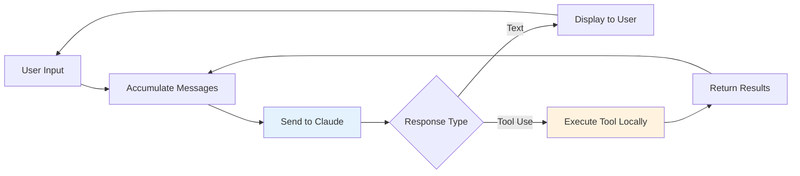
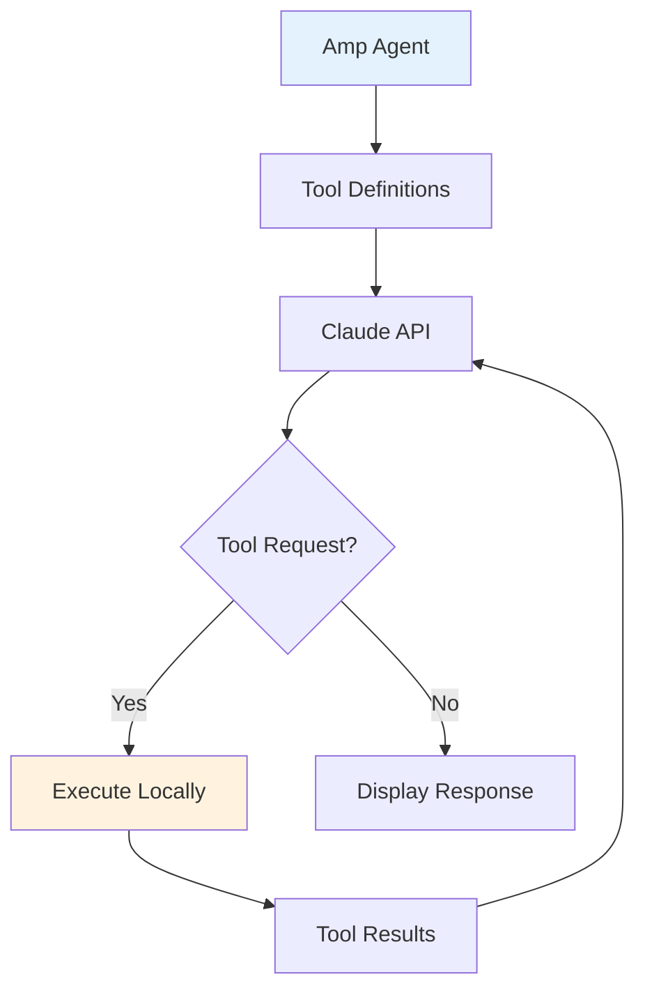

---
tags:
  - "#tool"
  - "#coding-assistant"
  - "#amp"
  - "#cli"
  - "#open-source"
date: 2025-12-01
status: published
last_updated: 2025-12-01
---

# Amp - AI-Augmented Coding CLI

An open-source, terminal-based coding assistant built by a small team at Sourcegraph. Amp emphasizes transparency, simplicity, and the philosophy that "there is no moat" - agent technology is accessible to all developers.

> **Philosophy:** "It's an LLM, a loop, and enough tokens. There isn't a secret." - Amp Team

---

## Overview

**Developer:** Sourcegraph (6-person team)
**Type:** Command-line coding assistant
**Model:** Claude 3.7+ Sonnet (and other LLMs)
**License:** Open Source
**Interface:** Terminal/CLI
**Philosophy:** Transparent architecture, demystified agent technology

**Key Differentiator:** Amp openly demonstrates that impressive coding assistants require surprisingly little code (~400 lines for core functionality), positioning itself as both a production tool and an educational resource.

---

## Core Features

### Terminal-Native Experience

- **CLI-First Design:** Built for developers who live in the terminal
- **Session Management:** Persistent conversations across terminal sessions
- **Git Integration:** Understands repository context and version control
- **Fast Execution:** Optimized for quick interactions and tool execution

### The Five Agent Primitives

Amp implements the fundamental tools that power coding agents:

1. **Read Tool** - Import file contents into context
2. **List Tool** - Navigate file system and discover code structure
3. **Edit Tool** - Modify files via string replacement
4. **Bash Tool** - Execute shell commands and run tests
5. **Search Tool** - Find patterns across codebase using ripgrep

**Simplicity Principle:** These 5 tools provide all necessary capabilities. Complex functionality emerges from tool combination, not tool proliferation.

### Multi-Model Support

- Primary: Claude 3.7 Sonnet (optimized for agentic workflows)
- Support for other Anthropic models
- Extensible architecture for additional LLM providers

### Context Awareness

- **Project Context:** Reads configuration files (e.g., AMP.md)
- **Git Context:** Understands current branch, changes, commit history
- **Conversation History:** Maintains context across interactions
- **Smart Context Management:** Optimizes token usage for large codebases

---

## Architecture

### The Core Loop

Amp's architecture demonstrates the fundamental simplicity of coding agents:



**Key Insight:** ~400 lines of code for core functionality, proving that agent sophistication comes from LLM capability and tool design, not complex algorithms.

### Tool System



**Tool Execution:**
- Defined with JSON schemas
- Executed in local environment
- Results returned to Claude as conversation context
- No server-side execution required

### Conversation State Management

```json
{
  "messages": [
    {"role": "user", "content": "List Python files"},
    {"role": "assistant", "content": [{"type": "tool_use", "name": "list_files"}]},
    {"role": "user", "content": [{"type": "tool_result", "content": "main.py\nutils.py"}]},
    {"role": "assistant", "content": "You have 2 Python files: main.py and utils.py"}
  ]
}
```

**State is Local:** Complete conversation history maintained on client side, sent with each API call.

---

## Getting Started

### Installation

```bash
# Install Amp (check official repository for latest instructions)
# Example installation:
brew install amp  # macOS
# or
cargo install amp  # Via Rust cargo
# or
git clone https://github.com/sourcegraph/amp && cd amp && make install
```

### Configuration

Create `AMP.md` in your project root:

```markdown
# Project: MyApp

## Tech Stack
- Language: TypeScript
- Framework: Next.js
- Testing: Jest
- Build: Turbo

## Common Commands
- Test: `npm test`
- Build: `npm run build`
- Lint: `npm run lint`
- Dev: `npm run dev`

## Code Conventions
- Use functional components with hooks
- Prefer named exports
- Test files: `*.test.ts`
- API routes: `/app/api/`

## Project Structure
- `/app` - Next.js app router pages
- `/components` - Reusable React components
- `/lib` - Utility functions
- `/types` - TypeScript type definitions
```

### First Session

```bash
# Start Amp in your project directory
cd ~/projects/myapp
amp

# Amp loads context from AMP.md and git repository
```

**Example Interaction:**
```
You: What's the project structure?

Amp: [Uses list_files tool]
Based on the directory structure, this is a Next.js project with:
- app/ - App router pages and API routes
- components/ - React components
- lib/ - Utilities
- types/ - TypeScript definitions

The AMP.md indicates you're using TypeScript, Jest for testing, and Turbo for builds.

You: Add input validation to the /api/users endpoint

Amp: [Workflow]
1. [Reads app/api/users/route.ts]
2. [Searches for existing validation patterns]
3. [Edits file to add validation]
4. [Runs: npm test]
5. Reports success or any test failures
```

---

## Use Cases

### Daily Development

**Best For:**
- Feature implementation
- Bug fixing
- Refactoring code
- Writing tests
- Code exploration

**Workflow:**
```bash
amp
> "Add JWT authentication middleware"
> "Write tests for the new auth middleware"
> "Run the test suite and fix any failures"
```

### Code Review

```bash
amp
> "Review the changes in src/auth.ts for security issues"
> "Check if error handling is comprehensive"
```

### Learning Codebases

```bash
amp
> "Explain how authentication works in this project"
> "Where are database queries defined?"
> "Show me the API endpoint for user registration"
```

### Test-Driven Development

```bash
amp
> "Write failing tests for user registration validation"
> "Now implement the validation to pass those tests"
> "Verify all tests pass"
```

---

## Comparison with Other Tools

| Feature | Amp | [[Claude Code]] | [[Aider|Aider]] | Cursor |
|---------|-----|---------|-------|--------|
| **Interface** | Terminal | Terminal | Terminal | IDE |
| **Primary Model** | Claude 3.7+ | Claude 4.5 | User choice | GPT-4o/Claude |
| **Philosophy** | Transparent | Agentic | Git-centric | Hybrid |
| **Open Source** | ✅ Yes | ❌ No | ✅ Yes | ❌ No |
| **Pricing** | Free + API | $20/month | Free + API | $20/month |
| **Git Integration** | ⭐⭐⭐⭐ | ⭐⭐⭐⭐ | ⭐⭐⭐⭐⭐ | ⭐⭐⭐⭐ |
| **Multi-file Editing** | ⭐⭐⭐⭐ | ⭐⭐⭐⭐⭐ | ⭐⭐⭐⭐ | ⭐⭐⭐⭐ |
| **Editor Integration** | ❌ | ✅ (VS Code) | ❌ | ✅ (Native) |
| **Autocomplete** | ❌ | ❌ | ❌ | ✅ |
| **Learning Curve** | ⭐⭐⭐ | ⭐⭐⭐ | ⭐⭐⭐ | ⭐⭐⭐⭐ |
| **Educational Value** | ⭐⭐⭐⭐⭐ | ⭐⭐⭐ | ⭐⭐⭐⭐ | ⭐⭐ |

### When to Choose Amp

**Choose Amp if:**
- You prefer terminal-based workflows
- You want to understand agent architecture
- Open source is important to you
- You want control over your API costs
- You value transparency over polish
- You're learning agent development

**Consider Alternatives if:**
- You need IDE integration and autocomplete → Cursor
- You want maximum autonomy and polish → Claude Code
- You need git-first workflows → Aider
- You want enterprise features → GitHub Copilot

---

## Strengths

### 1. Transparency

**Open Architecture:** Amp openly demonstrates that:
- Core agent functionality requires ~400 lines of code
- Impressive behavior comes from LLM + tools, not magic
- Agent development is accessible to all developers

**Educational Value:** Understanding Amp helps you understand all coding agents.

### 2. Simplicity

**Minimal Tool Set:** 5 primitives provide complete functionality
- No tool bloat
- Easy to understand
- Efficient token usage

**Clean Design:** Straightforward architecture makes debugging and customization easy.

### 3. Terminal-Native

**For CLI Power Users:**
- Fast interactions
- Scriptable
- Integrates with existing terminal workflows
- No context switching to IDE

### 4. Cost Control

**Open Source + API:**
- No subscription fees
- Pay only for API usage
- Use with any Anthropic API tier
- Full control over costs

### 5. Community-Driven

**Built by Developers for Developers:**
- Active community contributions
- Transparent development process
- Responsive to feedback
- Educational resources

---

## Limitations

### 1. No IDE Integration

**Trade-off:** Terminal-only means:
- No inline code suggestions
- No LSP diagnostics in real-time
- No visual code navigation
- Must switch between terminal and editor

**Workaround:** Use alongside your preferred editor.

### 2. Limited Polish

**Early Stage:**
- Fewer UX refinements than commercial tools
- Less sophisticated context management
- Fewer safety features
- More DIY approach

**Philosophy:** Prioritizes transparency and learning over polish.

### 3. No Autocomplete

**Terminal-Only:**
- No GitHub Copilot-style completions
- No inline suggestions while typing
- Requires explicit prompting

**Use Case:** Better for complete features than line-by-line coding.

### 4. Smaller Ecosystem

**Fewer Integrations:**
- No MCP support (yet)
- Limited third-party tools
- Smaller community than commercial alternatives

**Growing:** Active development and community contributions.

---

## Advanced Usage

### Context Optimization

**Project Context File:**
```markdown
# AMP.md

## Naming Conventions
- Use `user_service` not `userService` or `UserService`
- API endpoints: `/api/v1/resource`
- Test files: `*.test.ts`

## Testing
- Run specific test: `npm test -- path/to/test`
- Coverage: `npm run test:coverage`
- Always run tests after changes

## Architecture
- Service layer: `src/services/`
- Data models: `src/models/`
- Controllers: `src/controllers/`
```

**Why It Matters:** Consistent naming and clear commands help Claude work more effectively.

### Multi-Step Workflows

```bash
amp
> "Research how authentication is currently implemented,
   create a plan for adding OAuth support,
   then implement it with tests"
```

**Amp's Approach:**
1. Searches for auth-related code
2. Reads relevant files
3. Creates implementation plan
4. Writes tests (TDD approach)
5. Implements OAuth support
6. Runs tests and fixes issues

### Using with Multiple Terminals

**Pattern:** Different terminals for different contexts

```bash
# Terminal 1: Feature development
cd ~/project && amp
> "Implement user notifications feature"

# Terminal 2: Bug fixes
cd ~/project && amp
> "Fix the memory leak in the websocket handler"

# Terminal 3: Code review
cd ~/project && amp
> "Review the PR #123 changes"
```

**Benefit:** Independent conversation contexts for different tasks.

---

## Real-World Workflows

### Feature Implementation

```bash
You: Add rate limiting to the API endpoints

Amp:
1. [Searches for existing middleware patterns]
2. [Reads relevant middleware files]
3. [Searches for rate limiting libraries in package.json]
4. [Edits middleware to add rate limiting]
5. [Updates route configurations]
6. [Writes tests for rate limiting]
7. [Runs tests: npm test]
8. Reports: "Rate limiting added with Redis backend. Tests passing."
```

### Debugging Session

```bash
You: The server crashes when handling large file uploads

Amp:
1. [Searches for file upload handlers]
2. [Reads upload.ts:45-120]
3. [Identifies missing size validation]
4. [Checks memory allocation patterns]
5. Suggests: "Add max file size check and streaming upload"
6. [Implements fixes]
7. [Runs tests with large file mocks]
```

### Refactoring

```bash
You: Refactor user service to use dependency injection

Amp:
1. [Reads current UserService implementation]
2. [Searches for DI patterns in codebase]
3. [Creates interface definitions]
4. [Refactors service constructor]
5. [Updates all service instantiations]
6. [Modifies tests to use mocks]
7. [Verifies: npm test]
```

---

## Learning from Amp

### Educational Value

Amp serves dual purposes:
1. **Production Tool:** Real coding assistant for daily work
2. **Learning Resource:** Demonstrates agent architecture principles

**Study Amp to Understand:**
- How coding agents work fundamentally
- Tool system design patterns
- LLM conversation management
- Context optimization techniques

### Building Your Own Agent

Amp's architecture is intentionally transparent:

**Tutorial:** [[../../techniques/agents/building-coding-agents|Building Coding Agents from Scratch]]

**Workshop:** [[../../workshops/building-coding-agents-workshop|Building Coding Agents Workshop]]

**Key Lesson:** You can build a functioning coding agent in ~400 lines of code. Production tools add polish, not magic.

---

## Resources

**Official:**
- [Amp Website](https://ampcode.com)
- [Amp on GitHub](https://github.com/sourcegraph/amp) *(check for actual repository link)*
- [How to Build an Agent - Tutorial](https://ampcode.com/how-to-build-an-agent)

**Community:**
- [Amp Discord](https://discord.gg/amp) *(check for actual invite)*
- [GitHub Discussions](https://github.com/sourcegraph/amp/discussions)
- r/amp on Reddit

**Related Tools:**
- [[Claude Code|Claude Code]] - Commercial alternative with more polish
- [[Aider|Aider]] - Git-centric terminal assistant
- [[README#Coding Assistants Comparison|Coding Assistants Comparison]]

**Learning:**
- [[../../techniques/agents/building-coding-agents|Building Coding Agents Tutorial]]
- [[../../workshops/building-coding-agents-workshop|Hands-On Workshop]]
- [[../../techniques/context-engineering/context-engineering-coding-agents|Context Engineering Guide]]

---

## The Amp Philosophy

### "There Is No Moat"

**Core Belief:** Agent technology is not proprietary magic. The impressive capabilities of coding assistants come from:
- Modern LLMs (Claude, GPT-4)
- Simple tool execution loops
- Careful context management
- Engineering refinement

**Implication:** Any developer can build agent systems. The knowledge is accessible, the tools are available, the LLMs are commoditized.

### Transparency Over Secrecy

Unlike commercial tools that emphasize "secret sauce," Amp openly demonstrates:
- Exact architecture patterns
- Tool implementation details
- Context management strategies
- The surprising simplicity underneath

**Goal:** Democratize understanding of agent development.

### Community Over Competition

**Open Source Values:**
- Share knowledge freely
- Collaborate on improvements
- Help developers learn
- Build collective expertise

---

## Future Development

**Potential Roadmap:**
- MCP (Model Context Protocol) support
- Additional LLM provider integrations
- Enhanced context management features
- Sub-agent capabilities
- Memory/persistence across sessions
- Browser-based UI (optional)

**Community-Driven:** Features prioritized based on user needs and contributions.

---

## Related Concepts

- [[README|Coding Assistants Overview]]
- [[Claude Code|Claude Code]]
- [[Aider|Aider]]
- [[../../techniques/agents/agents - agentisation|Agents & Agentisation]]
- [[../../techniques/agents/building-coding-agents|Building Coding Agents Guide]]
- [[../../techniques/context-engineering/context-engineering-coding-agents|Context Engineering]]
- [[../../workshops/building-coding-agents-workshop|Building Agents Workshop]]

---

**Last Updated:** 2025-12-01
**Status:** Active Development
**Next Review:** 2026-03-01
**Team Size:** 6 people (Sourcegraph)

*Amp proves that impressive coding agents require surprisingly little code. By making architecture transparent, Amp empowers developers to understand, build, and customize their own agent systems.*

---

## Quick Reference

**Installation:** Check [GitHub repository](https://github.com/sourcegraph/amp)
**API Key:** Anthropic API key required
**Cost:** Free (pay for API usage)
**Interface:** Terminal/CLI
**Best For:** Learning agent architecture, terminal workflows, cost control
**Not Ideal For:** IDE integration, autocomplete, visual development

**One-Line Summary:** Open-source terminal coding assistant that demystifies agent technology by proving impressive functionality requires only ~400 lines of code plus a capable LLM.
