---
tags:
  - "#tool"
  - "#coding-assistant"
  - "#agentic"
  - "#anthropic"
---

# Claude Code

**Type:** Agentic AI Coding Assistant
**Developer:** Anthropic
**Model:** Claude Sonnet 4.5 / Opus 4.5
**Interface:** Command Line (CLI)
**Pricing:** $20/month (Pro), $200/month (Max)
**Philosophy:** Autonomous multi-step execution with human checkpoints

---

## Overview

Claude Code is Anthropic's official CLI tool that brings the power of Claude 4 Sonnet and Opus models directly to your development workflow. Unlike traditional autocomplete-style assistants, Claude Code operates as an autonomous agent capable of planning, executing, and verifying complex multi-file changes.

**Released:** 2024
**Major Update:** Claude Code 2.0 (September 2025)

---

## Architecture


---

## Key Features

### 1. Autonomous Capabilities

**Multi-File Code Generation**
- Simultaneously create and modify multiple files
- Cross-file refactoring with awareness of dependencies
- Intelligent file organization

**Autonomous Debugging**
- Investigate errors independently
- Analyze logs and stack traces
- Propose and test fixes
- Iterate until resolution

**Terminal Integration**
- Execute bash commands
- Run tests and build processes
- Monitor output and respond to failures
- Background command execution (Ctrl-b)

**Git Operations**
- Commit changes with intelligent messages
- Create branches and pull requests
- Review diffs and conflicts
- GitHub integration (beta) - respond to PR feedback

### 2. Checkpoint System (New in 2.0)

**Automatic State Saves**
- Saves before each major change
- Transparent, no manual intervention

**Instant Rollback**
- `/rewind` command or double-Esc
- Return to any previous state
- Safe experimentation environment

**Use Cases:**
- Try different approaches without risk
- Quick recovery from mistakes
- A/B testing implementations

### 3. Subagent Architecture (New in 2.0)

**Parallel Development**
```
Main Agent: "Build a full-stack app"
  ├─ Subagent 1: Backend API development
  ├─ Subagent 2: Frontend UI implementation
  └─ Subagent 3: Database schema setup
```

**Specialized Agents:**
- **Explore Agent** - Codebase navigation and understanding
- **Plan Agent** - Architecture planning before implementation
- **Custom Agents** - Define your own specialized agents

**Benefits:**
- Faster development (parallel work)
- Specialized expertise per task
- Better separation of concerns

### 4. Customization

**Custom Slash Commands**
```bash
# Create .claude/commands/ directory
.claude/
  └─ commands/
      ├─ review.md      # /review command
      ├─ docs.md        # /docs command
      └─ test.md        # /test command
```

**Example Command (`review.md`):**
```markdown
Perform a code review checklist:
- Security vulnerabilities
- Error handling
- Edge cases
- Performance issues
- Code style consistency
- Test coverage
```

**Hooks**
- Event-driven automation
- Execute commands on tool calls
- Integrate with CI/CD

**Status Line Customization**
- Add terminal prompt to Claude Code
- `/statusline` command
- Show git branch, directory, etc.

### 5. MCP Integration

**Native Support** for Model Context Protocol:
- Connect to databases
- Access external APIs
- File system integration
- Custom MCP servers

**Benefits:**
- Standardized tool access
- Security-controlled permissions
- Extensible architecture

### 6. Advanced Context Management

**Large Context Window**
- 200k tokens (Claude Sonnet 4.5)
- 1M tokens capable (Claude 4 architecture)
- Entire codebase understanding

**Intelligent Selection**
- Automatically identifies relevant files
- Prioritizes context by relevance
- Maintains conversation history

---

## Workflow

```mermaid
sequenceDiagram
    participant Dev as Developer
    participant CC as Claude Code
    participant Agent as Claude Agent
    participant Tools as Tool System
    participant Code as Codebase

    Dev->>CC: "Add user authentication"
    CC->>Agent: Parse intent
    Agent->>Agent: Plan multi-step approach
    Agent->>Tools: Read current auth files
    Tools->>Code: Fetch files
    Code->>Tools: Return content
    Tools->>Agent: Provide context

    Note over Agent: Create checkpoint

    Agent->>Agent: Generate implementation plan
    Agent->>CC: Present plan to developer
    CC->>Dev: Show plan + ask confirmation

    Dev->>CC: Approve ✓
    CC->>Agent: Execute plan

    par Subagent 1
        Agent->>Tools: Create auth middleware
    and Subagent 2
        Agent->>Tools: Update user routes
    and Subagent 3
        Agent->>Tools: Add JWT utilities
    end

    Tools->>Code: Apply changes
    Agent->>Tools: Run tests
    Tools->>Agent: Test results

    alt Tests Pass
        Agent->>CC: Success ✓
        CC->>Dev: Changes complete
    else Tests Fail
        Agent->>Agent: Debug issues
        Agent->>Tools: Fix and retry
    end
```



---

## Claude Code 2.0 Features (September 2025)

### New Capabilities

**Checkpoints** ⭐ Most Requested Feature
- Automatic state saves before each change
- Instant rollback with `/rewind` or double-Esc
- Safe experimentation environment

**Subagents** ⭐ Parallel Development
- Delegate specialized tasks to subagents
- Frontend + Backend simultaneous development
- Faster feature implementation

**Background Commands** (Ctrl-b)
- Run long-running commands in background
- Dev servers, log tailing, builds
- Continue working while commands run

**Custom Slash Commands**
- Markdown files → slash commands
- Team standardization
- Workflow automation

**GitHub Integration (Beta)**
- Tag Claude Code on PRs
- Respond to reviewer feedback
- Fix CI errors automatically
- Modify code based on comments

**Claude Agent SDK**
- Build custom tools using Claude Code infrastructure
- Access core tool systems
- Context management APIs
- Permissions framework

### Enhanced Capabilities

**Refreshed Terminal Interface**
- Improved status visibility
- Searchable prompt history (Ctrl+r)
- Better error messages

**Four New API Capabilities**
- Code execution tool
- MCP connector
- Files API
- Prompt caching (1 hour)

---

## Use Cases

### Ideal For

**Feature Development**
```
Example: "Add pagination to the products API"
Claude Code will:
1. Read existing API endpoints
2. Design pagination strategy
3. Modify controller, service, and routes
4. Add tests
5. Update documentation
6. Verify with test runs
```

**Large-Scale Refactoring**
```
Example: "Migrate from Class components to Hooks"
Claude Code will:
1. Identify all Class components
2. Plan migration strategy
3. Convert components one by one
4. Update imports and dependencies
5. Run tests after each change
6. Handle edge cases
```

**Code Migration**
```
Example: "Upgrade from Express 4 to Express 5"
Claude Code will:
1. Analyze breaking changes
2. Update package.json
3. Modify affected code
4. Update middleware
5. Fix deprecated APIs
6. Verify functionality
```

**Autonomous Debugging**
```
Example: "The checkout process fails intermittently"
Claude Code will:
1. Analyze error logs
2. Read relevant code
3. Identify potential causes
4. Propose fixes
5. Test solutions
6. Verify resolution
```

**Learning Codebases**
```
Example: "Explain how authentication works in this app"
Uses Explore agent to:
1. Find auth-related files
2. Map authentication flow
3. Identify dependencies
4. Explain patterns used
4. Provide visual diagrams
```

---

## Best Practices

> **📚 For comprehensive best practices guide, see:** [[Claude Code Best Practices]]

### Quick Tips

**Effective Prompting:**
- Be specific and detailed
- Provide context and examples
- Set clear expectations
- Use "think" for complex problems

**Workflow Optimization:**
- Follow Explore-Plan-Code-Commit pattern
- Use subagents for parallel work
- Leverage checkpoints for experimentation
- Clear context between unrelated tasks

**Code Quality:**
- Always review AI-generated code
- Test thoroughly
- Check for security issues
- Verify edge cases

**Team Integration:**
- Share CLAUDE.md files with project conventions
- Create custom slash commands for common workflows
- Use hooks for automation
- Establish code review standards

### Essential Patterns

**Explore-Plan-Code-Commit:**
```bash
# 1. Explore
> "Read the auth module and explain how it works"

# 2. Plan
> "Think about adding OAuth. Create a detailed plan."

# 3. Code
> "Implement the OAuth plan"

# 4. Commit
> "Commit these changes"
```

**Test-Driven Development:**
```bash
# 1. Write tests first
> "Write tests for user registration validation"

# 2. Confirm failure
> "Run tests and confirm they fail"

# 3. Implement
> "Implement to pass the tests"

# 4. Verify
> "Use a subagent to verify implementation"
```

**Subagent Verification:**
```bash
# Preserve main context while researching
> "Use a subagent to investigate the database schema"
```

For detailed examples, workflows, and advanced patterns, see [[Claude Code Best Practices]].

---

## Comparison with Alternatives

| Feature | Claude Code | GitHub Copilot | Cursor | Windsurf |
|---------|-------------|----------------|--------|----------|
| **Autonomy** | ⭐⭐⭐⭐⭐ | ⭐⭐ | ⭐⭐⭐⭐ | ⭐⭐⭐⭐⭐ |
| **Multi-file** | ⭐⭐⭐⭐⭐ | ⭐⭐ | ⭐⭐⭐⭐ | ⭐⭐⭐⭐⭐ |
| **Autocomplete** | ❌ | ⭐⭐⭐⭐⭐ | ⭐⭐⭐⭐⭐ | ⭐⭐⭐⭐ |
| **Checkpoints** | ⭐⭐⭐⭐⭐ | ❌ | ⭐⭐⭐ | ⭐⭐⭐ |
| **MCP** | ⭐⭐⭐⭐⭐ | ❌ | ⭐⭐⭐ | ⭐⭐⭐ |
| **Customization** | ⭐⭐⭐⭐⭐ | ⭐⭐ | ⭐⭐⭐⭐ | ⭐⭐⭐ |
| **Interface** | CLI | IDE Plugin | IDE Fork | IDE Fork |
| **Learning Curve** | ⭐⭐⭐ | ⭐⭐⭐⭐⭐ | ⭐⭐⭐⭐ | ⭐⭐⭐ |

**When to Choose Claude Code:**
- Complex feature development
- Large-scale refactoring
- Autonomous debugging needed
- Terminal-centric workflow
- Need MCP integrations
- Want checkpointing safety

**When NOT to Choose Claude Code:**
- Just need autocomplete
- Prefer IDE-integrated experience
- Want minimal learning curve
- Need real-time suggestions while typing

---

## Installation & Setup

### Prerequisites
- Node.js 18+
- Terminal access
- Anthropic API key

### Installation

```bash
# Install globally via npm
npm install -g @anthropic/claude-code

# Initialize in project
claude-code init
```

### Configuration

```bash
# Set API key
export ANTHROPIC_API_KEY=your_key_here

# Or create .env file
echo "ANTHROPIC_API_KEY=your_key" > .env
```

### First Run

```bash
# Start Claude Code
claude-code

# Or in specific directory
cd /path/to/project
claude-code
```

---

## Advanced Features

### Subagent Usage

```bash
# Claude Code automatically uses subagents for parallel tasks
> "Build a REST API with React frontend"

# Claude spawns:
# - Backend subagent: Express API setup
# - Frontend subagent: React app creation
# - Test subagent: Integration tests
```

### MCP Server Integration

```bash
# Configure MCP server in .claude/mcp.json
{
  "mcpServers": {
    "database": {
      "command": "node",
      "args": ["./mcp-server/database.js"]
    }
  }
}
```

### Custom Hooks

```bash
# .claude/hooks.json
{
  "onToolCall": {
    "bash": ["echo 'Command executed' >> .claude/log.txt"]
  }
}
```

---

## Pricing

| Plan | Price | Features |
|------|-------|----------|
| **Free** | $0 | Limited usage, Claude Sonnet |
| **Pro** | $20/month | Unlimited usage, Sonnet 4.5, priority |
| **Max** | $200/month | Extended thinking, Opus 4.5, highest priority |
| **Enterprise** | Custom | Team features, SLA, dedicated support |

**Comparison:**
- GitHub Copilot: $10-21/month
- Cursor: $20/month
- Windsurf: $15-30/month

---

## Resources

**Official:**
- [Claude Code Website](https://claudecode.com)
- [Documentation](https://docs.claude.com/claude-code)
- [Claude Agent SDK](https://github.com/anthropics/claude-agent-sdk)
- [MCP Documentation](https://modelcontextprotocol.io)

**Community:**
- [Claude Code Discord](https://discord.gg/claude-code)
- [GitHub Discussions](https://github.com/anthropics/claude-code/discussions)
- [r/ClaudeAI Subreddit](https://reddit.com/r/ClaudeAI)

**Learning:**
- [[workshops/Coding Assistants Workshop - Plan|Coding Assistants Workshop]]
- [[tools/coding-assistants/README|Coding Assistants Comparison]]
- [[agents - agentisation|Agent Architectures]]

**News:**
- [Claude Code Changelog](https://claudelog.com/claude-code-changelog/)
- [Anthropic Blog](https://www.anthropic.com/news)

---

## Related Concepts

- [[models/Claude 4 Sonnet|Claude 4 Sonnet]] - Underlying model
- [[MCP|Model Context Protocol]] - Integration protocol
- [[agents - agentisation|Agents]] - Agent architecture
- [[tools/coding-assistants/README|Coding Assistants Overview]]

---

**Last Updated:** 2025-11-30
**Version:** Claude Code 2.0
**Next Review:** 2025-12-31

---

*Claude Code represents the future of AI-assisted development: autonomous yet supervised, powerful yet safe, complex yet intuitive.*
