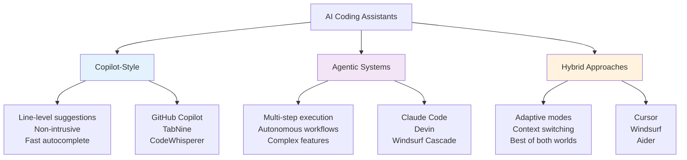
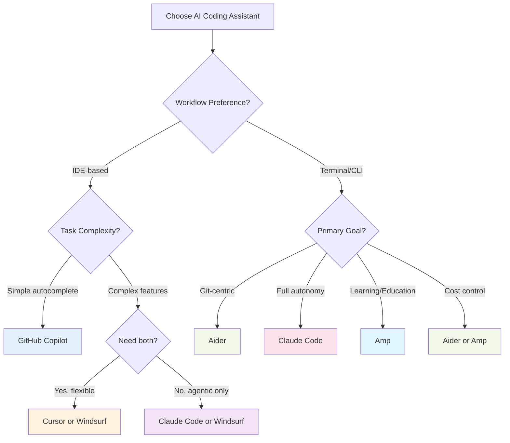

---
tags:
  - "#tool"
  - "#coding-assistant"
  - "#comparison"
---

# AI Coding Assistants - Overview & Comparison

AI coding assistants have evolved from simple autocomplete tools to sophisticated autonomous agents capable of multi-file code generation, debugging, and even project-wide refactoring. This guide helps you choose the right tool for your needs.

---

## Tool Categories



---

## Detailed Comparison Matrix

### Feature Comparison

| Feature | Claude Code | GitHub Copilot | Cursor | Windsurf | Aider | Amp |
|---------|-------------|----------------|--------|----------|-------|-----|
| **Philosophy** | Agentic | Copilot | Hybrid | Hybrid | Agentic | Transparent/Educational |
| **Primary Model** | Claude Sonnet 4.5/Opus 4.5 | GPT-4o, Claude Opus 4.5 | GPT-4o, Claude, Proprietary | SWE-1.5, Claude | User's choice | Claude 3.7+ Sonnet |
| **Interface** | CLI | IDE Plugin | IDE (VS Code fork) | IDE (VS Code fork) | Terminal | Terminal |
| **Multi-file Editing** | ⭐⭐⭐⭐⭐ Excellent | ⭐⭐ Limited | ⭐⭐⭐⭐ Very Good | ⭐⭐⭐⭐⭐ Excellent | ⭐⭐⭐⭐ Very Good | ⭐⭐⭐⭐ Very Good |
| **Autocomplete** | ❌ No | ⭐⭐⭐⭐⭐ Excellent | ⭐⭐⭐⭐⭐ Excellent | ⭐⭐⭐⭐ Very Good | ❌ No | ❌ No |
| **Autonomous Debugging** | ⭐⭐⭐⭐⭐ Excellent | ⭐⭐ Manual assist | ⭐⭐⭐⭐ Agent mode | ⭐⭐⭐⭐⭐ Excellent | ⭐⭐⭐⭐ Very Good | ⭐⭐⭐⭐ Very Good |
| **Terminal Integration** | ⭐⭐⭐⭐⭐ Native | ❌ No | ⭐⭐⭐ Limited | ⭐⭐⭐⭐ Good | ⭐⭐⭐⭐⭐ Native | ⭐⭐⭐⭐⭐ Native |
| **Git Integration** | ⭐⭐⭐⭐ Good | ⭐⭐⭐ Good | ⭐⭐⭐⭐ Very Good | ⭐⭐⭐⭐ Very Good | ⭐⭐⭐⭐⭐ Excellent | ⭐⭐⭐⭐ Good |
| **Checkpoints/Rollback** | ⭐⭐⭐⭐⭐ Built-in | ❌ No | ⭐⭐⭐ Manual | ⭐⭐⭐ Limited | ⭐⭐⭐⭐ Git-based | ⭐⭐ Basic |
| **Customization** | ⭐⭐⭐⭐⭐ Slash commands, hooks | ⭐⭐ Settings | ⭐⭐⭐⭐ Extensions | ⭐⭐⭐ Configuration | ⭐⭐⭐ Config file | ⭐⭐⭐ Config file |
| **MCP Support** | ⭐⭐⭐⭐⭐ Native | ❌ Coming | ⭐⭐⭐ Via extensions | ⭐⭐⭐ Limited | ❌ No | ❌ Planned |
| **Learning Curve** | ⭐⭐⭐ Moderate | ⭐⭐⭐⭐⭐ Easy | ⭐⭐⭐⭐ Easy | ⭐⭐⭐ Moderate | ⭐⭐⭐ Moderate | ⭐⭐⭐ Moderate |
| **Open Source** | ❌ No | ❌ No | ❌ No | ❌ No | ✅ Yes | ✅ Yes |
| **Educational Value** | ⭐⭐⭐ Good | ⭐⭐ Basic | ⭐⭐ Basic | ⭐⭐ Basic | ⭐⭐⭐⭐ Very Good | ⭐⭐⭐⭐⭐ Excellent |
| **Pricing** | $20/month Pro | $10-21/month | $20/month Pro | $15/month Pro | Free + API costs | Free + API costs |

### Capability Comparison

| Capability | Best Choice | Runner-up | Notes |
|------------|-------------|-----------|-------|
| **Quick Autocomplete** | GitHub Copilot | Cursor | Fastest, most mature |
| **Feature Development** | Claude Code | Windsurf | Multi-file autonomous work |
| **Large Refactoring** | Claude Code | Windsurf | Codebase-wide changes |
| **Debugging Complex Issues** | Claude Code | Windsurf Cascade | Autonomous investigation |
| **Learning New APIs** | Cursor | GitHub Copilot | Interactive + fast |
| **Terminal Workflow** | Aider | Amp | Git-aware, CLI-native |
| **Learning Agent Architecture** | Amp | Aider | Transparent, educational |
| **Open Source / Cost Control** | Aider | Amp | API costs only |
| **Team Collaboration** | Cursor | Windsurf | IDE integration, sharing |
| **Code Migration** | Claude Code | GitHub Copilot (Opus 4.5) | Large-scale transformations |

---

## Detailed Tool Profiles

### [[Claude Code]]

**Philosophy:** Autonomous agentic coding assistant
**Best For:** Complex features, large refactors, autonomous debugging

**Key Features:**
- Checkpointing system for safe experimentation
- Subagents for parallel development
- Native MCP integration
- Custom slash commands and hooks
- Background command execution
- GitHub integration (beta)

**Ideal Use Cases:**
- Implementing new features across multiple files
- Large-scale code migrations (e.g., API version updates)
- Debugging complex issues autonomously
- Codebase refactoring
- Learning unfamiliar codebases

**Pricing:** $20/month (Pro), $200/month (Max)

---

### GitHub Copilot

**Philosophy:** IDE-first autocomplete with AI assistance
**Best For:** Daily coding, autocomplete, learning APIs

**Key Features:**
- Excellent inline suggestions
- Context-aware completions
- Chat interface for questions
- Multiple model support (GPT-4o, Claude Opus 4.5)
- Wide IDE support
- Enterprise features

**Ideal Use Cases:**
- Writing boilerplate code
- Quick function implementations
- Learning framework syntax
- Code completion while typing
- Getting unstuck with suggestions

**Pricing:** $10/month (Individual), $21/month (Business)

**Latest:** Now supports Claude Opus 4.5 for agentic workflows (Nov 2025)

---

### Cursor

**Philosophy:** Hybrid - autocomplete + agent mode
**Best For:** Developers wanting flexibility between modes

**Key Features:**
- Fast autocomplete (Cursor Tab)
- Agent mode (Composer) for multi-file changes
- Proprietary Composer model
- VS Code fork with AI-first design
- Chat with codebase
- Privacy mode

**Ideal Use Cases:**
- Daily development with quick autocomplete
- Switching to agent mode for complex tasks
- Developers familiar with VS Code
- Teams wanting single tool for both approaches

**Pricing:** $20/month (Pro)

**Note:** Recently found using Chinese AI models (Z.ai) alongside proprietary models

---

### Windsurf

**Philosophy:** Fast agentic coding with semantic understanding
**Best For:** Quick agentic workflows with team features

**Key Features:**
- Cascade mode for autonomous development
- SWE-1.5 model (13x faster than Sonnet 4.5)
- Fast Context for codebase understanding
- AI-powered Codemaps
- Cascade 2.0 coming (multi-agent collaboration)

**Ideal Use Cases:**
- Fast feature development
- Teams needing collaboration features
- Projects requiring semantic code navigation
- Performance-critical development workflows

**Pricing:** $15/month (Pro), $30/month (Team)

**Developer:** Now by Cognition (creators of Devin)

---

### Aider

**Philosophy:** Terminal-based AI pair programming
**Best For:** CLI workflows, git-aware coding

**Key Features:**
- Git-native (understands diffs, commits)
- Model-agnostic (use any LLM)
- Edit files in-place
- Automatic git commits
- Chat about code
- Architect mode for planning

**Ideal Use Cases:**
- Developers preferring terminal workflows
- Git-heavy workflows
- Using custom/local models
- Scripting and automation
- Cost optimization (use cheaper models)

**Pricing:** Free (pay for API usage)

---

### [[Amp]]

**Philosophy:** Transparent architecture, educational focus
**Best For:** Learning agent development, terminal workflows, cost control

**Key Features:**
- Open-source codebase (~400 lines core)
- 5 fundamental primitives (read, list, edit, bash, search)
- Transparent "no moat" approach
- Terminal-native experience
- Claude 3.7+ Sonnet optimized
- Educational resources and tutorials

**Ideal Use Cases:**
- Learning how coding agents work internally
- Understanding agent architecture patterns
- Terminal-based development workflows
- Cost-conscious development (API-only pricing)
- Building custom agents based on proven patterns
- Teaching agent development concepts

**Pricing:** Free (pay for API usage)

**Unique Value:** Amp serves dual purposes as both a production tool and educational resource, openly demonstrating that coding agent "magic" is actually ~400 lines of well-designed code plus a capable LLM.

---

## Decision Tree



**Quick Selection Guide:**

1. **"I want fast autocomplete while I code"** → GitHub Copilot or Cursor
2. **"I need AI to implement entire features"** → Claude Code or Windsurf
3. **"I want both autocomplete AND agents"** → Cursor or Windsurf
4. **"I live in the terminal"** → Aider, Claude Code, or Amp
5. **"I need maximum autonomy for debugging"** → Claude Code
6. **"I want the fastest agentic tool"** → Windsurf
7. **"I need enterprise/team features"** → GitHub Copilot or Windsurf
8. **"I want to learn how agents work"** → Amp
9. **"I need open source with minimal cost"** → Aider or Amp
10. **"I want to build my own agent"** → Study Amp, then customize

---

## Latest Developments (November 2025)

### Major Announcements

**Claude Opus 4.5 in GitHub Copilot** (Nov 24, 2025)
- Available for Pro, Business, Enterprise users
- Excels at agentic workflows
- 50% reduction in token usage
- Ideal for code migration and refactoring

**GitHub AgentHQ Platform**
- Create custom AI agents within GitHub
- VS Code Plan Mode generally available
- Custom agents via AGENTS.md file

**Claude Code 2.0** (September 2025)
- Checkpoints for instant rollback
- Subagents for parallel development
- Background commands (Ctrl-b)
- Custom slash commands
- GitHub PR integration (beta)
- Claude Agent SDK released

**Cursor vs Windsurf Competition**
- Both released proprietary models
- Surprising discovery: Both using Chinese AI (Z.ai)
- Active feature competition
- Windsurf Cascade 2.0 coming with multi-agent collaboration

---

## Pricing Comparison

| Tool | Free Tier | Pro/Individual | Team/Business | Enterprise |
|------|-----------|----------------|---------------|------------|
| **Claude Code** | Limited | $20/month | - | Custom |
| **GitHub Copilot** | ❌ | $10/month | $21/month | Custom |
| **Cursor** | Yes (limited) | $20/month | - | Custom |
| **Windsurf** | Yes (limited) | $15/month | $30/month | Custom |
| **Aider** | ✅ Free | - | - | - |
| **Amp** | ✅ Free | - | - | - |

**Note:** Aider and Amp are free open-source software, but you pay for API usage (e.g., Anthropic, OpenAI). Typical costs: $5-20/month depending on usage.

---

## Best Practices Across Tools

### Effective Prompting

**Good Prompts:**
```
✓ "Add JWT authentication middleware to protect /api routes"
✓ "Refactor UserService to use dependency injection pattern"
✓ "Debug why the database connection times out after 30 seconds"
✓ "Migrate from React Class components to functional components with hooks"
```

**Poor Prompts:**
```
✗ "Fix this"
✗ "Make it better"
✗ "Add auth"
✗ "Optimize"
```

### Code Review Checklist

When using any AI coding assistant:
- [ ] Understand every line of generated code
- [ ] Check for security vulnerabilities
- [ ] Verify error handling
- [ ] Test edge cases
- [ ] Review performance implications
- [ ] Ensure code style consistency
- [ ] Validate documentation accuracy
- [ ] Run tests (don't just trust AI's test results)

### When to Use AI Assistants

**Good Use Cases:**
- ✅ Boilerplate generation
- ✅ Test writing
- ✅ Documentation
- ✅ Code refactoring
- ✅ API migrations
- ✅ Learning new frameworks

**Exercise Caution:**
- ⚠️ Security-critical code
- ⚠️ Complex business logic
- ⚠️ Performance-critical sections
- ⚠️ Code you don't fully understand

---

## Resources

**Tool Documentation:**
- [Claude Code Docs](https://claudecode.com)
- [GitHub Copilot Docs](https://docs.github.com/copilot)
- [Cursor Docs](https://cursor.sh/docs)
- [Windsurf Docs](https://windsurf.com/docs)
- [Aider Docs](https://aider.chat/docs)

**Comparison Articles:**
- [Claude Code vs GitHub Copilot 2025](https://skywork.ai/blog/claude-code-vs-github-copilot-2025-comparison/)
- [Windsurf vs Cursor Comparison](https://www.qodo.ai/blog/windsurf-vs-cursor/)
- [AI Coding Assistants Battle 2025](https://dev.to/bakhat_yar_016451bb6f3b86/ai-coding-assistants-battle-2025-github-copilots-raptor-mini-vs-claude-code-vs-cursor-composer-4n87)

**Community:**
- Claude Code Discord
- GitHub Copilot Community
- r/ClaudeAI, r/Cursor

---

## Related Concepts

- [[MCP|Model Context Protocol]] - Standardized AI-tool integration
- [[agents - agentisation|Agents & Agentisation]] - Agent architectures
- [[llm engineering/models|AI Models]] - Understanding underlying models
- [[workshops/Coding Assistants Workshop - Plan|Coding Assistants Workshop]] - Hands-on learning

---

**Last Updated:** 2025-11-30
**Next Review:** 2025-12-31

*This comparison is based on publicly available information as of November 2025. Features and pricing may change.*
