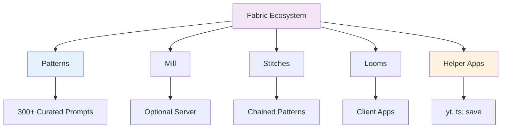

---
tags:
  - "#tool"
  - "#prompt-engineering"
  - "#cli"
  - "#patterns"
---

# Fabric - AI Prompt Management Framework

**Developer:** Daniel Miessler
**Type:** Open-source CLI framework
**License:** MIT
**Release:** Early 2024
**Philosophy:** Human augmentation through modular, reusable AI prompts

---

## Overview

Fabric is an open-source framework designed to augment human capabilities by solving AI's **integration challenge** rather than capability limitations. Created by cybersecurity expert Daniel Miessler, Fabric recognizes that while thousands of AI tools exist, meaningfully integrating them into daily workflows remains difficult.

**Core Philosophy:**
> "AI isn't a thing; it's a magnifier of human creativity."

Fabric solves this by providing a **modular framework for solving specific problems using a crowdsourced set of AI prompts (called Patterns)** that can be used anywhere.

---

## Key Concepts

### The Fabric Ecosystem (Textile Theme)



**Components:**

1. **Patterns** - Curated, task-specific prompts (the core value)
2. **Mill** - Optional server hosting patterns
3. **Stitches** - Chained patterns for advanced workflows
4. **Looms** - Client-side apps calling specific patterns
5. **Helper Apps** - Utilities like `yt` (YouTube), `ts` (transcribe), `save`

---

## Architecture & Design

### Pattern System

Patterns are **Markdown-based prompt templates** organized by real-world tasks. Each pattern is highly detailed and focused on extracting the best possible answers from LLMs.

**Pattern Structure:**
```markdown
# IDENTITY and PURPOSE
[Role definition and purpose]

# GOALS
[What the pattern aims to achieve]

# STEPS
[Step-by-step instructions for the AI]

# OUTPUT
[Expected output format]

# POSITIVE EXAMPLES
[Examples of good outputs]

# NEGATIVE EXAMPLES
[Examples to avoid]

# OUTPUT INSTRUCTIONS
[Detailed formatting requirements]

# INPUT
INPUT:
```

### Problem-Solving Approach

Fabric addresses two key challenges:

1. **Tasks Too Big** → Break down into smaller tasks, apply individually to LLMs
2. **Too Many Prompts** → Centralize collection and integration into workflows

---

## Features

### Pattern Categories (300+ Patterns)

**Content Analysis:**
- `extract_wisdom` - Extract key insights from videos/articles
- `extract_ideas` - Pull out main ideas
- `extract_insights` - Deeper analysis
- `summarize` - General summarization
- `summarize_paper` - Academic paper summaries
- `get_wow_per_minute` - Rate content quality

**Writing & Creation:**
- `write_essay` - Generate essays from ideas
- `write_micro_essay` - Short-form essays
- `improve_writing` - Enhance existing content
- `improve_academic_writing` - Academic style improvements
- `tweet` - Create social media posts

**Prompt Engineering:**
- `improve_prompt` - Transform basic prompts into sophisticated ones
- `create_pattern` - Generate new custom patterns
- `suggest_pattern` - Recommend patterns for tasks

**Code & Technical:**
- `explain_code` - Code explanation
- `explain_docs` - Documentation clarification
- `explain_project` - Project overview
- `summarize_git_changes` - Git history summaries
- `summarize_pull-requests` - PR summaries

**Security & Hacking:**
- `create_stride_threat_model` - Threat modeling
- `create_security_update` - Security bulletins
- `write_hackerone_report` - Bug bounty reports
- `create_sigma_rules` - Security detection rules

**Analysis & Critique:**
- `rate_content` - Content quality rating
- `find_logical_fallacies` - Identify reasoning flaws
- `rate_ai_response` - Evaluate AI outputs
- `label_and_rate` - Categorize and assess

**Creative & Entertainment:**
- `extract_song_meaning` - Song interpretation
- `create_npc` - RPG character creation
- `summarize_rpg_session` - Game session recaps
- `recommend_artists` - Music recommendations

### Technical Capabilities

**Multi-Provider Support:**
- OpenAI (GPT-4, GPT-4o, GPT-3.5)
- Anthropic (Claude 3.5, Claude Opus 4.5)
- Google (Gemini)
- Azure OpenAI
- Perplexity
- GitHub Models (added Nov 2025)
- Local models via Ollama

**Additional Features:**
- Image generation
- Speech-to-text via OpenAI Whisper API
- Web search integration
- REST API and web interface
- Custom pattern directory support
- Per-pattern model configuration
- OAuth authentication
- Desktop notifications

### Helper Applications

**`yt` - YouTube Utility:**
```bash
yt --transcript https://youtu.be/VIDEO_ID
```
Extracts transcripts and metadata from YouTube videos

**`ts` - Transcription:**
Uses OpenAI Whisper API to transcribe audio files

**`save` - Pipeline Utility:**
"tee-like" utility for saving content while keeping output stream intact

---

## Installation & Setup

### Quick Install (Recommended)

```bash
# One-line installation
curl -fsSL https://raw.githubusercontent.com/danielmiessler/fabric/main/scripts/installer/install.sh | bash

# Setup Fabric
fabric --setup
```

### Alternative Installation Methods

**Package Managers:**
- Homebrew (macOS)
- AUR (Arch Linux)
- Winget (Windows)

**Docker:**
```bash
docker run -it danielmiessler/fabric
```

### Prerequisites

- Python 3.10+
- Linux or macOS (Windows via WSL)
- API keys for desired providers (optional with Ollama)

### Configuration

During `fabric --setup`, you'll configure:
- OpenAI API key
- Anthropic API key
- Google API key
- YouTube API key
- Pattern directories
- Default model selection

**Default Model:** GPT-4 Turbo (can be changed per-command)

---

## Usage Examples

### Example 1: Extract Wisdom from YouTube

```bash
# Get summary and key insights from a video
yt --transcript https://youtu.be/VIDEO_ID | fabric -sp extract_wisdom
```

**Output includes:**
- Summary
- Key ideas
- Insights
- Quotes
- Habits mentioned
- Facts
- References
- One-sentence takeaway
- Recommendations

### Example 2: Write Essay from Idea

```bash
echo "AI has killed the need for coding skills" | fabric -sp write_essay
```

Generates a coherent, publish-ready essay on the topic.

### Example 3: Improve Prompts

**Before:**
```bash
echo "Please critique this article. Highlight any inconsistencies,
unverified claims, and factual inaccuracies" | fabric -sp improve_prompt
```

**After:**
Generates a detailed, structured prompt with:
- Step-by-step instructions
- Specific categories to address
- Output format requirements
- Examples and guidance

### Example 4: Use Local Models

```bash
# List available models
fabric --listmodels

# Use specific model
echo "tell me about dogs" | fabric -m ollama/llama3:latest
```

### Example 5: Streaming Output

```bash
# Stream results in real-time
echo "Explain quantum computing" | fabric -sp explain_terms --stream
```

---

## Creating Custom Patterns

### Method 1: Modify Existing Pattern

```bash
# Patterns are stored at:
~/.config/fabric/patterns/

# Copy and modify
cp -r ~/.config/fabric/patterns/write_essay ~/.config/my_patterns/write_poem
# Edit ~/.config/my_patterns/write_poem/system.md

# Copy back to use
cp -a ~/.config/my_patterns/* ~/.config/fabric/patterns/
```

### Method 2: Generate Pattern with AI

```bash
echo "I want a pattern that will write poetry" | fabric -sp create_pattern
```

Creates a complete pattern structure you can customize further.

**Example Custom Pattern:**
```markdown
# IDENTITY and PURPOSE
You are an AI assistant tasked with composing poetry...

# OUTPUT FORMAT
- Output a full, publish-ready poem
- Use absolutely ZERO cliches or jargon
- Do not output warnings or notes

# INPUT:
INPUT:
```

---

## Integration Approaches

### 1. Command-Line Interface (CLI)

```bash
# Basic usage
fabric -sp PATTERN_NAME

# With specific model
fabric -m MODEL_NAME -sp PATTERN_NAME

# Streaming
fabric -sp PATTERN_NAME --stream
```

### 2. Shell Aliases

```bash
# Add to ~/.bashrc or ~/.zshrc
alias wisdom='fabric -sp extract_wisdom'
alias improve='fabric -sp improve_prompt'
alias essay='fabric -sp write_essay'

# Usage
yt --transcript VIDEO_URL | wisdom
```

### 3. REST API

Fabric provides a web-based REST API for application integration.

### 4. Pipeline Integration

```bash
# Combine with clipboard utilities
pbpaste | fabric -sp summarize | pbcopy

# Chain multiple operations
cat article.txt | fabric -sp extract_insights | fabric -sp write_essay
```

### 5. Linux Clipboard Setup

```bash
# Install xsel (Linux)
sudo apt install xsel

# Add to ~/.bashrc
alias pbcopy='xsel -b -i'
alias pbpaste='xsel -b -o'

# Test
echo 'hello world' | pbcopy
pbpaste
```

---

## Strengths & Benefits

### ✅ Advantages

1. **Command-Line Focused** - Streamlines task creation and pipelines
2. **300+ High-Quality Patterns** - Curated, detailed, production-ready prompts
3. **Extensibility** - Easy to create custom patterns
4. **Multi-Provider** - Works with any LLM provider
5. **Open Source** - MIT licensed, community-driven
6. **Active Development** - ~200 contributors, frequent updates
7. **Zero Learning Curve** - Use patterns immediately
8. **Markdown-Based** - Maximum readability and editability
9. **Helper Utilities** - YouTube, transcription, pipeline tools
10. **Local Model Support** - Works offline with Ollama
11. **Pipeline-Friendly** - Unix philosophy, composable
12. **Agent Integration** - PraisonAI framework support

### 🎯 Unique Value Propositions

**vs. ChatGPT/Claude Web:**
- Integrated into command-line workflows
- Reusable, version-controlled prompts
- Scriptable and automatable

**vs. LangChain:**
- Simpler, focused on prompts not frameworks
- No code required
- Immediate utility

**vs. Custom Prompt Libraries:**
- Community-vetted patterns
- Standardized format
- Continuous improvements

---

## Weaknesses & Limitations

### ❌ Considerations

1. **CLI-Only on Native Systems** - Linux/macOS only (Windows via WSL)
2. **Command-Line Familiarity Required** - Not for GUI-focused users
3. **Pattern Discovery** - 300+ patterns can be overwhelming
4. **Documentation Depth** - Some patterns need better examples
5. **API Costs** - Commercial providers charge per use
6. **Pattern Quality Variance** - Community contributions vary
7. **Setup Complexity** - Initial configuration has learning curve
8. **Limited GUI** - Web interface less developed than CLI

---

## Use Cases

### 📚 Content Consumption

- Summarize YouTube videos before watching
- Extract key insights from podcasts
- Analyze academic papers
- Rate content quality ("wow per minute")
- Get actionable recommendations

### ✍️ Content Creation

- Generate essays from simple ideas
- Create social media posts
- Write in specific voices/styles
- Improve existing writing
- Create documentation

### 💻 Development Workflows

- Explain complex codebases
- Summarize git changes
- Generate PR descriptions
- Review code quality
- Document projects

### 🔒 Security & Pentesting

- Create threat models
- Write bug bounty reports
- Generate security rules (Sigma, Nuclei)
- Analyze security updates
- Document vulnerabilities

### 🧠 Prompt Engineering

- Improve basic prompts
- Create new patterns
- Test prompt variations
- Build prompt libraries
- Optimize AI interactions

### 📊 Analysis & Research

- Extract patterns from data
- Identify logical fallacies
- Compare and rate AI outputs
- Synthesize information
- Create concept maps

---

## Recent Updates (2025)

**November 2025:**
- Claude Opus 4.5 support (v1.4.334)
- GitHub Models integration (v1.4.331)
- Interactive HTML concept maps
- Claude Sonnet 4.5 support

**Key Improvements:**
- Enhanced OAuth authentication (Anthropic)
- Extended context windows
- Desktop notifications
- Improved agent framework integration
- Custom pattern directory enhancements

---

## Comparison with Related Tools

### Fabric vs. Prompt Libraries

| Aspect | Fabric | Traditional Libraries |
|--------|--------|----------------------|
| **Format** | Markdown files | Various (JSON, YAML, etc.) |
| **Execution** | Built-in CLI | Manual copy-paste |
| **Integration** | Native pipelines | External tools |
| **Community** | 200+ contributors | Varies |
| **Customization** | Easy (text files) | Depends on format |

### Fabric vs. AI Coding Assistants

| Feature | Fabric | Claude Code/Cursor |
|---------|--------|-------------------|
| **Focus** | Prompt management | Code generation |
| **Interface** | CLI | IDE/Editor |
| **Use Case** | General AI tasks | Software development |
| **Customization** | Pattern-based | Context-based |

### Fabric vs. LangChain/Agent Frameworks

| Aspect | Fabric | LangChain |
|--------|--------|-----------|
| **Complexity** | Low | High |
| **Code Required** | No | Yes |
| **Use Case** | Quick tasks | Complex applications |
| **Learning Curve** | ⭐⭐ | ⭐⭐⭐⭐ |

---

## Best Practices

### Pattern Selection

1. **Start Simple** - Use well-known patterns first
2. **Explore Categories** - Browse patterns by domain
3. **Test Outputs** - Validate pattern results
4. **Customize Gradually** - Modify existing patterns before creating new ones

### Workflow Integration

```bash
# Create project-specific aliases
alias project-summary='fabric -sp summarize_project'
alias code-review='fabric -sp explain_code'

# Pipeline patterns
cat document.pdf | fabric -sp extract_wisdom | fabric -sp create_summary
```

### Model Selection

- **Quick Tasks:** Use faster, cheaper models (GPT-3.5, local models)
- **Complex Analysis:** Use advanced models (GPT-4o, Claude Opus)
- **Cost Control:** Default to local Ollama models
- **Per-Pattern Override:** Specify models for specific patterns

### Pattern Development

1. **Use `create_pattern`** as starting point
2. **Test thoroughly** with diverse inputs
3. **Document examples** in pattern file
4. **Version control** custom patterns
5. **Share useful patterns** with community

---

## Community & Resources

**Official:**
- [GitHub Repository](https://github.com/danielmiessler/fabric)
- [Daniel Miessler's Blog](https://danielmiessler.com)
- Pattern contributions welcome

**Community:**
- ~200 active contributors
- Growing collection of patterns
- Active development and releases
- Responsive issue tracking

**Related Articles:**
- [An introduction to Fabric](https://medium.com/@thomas_reid/an-introduction-to-fabric-the-best-ai-tool-youve-never-heard-of-94a0b4f59ac6) by Thomas Reid
- [Enhance Your Prompting Skills with Fabric](https://www.tousifahmed.in/2024/02/29/enhance-your-prompting-skills-with-fabric-optimizing-ai-usage/)

---

## Getting Started Guide

### Day 1: Installation & Basics

```bash
# Install
curl -fsSL https://raw.githubusercontent.com/danielmiessler/fabric/main/scripts/installer/install.sh | bash

# Setup
fabric --setup

# List patterns
fabric -l

# Try first pattern
echo "Explain quantum computing" | fabric -sp summarize
```

### Day 2: YouTube & Content

```bash
# Analyze a video
yt --transcript VIDEO_URL | fabric -sp extract_wisdom

# Rate content quality
yt --transcript VIDEO_URL | fabric -sp rate_content
```

### Day 3: Writing & Prompts

```bash
# Improve a prompt
echo "Your basic prompt" | fabric -sp improve_prompt

# Generate an essay
echo "Your topic" | fabric -sp write_essay
```

### Week 2: Custom Patterns

```bash
# Create custom pattern
echo "Pattern description" | fabric -sp create_pattern > my_pattern.md

# Edit and deploy
vim my_pattern.md
cp my_pattern.md ~/.config/fabric/patterns/my_pattern/system.md
```

---

## Decision Matrix: Should You Use Fabric?

### ✅ Use Fabric If:

- You work extensively in terminal/CLI
- You need reusable, high-quality prompts
- You want to integrate AI into existing workflows
- You value open-source, customizable tools
- You want quick AI insights without UI context-switching
- You need to process content at scale (videos, articles, code)

### ❌ Consider Alternatives If:

- You prefer GUI interfaces
- You need complex agent orchestration (use LangGraph)
- You're building production applications (use LangChain)
- You need IDE integration (use Cursor, Claude Code)
- You rarely use command line

---

## Related Concepts & Tools

### Within This Vault

- **[[techniques/prompting/README|Prompt Engineering]]** - Fundamental prompting techniques
- **[[techniques/prompting/meta-prompting|Meta-Prompting]]** - Prompt optimization strategies
- **[[techniques/prompting/improve_prompt|Improving Prompts]]** - Similar to Fabric's approach
- **[[LangChain]]** - More complex agent framework
- **[[tools/coding-assistants/README|Coding Assistants]]** - IDE-integrated alternatives

### Complementary Tools

- **Ollama** - Local model hosting (works with Fabric)
- **LangChain** - Application framework (different use case)
- **AutoGen/CrewAI** - Agent frameworks (more complex)
- **MCP** - Protocol for tool integration

---

## Evaluation Summary

### Overall Assessment: ⭐⭐⭐⭐⭐ (5/5)

**Verdict:** Fabric is a **game-changing tool for CLI-focused users** who want to integrate AI into their workflows efficiently. It solves a real problem (prompt fragmentation) with an elegant solution (centralized, curated patterns).

### Category Ratings

| Category | Rating | Notes |
|----------|--------|-------|
| **Ease of Use** | ⭐⭐⭐⭐ | Simple once installed, CLI-focused |
| **Pattern Quality** | ⭐⭐⭐⭐⭐ | Excellent, detailed, production-ready |
| **Extensibility** | ⭐⭐⭐⭐⭐ | Easy to create custom patterns |
| **Integration** | ⭐⭐⭐⭐⭐ | Perfect for CLI pipelines |
| **Documentation** | ⭐⭐⭐⭐ | Good, could be more comprehensive |
| **Community** | ⭐⭐⭐⭐ | Active, growing, responsive |
| **Value** | ⭐⭐⭐⭐⭐ | Free, open-source, high utility |

### Key Takeaway

> **Fabric is the best AI tool you've never heard of** - especially if you live in the terminal. It transforms prompt engineering from an ad-hoc activity into a systematic, reusable practice.

---

**Last Updated:** 2025-12-01
**Status:** Actively maintained
**Recommendation:** Highly recommended for CLI users, developers, and content analysts

---

## Sources

- [GitHub - danielmiessler/Fabric](https://github.com/danielmiessler/Fabric)
- [An introduction to Fabric: The best AI tool you've never heard of?](https://medium.com/@thomas_reid/an-introduction-to-fabric-the-best-ai-tool-youve-never-heard-of-94a0b4f59ac6) by Thomas Reid
- [AI is Mostly Prompting | Daniel Miessler](https://danielmiessler.com/blog/ai-is-mostly-prompting)
- [Enhance Your Prompting Skills with Fabric](https://www.tousifahmed.in/2024/02/29/enhance-your-prompting-skills-with-fabric-optimizing-ai-usage/)
- [Fabric Releases - GitHub](https://github.com/danielmiessler/fabric/releases)
- [Empower Your Everyday: Unlocking the Potential of AI with Fabric](https://www.infralovers.com/blog/2024-06-25-fabric-overview/)
