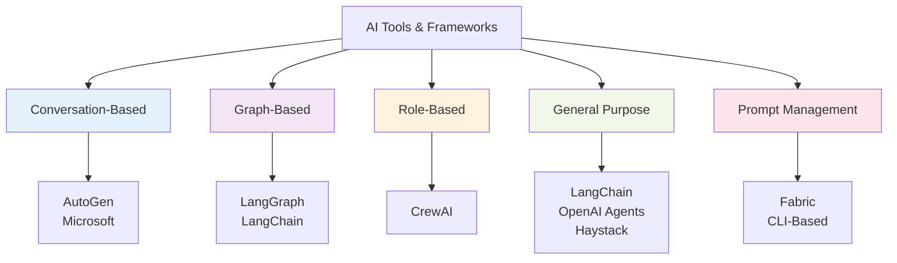
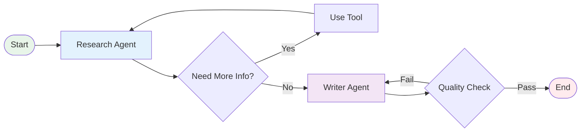
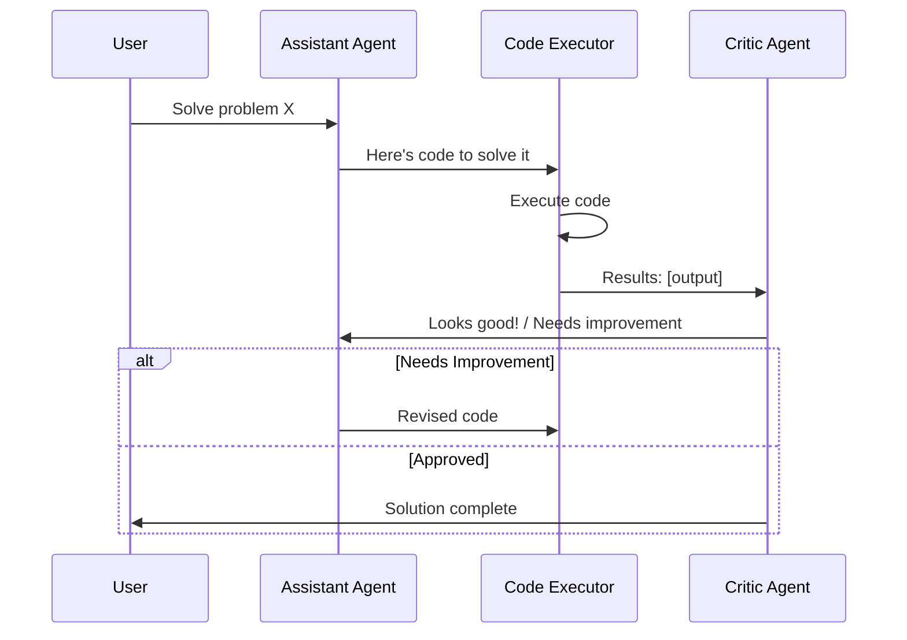
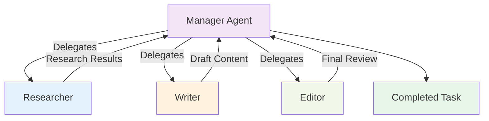
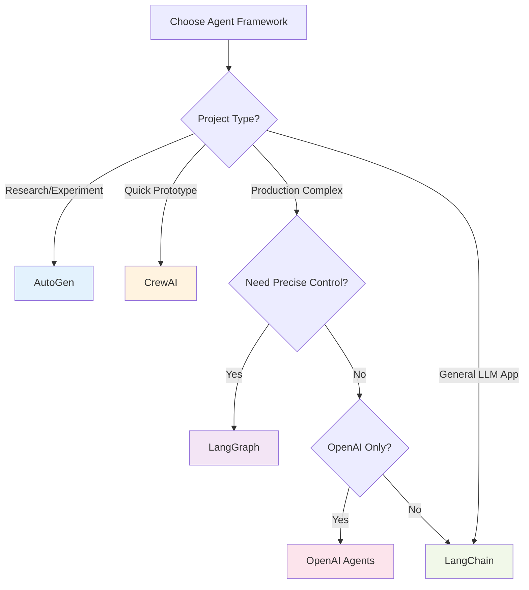

---
tags:
  - "#tool"
  - "#framework"
  - "#agents"
  - "#comparison"
---

# AI Agent Frameworks - Overview & Comparison

AI agent frameworks enable building sophisticated autonomous systems where LLMs can plan, decide, use tools, and collaborate to achieve complex goals. This guide compares the leading frameworks as of November 2025.

---

## Framework Categories



---

## Comparison Matrix

| Feature | LangGraph | AutoGen | CrewAI | LangChain | OpenAI Agents |
|---------|-----------|---------|---------|-----------|---------------|
| **Philosophy** | Graph-based state | Conversation-first | Role-based teams | Chain composition | Native SDK |
| **Developer** | LangChain | Microsoft | CrewAI Inc | LangChain | OpenAI |
| **Complexity** | High | Medium | Low | Medium-High | Medium |
| **Learning Curve** | ⭐⭐⭐ | ⭐⭐⭐⭐ | ⭐⭐⭐⭐⭐ | ⭐⭐⭐ | ⭐⭐⭐⭐ |
| **State Management** | ⭐⭐⭐⭐⭐ Excellent | ⭐⭐⭐ Good | ⭐⭐ Basic | ⭐⭐⭐ Good | ⭐⭐⭐ Good |
| **Multi-Agent** | ⭐⭐⭐⭐⭐ | ⭐⭐⭐⭐⭐ | ⭐⭐⭐⭐⭐ | ⭐⭐⭐ | ⭐⭐⭐⭐ |
| **Tool Integration** | ⭐⭐⭐⭐⭐ | ⭐⭐⭐⭐ | ⭐⭐⭐⭐ | ⭐⭐⭐⭐⭐ | ⭐⭐⭐⭐⭐ |
| **Persistence** | ⭐⭐⭐⭐⭐ Built-in | ⭐⭐⭐ Manual | ⭐⭐ Limited | ⭐⭐⭐ Via extensions | ⭐⭐⭐ Via SDK |
| **Debugging** | ⭐⭐⭐⭐⭐ Excellent | ⭐⭐⭐ Good | ⭐⭐⭐⭐ Good | ⭐⭐⭐ Good | ⭐⭐⭐⭐ Good |
| **Production Ready** | ⭐⭐⭐⭐⭐ | ⭐⭐⭐⭐ | ⭐⭐⭐ | ⭐⭐⭐⭐ | ⭐⭐⭐⭐⭐ |
| **Model Support** | Any LLM | Any LLM | Any LLM | Any LLM | OpenAI only |
| **Best For** | Complex workflows | Research, experiments | Quick prototypes | General purpose | OpenAI ecosystem |

---

## Detailed Framework Profiles

### [[LangGraph]]

**Developer:** LangChain Team
**Philosophy:** Stateful graph-based agent orchestration
**Best For:** Complex, multi-step workflows requiring precise control



**Key Features:**
- **Graph-Based Architecture** - Nodes (agents/tools) and edges (transitions)
- **Stateful Execution** - Persistent state across graph traversal
- **Checkpointing** - Save and resume at any point
- **Cycles Support** - Iterative refinement loops
- **Conditional Routing** - Dynamic path selection
- **Human-in-the-Loop** - Approval gates and feedback

**Strengths:**
- Precise control over workflow
- Excellent debugging and visualization
- Production-ready with persistence
- Complex state management
- Scalable architecture

**Weaknesses:**
- Steeper learning curve
- More code to write
- Overkill for simple tasks

**Use Cases:**
- Multi-agent research systems
- Complex approval workflows
- Iterative refinement processes
- Enterprise applications requiring auditability

**Learn More:** [[LangGraph]]

---

### AutoGen

**Developer:** Microsoft Research
**Philosophy:** Multi-agent conversation framework
**Best For:** Research, experimentation, conversational workflows



**Key Features:**
- **Conversable Agents** - Agents communicate asynchronously
- **Role Specialization** - Assistant, executor, critic, etc.
- **Built-in Executors** - Code execution, Docker support
- **Minimal Code** - Quick setup for common patterns
- **AutoBuild** - Automatically configure agent teams
- **LLM Fine-tuning** - Framework for model optimization

**Strengths:**
- Easy to get started
- Excellent for research and experimentation
- Strong code execution capabilities
- Good for customer-facing applications
- Active Microsoft support

**Weaknesses:**
- Less control than graph-based approaches
- State management less sophisticated
- Can be unpredictable in complex scenarios

**Use Cases:**
- Chatbots and conversational AI
- Code generation and testing
- Research prototyping
- Educational applications

---

### CrewAI

**Developer:** CrewAI Inc
**Philosophy:** Role-based collaborative agent teams
**Best For:** Quick prototyping, team-oriented tasks



**Key Features:**
- **Role-Based System** - Define agents by their role
- **Simple API** - Most beginner-friendly framework
- **Built-in Roles** - Researcher, writer, analyst, etc.
- **Task Assignment** - Automatic task delegation
- **Process Types** - Sequential, hierarchical, consensus
- **Memory** - Short-term and long-term agent memory

**Strengths:**
- Easiest to learn
- Quick to prototype
- Intuitive mental model (teams/roles)
- Good documentation
- Active community

**Weaknesses:**
- Less flexible than LangGraph
- Limited control over execution flow
- Newer framework (less battle-tested)
- State management basic

**Use Cases:**
- Content creation pipelines
- Market research automation
- Quick MVP prototypes
- Team collaboration simulations

---

### LangChain

**Developer:** LangChain
**Philosophy:** General-purpose LLM application framework
**Best For:** Broad range of LLM applications

**Key Features:**
- **Chains** - Compose LLM operations
- **Agents** - ReAct, OpenAI Functions, more
- **Memory** - Conversation and entity memory
- **Retrieval** - RAG implementations
- **Tool Ecosystem** - Massive library of integrations
- **LangSmith** - Debugging and monitoring

**Strengths:**
- Most comprehensive framework
- Huge ecosystem and community
- Production-ready
- Excellent documentation
- Regular updates

**Weaknesses:**
- Can be overwhelming
- Sometimes over-engineered for simple tasks
- Frequent API changes

**Use Cases:**
- RAG applications
- Chatbots with memory
- Document Q&A
- General LLM applications

**Learn More:** [[LangChain]]

---

### OpenAI Agents SDK

**Developer:** OpenAI
**Philosophy:** Native OpenAI integration
**Best For:** OpenAI-specific workflows

**Key Features:**
- **Swarm** - Lightweight multi-agent orchestration
- **Structured Outputs** - Type-safe responses
- **Native Integration** - Direct OpenAI API usage
- **Handoffs** - Agent-to-agent delegation
- **Streaming** - Real-time responses

**Strengths:**
- Official OpenAI support
- Clean, simple API
- Excellent for OpenAI models
- Well-documented

**Weaknesses:**
- OpenAI models only
- Less flexible than framework-agnostic options
- Newer offering

**Use Cases:**
- OpenAI-exclusive projects
- Production OpenAI deployments
- Enterprise OpenAI integrations

---

## Decision Tree



**Quick Selection:**

1. **"I need maximum control over workflow"** → LangGraph
2. **"I want quick conversational agents"** → AutoGen
3. **"I need team-based collaboration"** → CrewAI
4. **"I'm building general LLM apps"** → LangChain
5. **"I'm only using OpenAI"** → OpenAI Agents SDK
6. **"I'm researching multi-agent systems"** → AutoGen
7. **"I need production-ready state management"** → LangGraph

---

## Architectural Comparison

### Execution Models

**LangGraph: Graph Traversal**
```python
from langgraph.graph import StateGraph

graph = StateGraph(State)
graph.add_node("research", research_agent)
graph.add_node("write", write_agent)
graph.add_edge("research", "write")
graph.set_entry_point("research")
```

**AutoGen: Conversations**
```python
assistant = AssistantAgent("assistant")
executor = UserProxyAgent("executor")

executor.initiate_chat(assistant, message="Solve X")
```

**CrewAI: Teams**
```python
crew = Crew(
    agents=[researcher, writer, editor],
    tasks=[research_task, write_task, edit_task],
    process=Process.sequential
)
```

---

## Latest Developments (November 2025)

**LangGraph:**
- Enhanced visualization tools
- Better debugging with LangSmith
- Improved streaming support
- Production deployment guides

**AutoGen:**
- AutoBuild improvements
- Better agent templates
- Enhanced code execution safety
- Multi-modal support

**CrewAI:**
- Improved memory systems
- Better tool integration
- Performance optimizations
- Enterprise features

**Ecosystem:**
- MCP integration across frameworks
- Better interoperability
- Standardization efforts
- Enhanced monitoring tools

---

## Performance Comparison

| Framework | Setup Time | Execution Speed | Token Efficiency | Scalability |
|-----------|-----------|----------------|------------------|-------------|
| **LangGraph** | ⭐⭐⭐ | ⭐⭐⭐⭐ | ⭐⭐⭐⭐ | ⭐⭐⭐⭐⭐ |
| **AutoGen** | ⭐⭐⭐⭐⭐ | ⭐⭐⭐ | ⭐⭐⭐ | ⭐⭐⭐ |
| **CrewAI** | ⭐⭐⭐⭐⭐ | ⭐⭐⭐ | ⭐⭐⭐ | ⭐⭐⭐ |
| **LangChain** | ⭐⭐⭐ | ⭐⭐⭐⭐ | ⭐⭐⭐⭐ | ⭐⭐⭐⭐ |
| **OpenAI Agents** | ⭐⭐⭐⭐ | ⭐⭐⭐⭐⭐ | ⭐⭐⭐⭐⭐ | ⭐⭐⭐⭐ |

---

## Resources

**Official Documentation:**
- [LangGraph Docs](https://langchain-ai.github.io/langgraph/)
- [AutoGen Docs](https://microsoft.github.io/autogen/)
- [CrewAI Docs](https://docs.crewai.com/)
- [LangChain Docs](https://python.langchain.com/)
- [OpenAI Agents Docs](https://platform.openai.com/docs/agents)

**Comparisons:**
- [LangGraph vs AutoGen vs CrewAI Analysis](https://latenode.com/blog/langgraph-vs-autogen-vs-crewai-complete-comparison/)
- [Modern AI Agent Frameworks Comparison](https://langfuse.com/blog/2025-03-19-ai-agent-comparison)
- [Top AI Agent Frameworks 2025](https://medium.com/@iamanraghuvanshi/agentic-ai-3-top-ai-agent-frameworks-in-2025-langchain-autogen-crewai-beyond-2fc3388e7dec)

**Exercises:**
- [[exercises/Agents - LangGraph|LangGraph Exercise]]
- [[exercises/Agents - OpenAI SDK|OpenAI SDK Exercise]]

---

## Prompt Management Tools

### [[Fabric]]

**Developer:** Daniel Miessler
**Philosophy:** CLI-based prompt management and human augmentation
**Best For:** Terminal users who want reusable, high-quality prompts

**Key Features:**
- **300+ Curated Patterns** - Ready-to-use, production-quality prompts
- **CLI-First Design** - Pipeline-friendly, scriptable
- **Multi-Provider** - Works with any LLM (OpenAI, Anthropic, Google, Ollama)
- **Helper Apps** - YouTube transcription, audio processing
- **Easy Customization** - Markdown-based pattern creation

**Use Cases:**
- Content analysis and summarization
- Prompt engineering and improvement
- Writing assistance
- Code explanation
- Security and pentesting workflows

**Learn More:** [[Fabric]]

---

## Related Concepts

- [[agents - agentisation|Agents & Agentisation]]
- [[techniques/prompting/README|Prompt Engineering]] - Core techniques used by Fabric
- [[MCP|Model Context Protocol]]
- [[exercises/LLM Engineering - Tools|Tools Integration]]
- [[tools/coding-assistants/README|Coding Assistants]] (practical agent applications)

---

**Last Updated:** 2025-12-01
**Next Review:** 2025-12-31

*Choose your framework based on your needs: LangGraph for control, AutoGen for speed, CrewAI for simplicity, Fabric for prompt management.*
