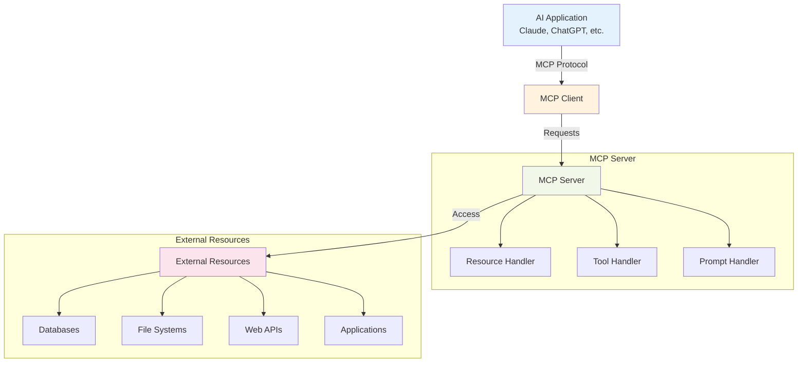
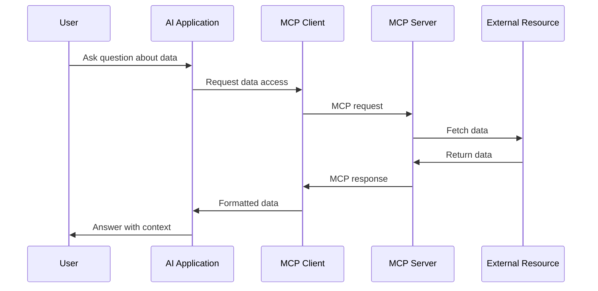

---
tags:
  - "#protocol"
  - "#mcp"
  - "#tools"
  - "#integration"
aliases:
  - Model Context Protocol
  - MCP Protocol
---

# MCP (Model Context Protocol)

## Overview

The Model Context Protocol (MCP) is an open standard that enables AI applications to securely connect to external data sources and tools. It provides a standardized way for AI models to access and interact with various services, databases, and applications while maintaining security and user control.

## Core Concepts

### What MCP Solves
- **Data Silos** - AI models can't access private or real-time data
- **Tool Integration** - Complex setup for connecting AI to external services
- **Security Concerns** - Uncontrolled access to sensitive systems
- **Standardization** - Each integration requires custom implementation

### Key Principles
- **User Control** - Users decide what data and tools AI can access
- **Security First** - Secure, permission-based access to resources
- **Standardization** - Common protocol for all integrations
- **Extensibility** - Easy to add new data sources and tools

## Architecture Overview



## MCP Components

### 1. MCP Client
- **Integration Layer** - Embedded in AI applications
- **Protocol Handler** - Manages MCP communication
- **Request Routing** - Directs requests to appropriate servers
- **Response Processing** - Handles server responses and data

### 2. MCP Server
- **Resource Provider** - Exposes external data and services
- **Authentication** - Manages access permissions
- **Request Processing** - Handles client requests
- **Data Transformation** - Formats data for AI consumption

### 3. Protocol Specification
- **JSON-RPC 2.0** - Standard remote procedure call protocol
- **Message Types** - Resources, Tools, Prompts
- **Error Handling** - Standardized error responses
- **Capabilities** - Server feature advertisement

## How MCP Works

### Simple Flow Diagram



### Detailed Workflow
1. **User Query** - User asks AI about external data
2. **AI Recognition** - AI identifies need for external information
3. **MCP Request** - Client makes standardized request to server
4. **Authentication** - Server validates permissions
5. **Resource Access** - Server accesses external system
6. **Data Retrieval** - External system returns requested data
7. **Response Formatting** - Server formats data for AI consumption
8. **Context Integration** - AI incorporates data into response
9. **User Response** - AI provides informed answer

## MCP Resource Types

### Resources
- **Read-only data** - Files, database records, API responses
- **Structured content** - JSON, XML, CSV data
- **Unstructured content** - Text files, documents, logs
- **Real-time data** - Live feeds, sensor data, metrics

### Tools
- **Action capabilities** - Functions AI can execute
- **Data manipulation** - Create, update, delete operations
- **External API calls** - Third-party service integration
- **System operations** - File operations, process management

### Prompts
- **Template library** - Reusable prompt templates
- **Context injection** - Dynamic data insertion
- **Workflow guidance** - Multi-step process templates
- **Domain expertise** - Specialized knowledge prompts

## Implementation Example

### Basic MCP Server Structure
```python
from mcp import Server, Resource, Tool

class MyMCPServer(Server):
    def __init__(self):
        super().__init__("my-app-server")
        
    @self.resource("user_data")
    async def get_user_data(self, user_id: str):
        # Fetch user data from database
        return await database.get_user(user_id)
    
    @self.tool("send_email")
    async def send_email(self, to: str, subject: str, body: str):
        # Send email via external service
        return await email_service.send(to, subject, body)
```

### MCP Client Usage
```python
from mcp import Client

client = Client()
await client.connect("my-app-server")

# Request resource
user_data = await client.call_resource("user_data", {"user_id": "123"})

# Use tool
result = await client.call_tool("send_email", {
    "to": "user@example.com",
    "subject": "Hello",
    "body": "Welcome!"
})
```

## Real-World Examples

### 1. Obsidian Integration
**Server:** Obsidian MCP Server
**Capabilities:**
- Read vault files and notes
- Search across knowledge base
- Create and update notes
- Execute Templater templates

**Use Case:** AI assistant with access to personal knowledge base

### 2. Database Integration
**Server:** Database MCP Server
**Capabilities:**
- Query customer records
- Retrieve product information
- Generate reports
- Update inventory data

**Use Case:** Customer service AI with real-time data access

### 3. File System Integration
**Server:** File System MCP Server
**Capabilities:**
- Read configuration files
- List directory contents
- Monitor log files
- Backup operations

**Use Case:** System administration AI assistant

### 4. Web API Integration
**Server:** REST API MCP Server
**Capabilities:**
- Fetch weather data
- Stock market information
- Social media posts
- E-commerce operations

**Use Case:** Multi-service AI assistant with real-time information

## Security Model

### Permission-Based Access
- **Explicit Grants** - Users explicitly authorize each server
- **Scope Limitations** - Servers can only access granted resources
- **Audit Trail** - All access logged and monitored
- **Revocation** - Users can revoke access anytime

### Data Protection
- **Encryption** - All communication encrypted in transit
- **Authentication** - Server identity verification
- **Sandboxing** - Isolated execution environments
- **Privacy Controls** - User data handling policies

## Benefits of MCP

### For Users
- **Data Sovereignty** - Full control over AI access to personal data
- **Enhanced Capabilities** - AI with access to private information
- **Security** - Controlled, auditable access patterns
- **Integration** - Seamless connection to existing tools

### For Developers
- **Standardization** - Common protocol reduces implementation complexity
- **Ecosystem** - Growing library of pre-built servers
- **Flexibility** - Easy to extend and customize
- **Interoperability** - Works across different AI applications

### For Organizations
- **Compliance** - Meet data governance requirements
- **Productivity** - AI access to internal systems
- **Control** - Centralized management of AI capabilities
- **Scalability** - Efficient resource sharing across teams

## Getting Started

### Setting Up MCP
1. **Choose AI Application** - Claude, ChatGPT, or custom app
2. **Install MCP Client** - Add to your AI application
3. **Deploy MCP Server** - Set up resource providers
4. **Configure Permissions** - Grant appropriate access
5. **Test Integration** - Verify functionality

### Best Practices
- **Principle of Least Privilege** - Grant minimal necessary permissions
- **Regular Audits** - Review and update access permissions
- **Error Handling** - Implement robust error recovery
- **Documentation** - Clear server capability descriptions
- **Monitoring** - Track usage and performance metrics

## Future Directions

### Protocol Evolution
- **Enhanced Security** - Advanced authentication methods
- **Performance Optimization** - Faster data transfer protocols
- **Mobile Support** - Optimized for mobile AI applications
- **Federation** - Cross-organization resource sharing

### Ecosystem Growth
- **Server Marketplace** - Community-built MCP servers
- **Tool Libraries** - Reusable component collections
- **Enterprise Solutions** - Business-focused integrations
- **Open Source** - Community-driven development

## Related Concepts
- **[[tools]]** - Function calling and external integrations
- **[[API Integration]]** - Connecting AI to web services
- **[[Data Security]]** - Protecting sensitive information
- **[[Protocol Standards]]** - Communication specifications