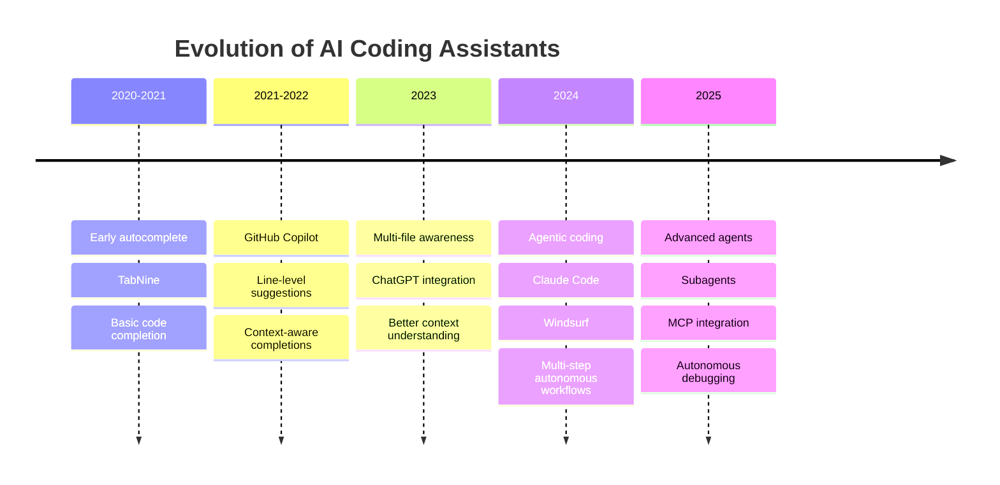
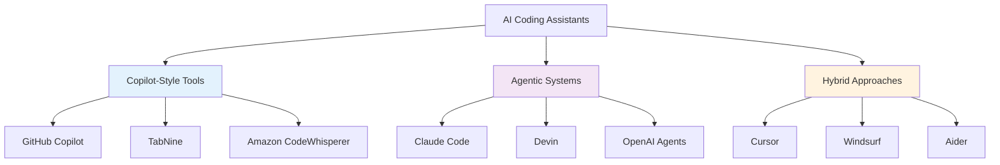
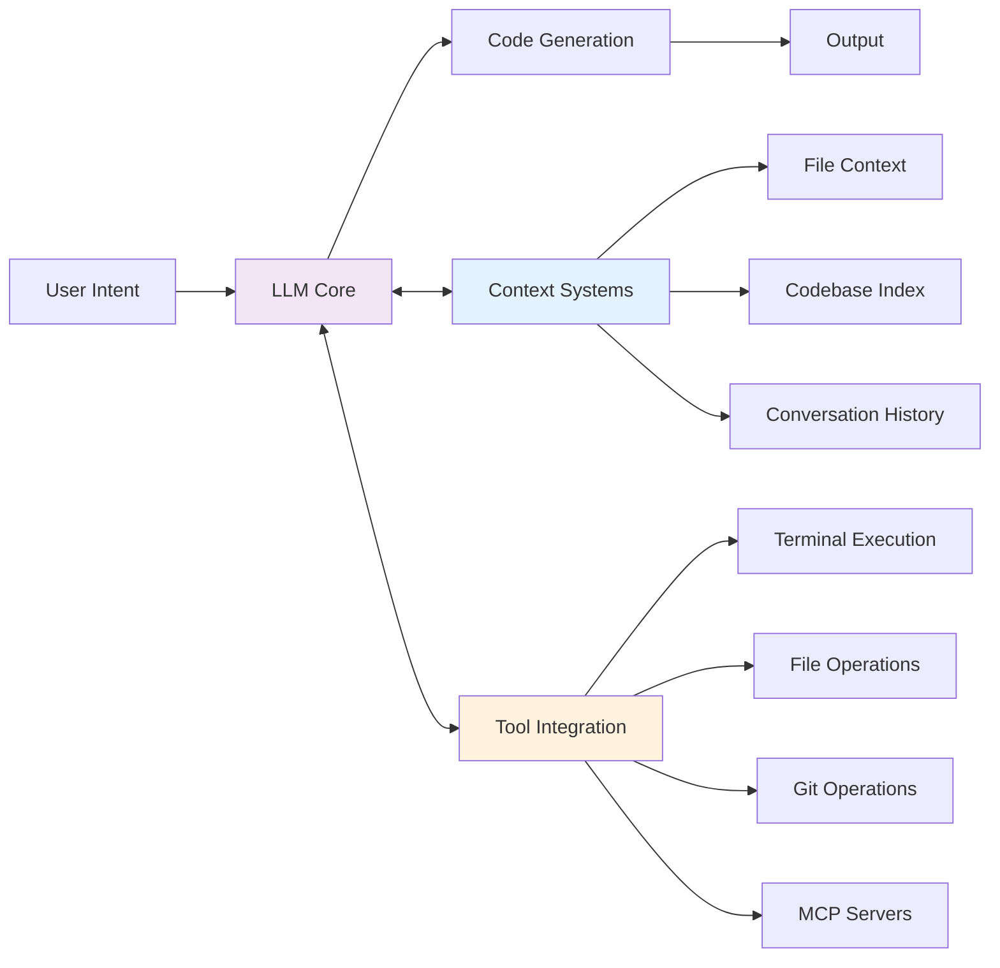
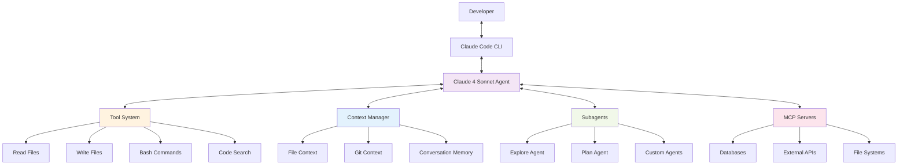
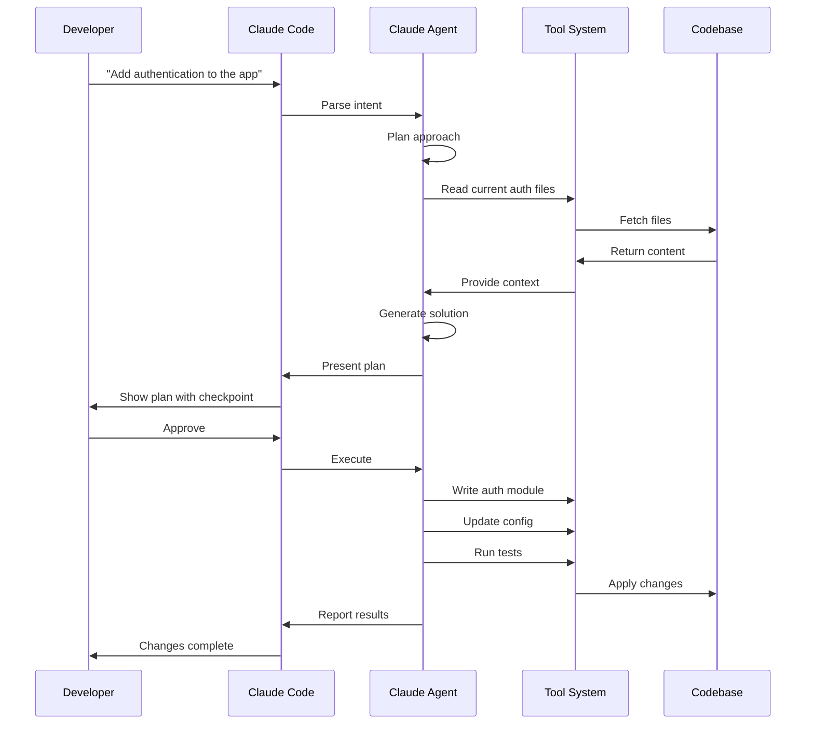
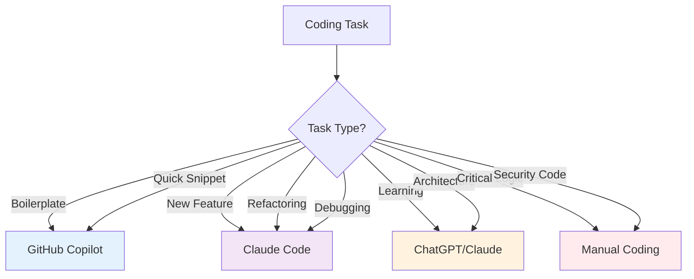
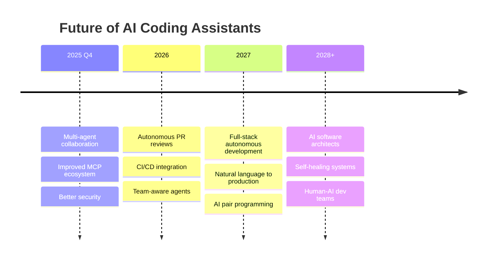

---
tags:
  - "#workshop"
  - "#coding-assistants"
  - "#ai-coding"
  - "#claude-code"
date: 2025-11-30
status: draft
---

# Coding Assistants Workshop - Comprehensive Plan

## Workshop Overview

**Target Audience:** Colleagues with basic AI knowledge (from previous workshop)
**Duration:** 2-3 hours
**Format:** Theoretical + Practical hands-on
**Prerequisites:** Basic understanding of LLMs, prompting, and AI concepts

## Workshop Objectives

- Understand the landscape of AI coding assistants and their capabilities
- Learn the differences between copilot-style and agentic coding tools
- Get hands-on experience with Claude Code
- Understand best practices for AI-assisted development
- Explore the future of AI in software development

---

## Part 1: Theoretical Foundation

### 1.1 Evolution of AI Coding Tools



**Discussion Points:**
- From autocomplete to autonomous agents
- Shift from "suggesting" to "executing"
- Integration with development workflows
- Current state (Nov 2025)

### 1.2 AI Coding Assistant Categories



#### Copilot-Style Tools
**Philosophy:** IDE-first, augment developer line-by-line
- **Examples:** GitHub Copilot, TabNine, CodeWhisperer
- **Strengths:** Fast, non-intrusive, familiar workflow
- **Use Cases:** Autocomplete, boilerplate, quick refactoring
- **Developer Control:** High - developer drives every action

#### Agentic Systems
**Philosophy:** Plan and execute multi-step changes autonomously
- **Examples:** Claude Code, Devin, Windsurf Cascade
- **Strengths:** Complex tasks, cross-file changes, autonomous debugging
- **Use Cases:** Feature implementation, large refactors, bug hunting
- **Developer Control:** Medium - developer provides checkpoints

#### Hybrid Approaches
**Philosophy:** Combine both paradigms
- **Examples:** Cursor (autocomplete + agent mode), Windsurf
- **Strengths:** Flexibility, context switching between modes
- **Use Cases:** Adaptive to task complexity

### 1.3 Latest News & Developments (November 2025)

#### Major Announcements

**Claude Opus 4.5 in GitHub Copilot**
- Available for Copilot Pro, Business, Enterprise (Nov 24, 2025)
- Excels at heavy-duty agentic workflows
- 50% reduction in token usage vs previous models
- Ideal for code migration and refactoring

**GitHub AgentHQ Platform**
- Announced at GitHub Universe 2025
- Create and deploy AI agents within GitHub
- VS Code Plan Mode now generally available
- Custom agents via AGENTS.md file

**Claude Code 2.0 Features** (September 2025)
- Checkpoints system for instant rollback
- Subagents for parallel development
- Background commands (Ctrl-b)
- Custom slash commands
- Claude Code on GitHub (beta) - PR integration
- Claude Agent SDK released

**Cursor vs Windsurf Competition**
- **Cursor 2.0:** New agent mode, proprietary Composer model, $20/month
- **Windsurf:** SWE-1.5 model (13x faster than Sonnet 4.5), Cascade 2.0 with multi-agent collaboration, $15/month
- Surprising discovery: Both using Chinese AI models (Z.ai)

**Model Context Protocol (MCP) Adoption**
- OpenAI officially adopted MCP (March 2025)
- Google DeepMind announced Gemini MCP support (April 2025)
- Integrated in Zed, Replit, Codeium, Sourcegraph
- Security concerns raised (prompt injection, tool permissions)
- MCP Registry launched (September 2025)

### 1.4 Key Technologies Behind Coding Assistants



**Core Components:**
1. **LLM Models** - GPT-4o, Claude Sonnet 4.5, Opus 4.5, proprietary models
2. **Context Management** - Codebase indexing, semantic search, RAG
3. **Tool Calling** - File ops, terminal, git, databases
4. **Agent Architecture** - Planning, execution, verification loops
5. **MCP Integration** - Standardized tool/data access

---

## Part 2: Deep Dive into Claude Code

### 2.1 Claude Code Architecture



### 2.2 Claude Code Key Features

**1. Autonomous Capabilities**
- Multi-file code generation and editing
- Autonomous debugging and error resolution
- Terminal command execution
- Git operations

**2. Checkpointing System**
- Automatic state saves before changes
- Instant rollback with `/rewind` or double-Esc
- Safety net for experimentation

**3. Subagent Architecture**
- Parallel task execution
- Specialized agents (Explore, Plan, custom)
- Delegate backend API while building frontend

**4. Customization**
- Custom slash commands (.claude/commands/)
- Hooks for event-driven automation
- Customizable status line
- Integration with existing workflows

**5. Advanced Context Management**
- 200k token context window (Sonnet 4.5)
- Intelligent file selection
- Codebase-wide understanding
- Conversation history

**6. MCP Integration**
- Connect to databases, APIs, file systems
- Standardized protocol
- Extensible architecture

### 2.3 How Claude Code Works



**Workflow Steps:**
1. **Intent Recognition** - Understand developer request
2. **Planning** - Break down into subtasks
3. **Context Gathering** - Read relevant files
4. **Generation** - Create/modify code
5. **Execution** - Run tests, verify
6. **Checkpointing** - Save state
7. **Iteration** - Refine based on results

### 2.4 Claude Code vs GitHub Copilot

| Feature | Claude Code | GitHub Copilot |
|---------|-------------|----------------|
| **Philosophy** | Agentic, multi-step execution | Autocomplete, suggestions |
| **Model** | Claude Sonnet 4.5 / Opus 4.5 | GPT-4o, Opus 4.5 (new) |
| **Use Case** | Complex features, refactoring | Line completion, snippets |
| **Autonomy** | High - executes workflows | Low - suggests code |
| **Multi-file** | Excellent | Limited |
| **Debugging** | Autonomous | Manual with assistance |
| **Learning Curve** | Moderate | Low |
| **Pricing** | $20/month (Pro) | $10-21/month |
| **Best For** | Large features, migrations | Daily coding, boilerplate |

**Discussion: When to use which?**
- Use Claude Code: Feature development, large refactors, debugging sessions
- Use GitHub Copilot: Fast autocomplete, learning new APIs, boilerplate

---

## Part 3: Hands-On Practice

### 3.1 Setup & Installation

**Prerequisites:**
- Node.js 18+ installed
- API keys (Anthropic, optionally OpenAI/Google)
- Terminal access
- Code editor

**Installation:**
```bash
npm install -g @anthropic/claude-code
claude-code init
```

**Configuration:**
- Set up API keys in .env
- Configure preferences
- Test basic functionality

### 3.2 Exercise 1: Basic Workflow

**Goal:** Create a simple Node.js REST API

**Tasks:**
1. Start Claude Code in a new directory
2. Ask Claude to "Create a Node.js Express REST API with CRUD endpoints for a task list"
3. Observe the workflow:
   - File creation
   - Dependencies installation
   - Code generation
4. Test the API
5. Use checkpoints to experiment with changes

**Discussion Points:**
- How Claude plans the work
- File organization decisions
- Error handling approach

### 3.3 Exercise 2: Debugging Session

**Goal:** Let Claude debug a broken application

**Setup:** Provide buggy code sample

**Tasks:**
1. Present the bug to Claude
2. Let Claude investigate autonomously
3. Observe debugging workflow:
   - Log analysis
   - Code inspection
   - Hypothesis testing
4. Review the fix
5. Rollback and try alternative approaches

**Discussion Points:**
- Claude's debugging methodology
- When to intervene vs let it work
- Checkpoint usage for experimentation

### 3.4 Exercise 3: Custom Slash Commands

**Goal:** Create custom workflow commands

**Setup:**
```bash
mkdir -p .claude/commands
```

**Example 1: Code Review Command**
Create `.claude/commands/review.md`:
```markdown
Perform a comprehensive code review:

## Security
- [ ] SQL injection vulnerabilities
- [ ] XSS vulnerabilities
- [ ] Authentication/authorization issues
- [ ] Input validation

## Code Quality
- [ ] Error handling
- [ ] Edge cases
- [ ] Performance
- [ ] Code style consistency

## Testing
- [ ] Unit tests exist
- [ ] Edge cases tested
- [ ] Adequate coverage

Provide specific line references and actionable feedback.
```

**Example 2: Test Command**
Create `.claude/commands/test.md`:
```markdown
Write comprehensive unit tests for $ARGUMENTS

Requirements:
- Use Jest testing framework
- Cover happy path and edge cases
- Mock external dependencies
- Aim for 90%+ coverage
- Use descriptive test names
```

**Usage:**
```bash
/review
/test UserService.ts
```

**Discussion Points:**
- Customization for team workflows
- Standardizing best practices
- Using `$ARGUMENTS` for parameters
- Team sharing via version control

### 3.5 Exercise 4: MCP Integration (Optional)

**Goal:** Connect Claude Code to external data

**Tasks:**
1. Set up a simple MCP server (e.g., file system)
2. Configure Claude Code to use it
3. Build a feature that uses MCP data
4. Observe how Claude accesses external resources

**Discussion Points:**
- Security considerations
- Use cases for MCP
- Building custom MCP servers

---

## Part 4: Best Practices & Advanced Topics

> **📚 Detailed Reference:** [[tools/coding-assistants/Claude Code Best Practices|Claude Code Best Practices]]

### 4.1 Effective Prompting for Coding Assistants (10 min)

**Good Prompts:**
```
✓ "Add authentication middleware to protect /api routes using JWT"
✓ "Refactor the UserService to use dependency injection"
✓ "Debug why the database connection times out after 30 seconds"
✓ "Write unit tests for the payment processing module"
```

**Poor Prompts:**
```
✗ "Fix the code"
✗ "Make it better"
✗ "Add features"
✗ "Do something with auth"
```

**Principles:**
1. **Be specific** - What, where, how
2. **Provide context** - Current state, constraints
3. **Set expectations** - Testing, documentation, style
4. **Iterate** - Refine based on results
5. **Use checkpoints** - Safe experimentation

**Extended Thinking:**
Use keywords to trigger deeper analysis:
- `"think"` - Basic extended thinking
- `"think hard"` - More computation
- `"think harder"` - Even more analysis
- `"ultrathink"` - Maximum thinking budget

### 4.2 When to Use AI Coding Assistants (5 min)



**Ideal Use Cases:**
- Boilerplate and scaffolding
- Repetitive transformations
- Test writing
- Documentation generation
- Exploratory coding
- Learning new frameworks

**Exercise Caution:**
- Security-critical code
- Complex business logic
- Performance-critical sections
- Code you don't understand

### 4.3 Code Quality & Review (5 min)

**AI-Generated Code Checklist:**
- [ ] Understand every line
- [ ] Review for security issues
- [ ] Check error handling
- [ ] Verify edge cases
- [ ] Run tests (don't just trust AI's test results)
- [ ] Performance profiling if needed
- [ ] Code style consistency
- [ ] Documentation accuracy

**Red Flags:**
- Deprecated APIs
- Hardcoded credentials
- Missing input validation
- Unhandled errors
- Inefficient algorithms
- Copy-paste patterns

### 4.4 Team Integration (5 min)

**Adoption Strategy:**
1. **Start small** - Individual experimentation
2. **Share learnings** - Team workshops (like this!)
3. **Standardize** - Custom commands, prompts
4. **Measure** - Productivity, code quality
5. **Iterate** - Refine workflows

**Team Best Practices:**
- Shared `.claude/commands/` repository
- Code review guidelines for AI-generated code
- Documentation requirements
- Testing standards
- Security review process

---

## Part 5: Future Trends & Discussion (15-20 min)

### 5.1 The Future of AI Coding (10 min)



**Emerging Trends:**
1. **Multi-Agent Systems**
   - Specialized agents collaborating (Windsurf Cascade 2.0)
   - One agent writes, another reviews, third benchmarks

2. **MCP Ecosystem Growth**
   - Standardized integrations
   - Enterprise MCP servers
   - Security improvements

3. **AI in DevOps**
   - Autonomous CI/CD optimization
   - Self-healing infrastructure
   - Intelligent monitoring

4. **Enhanced Context**
   - Million+ token contexts
   - Full codebase understanding
   - Cross-repository knowledge

5. **Better Human-AI Collaboration**
   - Improved checkpointing
   - More granular control
   - Better explainability

### 5.2 Ethical & Practical Considerations (5 min)

**Questions to Consider:**
- How does AI coding affect developer skills?
- What about code attribution and licensing?
- Security implications of AI-generated code
- Impact on junior developer learning
- Dependency on AI services
- Cost vs productivity tradeoffs

**Discussion:** Open floor for concerns and questions

### 5.3 Wrap-up & Resources (5 min)

**Key Takeaways:**
1. AI coding assistants are rapidly evolving from autocomplete to autonomous agents
2. Different tools for different tasks - choose appropriately
3. Claude Code excels at complex, multi-step workflows
4. Always review and understand AI-generated code
5. Start small, iterate, share learnings with team

**Resources:**
- Claude Code Docs: https://claudecode.com
- MCP Documentation: https://modelcontextprotocol.io
- Claude Agent SDK: https://github.com/anthropics/claude-agent-sdk
- Community: Discord, GitHub Discussions

**Next Steps:**
- Install and experiment with Claude Code
- Try building a small project end-to-end
- Create custom slash commands for your workflow
- Share experiences with the team

---

## Discussion Topics for Deep Dive

Based on group interest, we can spend more time on:

1. **Technical Deep Dive**
   - Agent architectures in detail
   - How context management works
   - Tool calling and execution

2. **Practical Workflows**
   - Real-world migration projects
   - Debugging complex issues
   - Integration with existing toolchains

3. **MCP & Extensibility**
   - Building custom MCP servers
   - Security best practices
   - Enterprise integration patterns

4. **Comparison Deep Dive**
   - Hands-on with multiple tools
   - Use case optimization
   - Cost-benefit analysis

---

## Preparation Checklist

**For Presenter:**
- [ ] Install Claude Code, Cursor, or Windsurf for demos
- [ ] Prepare code samples for debugging exercise
- [ ] Set up MCP demo environment
- [ ] Create custom slash command examples
- [ ] Prepare comparison matrix slide
- [ ] Test all exercises
- [ ] Have API keys ready (Anthropic, OpenAI)

**For Participants:**
- [ ] Basic understanding of AI/LLMs (from previous workshop)
- [ ] Laptop with terminal access
- [ ] Node.js 18+ installed
- [ ] Code editor (VS Code recommended)
- [ ] API keys (will provide instructions)
- [ ] Open mind and willingness to experiment

---

## Additional Resources & References

### Research Sources (November 2025)

**Claude Code & Anthropic:**
- [Introducing Claude 4.5 Sonnet](https://www.anthropic.com/news/claude-sonnet-4-5)
- [Introducing Claude Opus 4.5](https://www.anthropic.com/news/claude-opus-4-5)
- [Enabling Claude Code to work more autonomously](https://www.anthropic.com/news/enabling-claude-code-to-work-more-autonomously)
- [The Complete Claude Code 2.0 Capability Guide](https://alirezarezvani.medium.com/the-complete-claude-code-2-0-0051c3ee737e)
- [Claude Code Documentation](https://claudelog.com/claude-code-changelog/)

**GitHub & Coding Tools:**
- [Claude Opus 4.5 in GitHub Copilot](https://github.blog/changelog/2025-11-24-claude-opus-4-5-is-in-public-preview-for-github-copilot/)
- [GitHub Expands Copilot Ecosystem with AgentHQ](https://www.infoq.com/news/2025/11/github-copilot-agenthq/)
- [Best AI Coding Tools November 2025](https://www.shuttle.dev/blog/2025/11/20/ai-coding-tools-for-developers)
- [AI Coding Assistants Battle 2025](https://dev.to/bakhat_yar_016451bb6f3b86/ai-coding-assistants-battle-2025-github-copilots-raptor-mini-vs-claude-code-vs-cursor-composer-4n87)

**Cursor vs Windsurf:**
- [Windsurf vs Cursor: AI IDEs Tested and Compared](https://www.qodo.ai/blog/windsurf-vs-cursor/)
- [Windsurf vs Cursor: which is the better AI code editor?](https://www.builder.io/blog/windsurf-vs-cursor)
- [Cursor 2.0 vs Windsurf 2025](https://skywork.ai/blog/vibecoding/cursor-2-0-vs-windsurf/)
- [Chinese AI in Cursor and Windsurf](https://kr-asia.com/coding-tools-cursor-and-windsurf-found-using-chinese-ai-in-latest-releases)

**Model Context Protocol:**
- [Introducing the Model Context Protocol](https://www.anthropic.com/news/model-context-protocol)
- [Model Context Protocol - Wikipedia](https://en.wikipedia.org/wiki/Model_Context_Protocol)
- [What is Model Context Protocol (MCP)?](https://www.ibm.com/think/topics/model-context-protocol)
- [MCP Complete Guide 2025](https://quashbugs.com/blog/model-context-protocol-mcp-guide)
- [MCP GitHub](https://github.com/modelcontextprotocol)

**Agent Frameworks:**
- [Top AI Agent Frameworks 2025: LangChain, AutoGen, CrewAI](https://medium.com/@iamanraghuvanshi/agentic-ai-3-top-ai-agent-frameworks-in-2025-langchain-autogen-crewai-beyond-2fc3388e7dec)
- [Detailed Comparison of Top 6 AI Agent Frameworks](https://www.turing.com/resources/ai-agent-frameworks)
- [LangGraph vs AutoGen vs CrewAI](https://latenode.com/blog/platform-comparisons-alternatives/automation-platform-comparisons/langgraph-vs-autogen-vs-crewai-complete-ai-agent-framework-comparison-architecture-analysis-2025)
- [Comparing Open-Source AI Agent Frameworks](https://langfuse.com/blog/2025-03-19-ai-agent-comparison)

### Tools to Try

**Coding Assistants:**
- Claude Code - https://claudecode.com
- GitHub Copilot - https://github.com/features/copilot
- Cursor - https://cursor.sh
- Windsurf - https://windsurf.com
- Aider - https://aider.chat

**Agent Frameworks:**
- LangGraph - https://langchain-ai.github.io/langgraph/
- AutoGen - https://microsoft.github.io/autogen/
- CrewAI - https://www.crewai.com/

**MCP Resources:**
- MCP Specification - https://modelcontextprotocol.io
- MCP GitHub - https://github.com/modelcontextprotocol
- MCP Registry - https://modelcontextprotocol.io/registry

---

## Workshop Variations

### Short Version (1 hour)
- Quick landscape overview (15 min)
- Claude Code demo (20 min)
- One hands-on exercise (20 min)
- Q&A (5 min)

### Extended Version (Half Day)
- Add more hands-on exercises
- Deep dive into agent architectures
- Build a complete project
- Team collaboration session
- Advanced customization workshop

### Follow-up Workshops
1. **Advanced Claude Code** - Subagents, MCP, enterprise integration
2. **Building AI Agents** - LangGraph, AutoGen deep dive
3. **AI DevOps** - CI/CD integration, automated testing
4. **Security & AI Code** - Secure coding practices, code review

---

*This workshop plan is designed to be flexible and interactive. Adjust timing and depth based on audience engagement and interest.*
