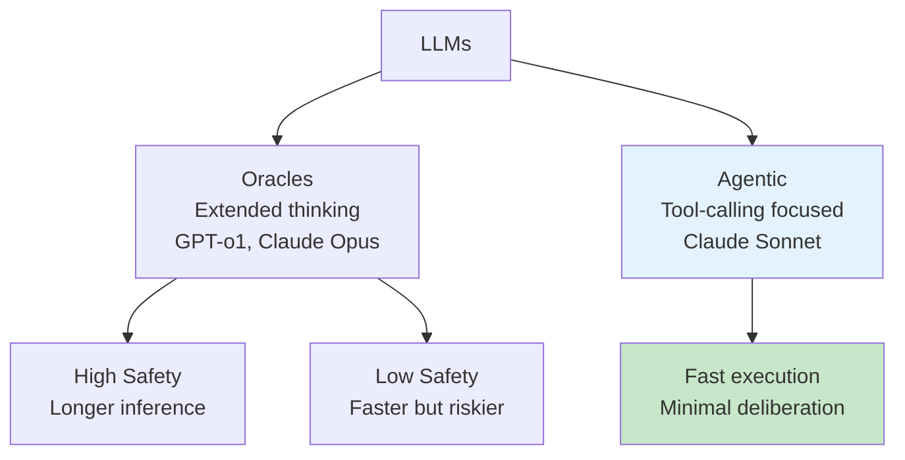

---
tags:
  - "#workshop"
  - "#agents"
  - "#coding-agents"
  - "#hands-on"
  - "#tutorial"
date: 2025-12-01
status: published
last_updated: 2025-12-01
---

# Building Coding Agents Workshop

A hands-on workshop teaching developers to construct functioning coding agents from first principles. Learn by building: transform from AI consumer to AI producer.

> **Workshop Goal:** "Transform participants from consumers of AI to producers of AI who can automate things with AI." - Geoffrey Huntley

---

## Workshop Overview

### Format
- **Duration:** 2-3 hours
- **Level:** Intermediate (basic programming knowledge required)
- **Approach:** Live coding with progressive complexity
- **Output:** Working coding agent by end of session

### Learning Objectives

By the end of this workshop, participants will:

1. **Understand** agent architecture fundamentals
2. **Implement** the 5 core agent primitives
3. **Build** a functioning file-editing agent (~400 lines)
4. **Recognize** that production tools use the same core principles
5. **Gain confidence** that agent development is accessible, not magical

### Prerequisites

**Required Knowledge:**
- Basic programming (Go, Python, or TypeScript)
- Familiarity with APIs and JSON
- Understanding of command-line tools
- Basic git knowledge

**Required Setup:**
- Development environment (Go 1.21+, Python 3.10+, or Node 18+)
- Anthropic API key ([get one here](https://console.anthropic.com/))
- Text editor or IDE
- Terminal access

**Optional:**
- GitHub account (for git exercises)
- Docker (for sandboxed execution)

---

## Workshop Structure

### Part 1: Demystification (30 minutes)

#### The Emperor Has No Clothes

**Discussion Topics:**
- What makes coding assistants impressive?
- Common misconceptions about AI agents
- The truth: "300 lines of code running in a loop with LLM tokens"

**Interactive Demo:**
- Live demonstration of Claude Code, Cursor, or Amp
- Show tool calls in action
- Reveal the simple patterns underneath

**Key Insight:** Modern frontier models (Claude 3.7+, GPT-4+) intrinsically understand:
- They don't know everything
- Tools provide additional capabilities
- When to use tools vs. generate responses

#### Understanding LLM Categories



**Claude Sonnet as "Mechanical Squirrel":**
- Optimized for tool execution
- Minimal extended thinking
- Fast, action-oriented
- Perfect for coding agents

**GPT-o1/Opus as "Oracles":**
- Extended reasoning
- Better for complex planning
- Can be called as tools within agentic loop
- Slower but more thoughtful

#### Context Window Reality Check

**Advertised vs. Usable:**
```
Claude Sonnet: 200k tokens advertised
Reality:
  - System prompts: ~20k (10%)
  - Tool definitions: ~30k (15%)
  - CLAUDE.md: ~10k (5%)
  - Harness overhead: ~20k (10%)
  --------------------------------
  Available for work: ~120k (60%)
```

**Critical Principle:** "Less is more" - Context efficiency matters more than window size.

---

### Part 2: Hands-On Building (90 minutes)

#### Exercise 1: The Basic Loop (20 minutes)

**Goal:** Create minimal conversational agent

**Code Structure:**
```python
import anthropic

client = anthropic.Anthropic(api_key="YOUR_KEY")
messages = []

while True:
    user_input = input("You: ")
    messages.append({"role": "user", "content": user_input})

    response = client.messages.create(
        model="claude-3-5-sonnet-20241022",
        max_tokens=1024,
        messages=messages
    )

    assistant_message = response.content[0].text
    print(f"Assistant: {assistant_message}")

    messages.append({"role": "assistant", "content": assistant_message})
```

**Test:**
```
You: Hello!
Assistant: Hello! How can I help you today?

You: What's 2+2?
Assistant: 2 + 2 = 4
```

**Lines of Code:** ~20

**Learning:** Conversation state is just a list of messages.

#### Exercise 2: Adding First Tool - Read File (25 minutes)

**Goal:** Agent can read files

**Tool Definition:**
```python
tools = [
    {
        "name": "read_file",
        "description": "Reads the contents of a file at the given path",
        "input_schema": {
            "type": "object",
            "properties": {
                "path": {
                    "type": "string",
                    "description": "Path to the file to read"
                }
            },
            "required": ["path"]
        }
    }
]
```

**Tool Execution:**
```python
def execute_tool(tool_name, tool_input):
    if tool_name == "read_file":
        try:
            with open(tool_input["path"], "r") as f:
                return f.read()
        except Exception as e:
            return f"Error reading file: {str(e)}"
```

**Updated Loop:**
```python
while True:
    user_input = input("You: ")
    messages.append({"role": "user", "content": user_input})

    response = client.messages.create(
        model="claude-3-5-sonnet-20241022",
        max_tokens=1024,
        messages=messages,
        tools=tools  # Add tools!
    )

    # Handle tool use
    if response.stop_reason == "tool_use":
        for block in response.content:
            if block.type == "tool_use":
                result = execute_tool(block.name, block.input)
                messages.append({
                    "role": "user",
                    "content": [{
                        "type": "tool_result",
                        "tool_use_id": block.id,
                        "content": result
                    }]
                })
        # Continue loop to get next response
        continue

    # Display text response
    print(f"Assistant: {response.content[0].text}")
    messages.append({"role": "assistant", "content": response.content})
```

**Test:**
```
You: Read the file README.md
[Agent uses read_file tool]
Assistant: The README contains information about...
```

**Lines of Code:** ~60 total

**Learning:** Tool use is detected, executed locally, results returned to Claude.

#### Exercise 3: The Riddle Challenge (15 minutes)

**Setup:**
Create `riddle.txt`:
```
What has keys but no locks,
Space but no room,
And you can enter but can't go inside?
```

**Challenge:**
```
You: There's a riddle in riddle.txt. Can you solve it?
```

**Expected Behavior:**
1. Agent uses `read_file` on riddle.txt
2. Reads riddle content
3. Thinks about answer
4. Responds: "A keyboard!"

**Learning:** Claude chains tool use naturally - no explicit instruction needed.

#### Exercise 4: Adding List Files (15 minutes)

**Tool Definition:**
```python
{
    "name": "list_files",
    "description": "Lists files and directories. Directories have trailing /",
    "input_schema": {
        "type": "object",
        "properties": {
            "path": {
                "type": "string",
                "description": "Directory to list (default: current directory)",
                "default": "."
            }
        }
    }
}
```

**Implementation:**
```python
def execute_tool(tool_name, tool_input):
    if tool_name == "list_files":
        path = tool_input.get("path", ".")
        entries = []
        for entry in os.listdir(path):
            full_path = os.path.join(path, entry)
            if os.path.isdir(full_path):
                entries.append(f"{entry}/")
            else:
                entries.append(entry)
        return "\n".join(entries)
    # ... other tools
```

**Test:**
```
You: What files are in the project?
[Agent uses list_files]
Assistant: I can see:
- src/ (directory)
- tests/ (directory)
- README.md
- main.py
- requirements.txt
```

**Lines of Code:** ~90 total

#### Exercise 5: Adding Edit Capability (25 minutes)

**Tool Definition:**
```python
{
    "name": "edit_file",
    "description": "Edits a file by replacing old_str with new_str",
    "input_schema": {
        "type": "object",
        "properties": {
            "path": {"type": "string"},
            "old_str": {
                "type": "string",
                "description": "Exact string to find and replace"
            },
            "new_str": {
                "type": "string",
                "description": "Replacement string"
            }
        },
        "required": ["path", "old_str", "new_str"]
    }
}
```

**Implementation:**
```python
def execute_tool(tool_name, tool_input):
    if tool_name == "edit_file":
        path = tool_input["path"]
        old_str = tool_input["old_str"]
        new_str = tool_input["new_str"]

        try:
            with open(path, "r") as f:
                content = f.read()

            if old_str not in content:
                return f"Error: '{old_str}' not found in file"

            updated = content.replace(old_str, new_str)

            with open(path, "w") as f:
                f.write(updated)

            return "File updated successfully"
        except Exception as e:
            return f"Error: {str(e)}"
    # ... other tools
```

**Test:**
```
You: Create a hello.py file that prints "Hello World"
Assistant: I can't create files, but I can edit existing ones.

[Create hello.py manually with "print('Hello')"]

You: Change the hello.py to print "Hello, Agent!"
[Agent reads file, then edits it]
Assistant: I've updated hello.py to print "Hello, Agent!"
```

**Lines of Code:** ~130 total

#### Exercise 6: Adding Bash Execution (20 minutes)

**Tool Definition:**
```python
{
    "name": "bash",
    "description": "Executes a bash command and returns output",
    "input_schema": {
        "type": "object",
        "properties": {
            "command": {
                "type": "string",
                "description": "The command to execute"
            }
        },
        "required": ["command"]
    }
}
```

**Implementation:**
```python
import subprocess

def execute_tool(tool_name, tool_input):
    if tool_name == "bash":
        command = tool_input["command"]
        try:
            result = subprocess.run(
                command,
                shell=True,
                capture_output=True,
                text=True,
                timeout=30
            )
            output = result.stdout
            if result.stderr:
                output += f"\nErrors:\n{result.stderr}"
            return output
        except subprocess.TimeoutExpired:
            return "Command timed out"
        except Exception as e:
            return f"Error: {str(e)}"
    # ... other tools
```

**Security Note:** This is for learning. Production systems should:
- Sandbox execution
- Allowlist commands
- Validate inputs
- Limit resources

**Test - FizzBuzz Challenge:**
```
You: Create a Python script called fizzbuzz.py that prints FizzBuzz for numbers 1-20, then run it

[Agent workflow:]
1. Reads any existing fizzbuzz.py (or creates via bash echo)
2. Writes FizzBuzz implementation
3. Runs: bash("python fizzbuzz.py")
4. Shows output
```

**Expected Output:**
```
1
2
Fizz
4
Buzz
Fizz
7
8
Fizz
Buzz
11
Fizz
13
14
FizzBuzz
16
17
Fizz
19
Buzz
```

**Lines of Code:** ~170 total

#### Exercise 7: Adding Search (10 minutes)

**Tool Definition:**
```python
{
    "name": "search",
    "description": "Searches for patterns using grep",
    "input_schema": {
        "type": "object",
        "properties": {
            "pattern": {"type": "string"},
            "path": {"type": "string", "default": "."}
        },
        "required": ["pattern"]
    }
}
```

**Implementation:**
```python
def execute_tool(tool_name, tool_input):
    if tool_name == "search":
        pattern = tool_input["pattern"]
        path = tool_input.get("path", ".")

        # Use ripgrep if available, fallback to grep
        try:
            result = subprocess.run(
                ["rg", pattern, path, "--line-number"],
                capture_output=True,
                text=True
            )
            return result.stdout or "No matches found"
        except FileNotFoundError:
            # Fallback to grep
            result = subprocess.run(
                ["grep", "-rn", pattern, path],
                capture_output=True,
                text=True
            )
            return result.stdout or "No matches found"
    # ... other tools
```

**Test:**
```
You: Find all Python functions in the project
[Agent searches for "def " pattern]
Assistant: I found these functions:
- main.py:15: def execute_tool(...)
- main.py:45: def run_agent(...)
- fizzbuzz.py:1: def fizzbuzz(n):
```

**Lines of Code:** ~200 total

---

### Part 3: Real-World Application (30 minutes)

#### Exercise 8: Multi-Step Workflow

**Challenge:** "Add input validation to fizzbuzz.py so it only accepts numbers 1-100"

**Expected Agent Workflow:**

1. **Read** current fizzbuzz.py
2. **Understand** existing logic
3. **Edit** to add validation:
   ```python
   def fizzbuzz(n):
       if not isinstance(n, int) or n < 1 or n > 100:
           raise ValueError("n must be an integer between 1 and 100")
       # ... existing logic
   ```
4. **Run** tests to verify

**Learning:** Claude naturally chains operations to accomplish complex goals.

#### Exercise 9: Debugging Session

**Setup:** Introduce a bug into fizzbuzz.py:
```python
def fizzbuzz(n):
    for i in range(1, n):  # Bug: should be range(1, n+1)
        # ...
```

**Challenge:** "Run fizzbuzz for 1-20 and fix any issues"

**Expected Workflow:**
1. **Run** the script
2. **Observe** only prints 1-19
3. **Identify** off-by-one error
4. **Fix** range to include endpoint
5. **Verify** fix works

#### Exercise 10: Project Context

**Create AGENT.md:**
```markdown
# Project Context

## Tech Stack
- Language: Python 3.10+
- Testing: pytest
- Style: Black formatter, type hints

## Commands
- Run: `python script.py`
- Test: `pytest`
- Format: `black .`

## Conventions
- Functions: snake_case
- Classes: PascalCase
- Constants: UPPER_CASE
- All functions should have type hints
```

**Update System Prompt:**
```python
system_prompt = """You are a coding assistant with file and command execution tools.

Follow the project conventions in AGENT.md.

When implementing features:
1. Read existing code for patterns
2. Maintain consistent style
3. Run tests after changes
"""

# Add to messages
messages = [
    {"role": "system", "content": system_prompt},
    # ... rest of conversation
]
```

**Test:**
```
You: Add a function to calculate factorial

[Agent should:]
1. Read AGENT.md (or have it in system prompt)
2. Create function with snake_case name
3. Add type hints
4. Format with black
```

**Lines of Code:** ~250-300 total with proper error handling and UX

---

### Part 4: Understanding Production Tools (30 minutes)

#### Comparison: Your Agent vs. Claude Code

**What's the Same:**
- Core loop: messages → LLM → tools → results → repeat
- Tool execution pattern
- Context management principles

**What Claude Code Adds:**
- **Editor Integration:** LSP diagnostics, inline errors
- **Advanced Context:** Sub-agents, automatic compaction
- **System Prompts:** 1000+ lines of carefully tuned prompts
- **UX Polish:** Checkpoints, progress indicators, rollback
- **Safety:** Sandboxing, permission system, hooks
- **GitHub Integration:** PR creation, issue management
- **MCP Support:** Extensible tool ecosystem

**Key Insight:** Your 300-line agent has the same fundamental architecture as production tools. The difference is engineering refinement, not magical algorithms.

#### The Oracle Pattern

**Advanced Technique:** Use GPT-o1 or Claude Opus as a tool within your Sonnet agent:

```python
{
    "name": "think_deeply",
    "description": "Use extended thinking for complex decisions",
    "input_schema": {
        "type": "object",
        "properties": {
            "question": {"type": "string"}
        }
    }
}

def execute_tool(tool_name, tool_input):
    if tool_name == "think_deeply":
        # Call GPT-o1 or Claude Opus
        response = client.messages.create(
            model="claude-opus-4-20250514",  # or GPT-o1
            messages=[{"role": "user", "content": tool_input["question"]}]
        )
        return response.content[0].text
```

**Use Case:** Complex architectural decisions, security reviews, algorithm design

#### Context Engineering Principles

**Key Takeaways:**
- Keep context under 50% utilization for optimal performance
- Use sub-agents to isolate exploration from main conversation
- Compress progress to markdown, start fresh sessions
- See [[../techniques/context-engineering/context-engineering-coding-agents|Context Engineering Guide]] for advanced patterns

---

## Workshop Materials

### GitHub Repository

**Suggested Structure:**
```
building-coding-agents-workshop/
├── README.md                    # Workshop overview
├── exercises/
│   ├── 01-basic-loop/
│   │   ├── starter.py          # Template to fill in
│   │   └── solution.py         # Complete solution
│   ├── 02-read-file/
│   ├── 03-riddle/
│   │   └── riddle.txt
│   ├── 04-list-files/
│   ├── 05-edit-file/
│   ├── 06-bash-fizzbuzz/
│   ├── 07-search/
│   └── 08-complete-agent/
│       └── agent.py            # Full implementation
├── examples/
│   ├── agent-go/               # Go implementation
│   ├── agent-python/           # Python implementation
│   └── agent-typescript/       # TypeScript implementation
├── slides/                      # Presentation materials
└── resources/
    ├── AGENT.md.template        # Project context template
    └── useful-prompts.md        # Starter prompts
```

### Installation Guide

**Python Setup:**
```bash
# Clone repository
git clone https://github.com/yourusername/building-coding-agents-workshop
cd building-coding-agents-workshop

# Create virtual environment
python -m venv venv
source venv/bin/activate  # or `venv\Scripts\activate` on Windows

# Install dependencies
pip install anthropic

# Set API key
export ANTHROPIC_API_KEY="your-key-here"

# Run basic example
python exercises/01-basic-loop/starter.py
```

**Go Setup:**
```bash
# Initialize Go module
go mod init workshop

# Install Anthropic SDK
go get github.com/anthropics/anthropic-sdk-go

# Set API key
export ANTHROPIC_API_KEY="your-key-here"

# Run example
go run main.go
```

### Makefile for Easy Execution

```makefile
.PHONY: help setup run-01 run-02 run-03 clean

help:
	@echo "Building Coding Agents Workshop"
	@echo ""
	@echo "Available commands:"
	@echo "  make setup    - Install dependencies"
	@echo "  make run-01   - Run Exercise 1 (basic loop)"
	@echo "  make run-02   - Run Exercise 2 (read file)"
	@echo "  make run-03   - Run Exercise 3 (riddle)"
	@echo "  make run-full - Run complete agent"

setup:
	python -m venv venv
	./venv/bin/pip install anthropic

run-01:
	./venv/bin/python exercises/01-basic-loop/solution.py

run-02:
	./venv/bin/python exercises/02-read-file/solution.py

run-full:
	./venv/bin/python exercises/08-complete-agent/agent.py

clean:
	rm -rf venv __pycache__ *.pyc
```

---

## Facilitation Guide

### Pre-Workshop (1 week before)

**Send to Participants:**
- [ ] Workshop overview and objectives
- [ ] Prerequisites checklist
- [ ] Setup instructions
- [ ] API key registration link
- [ ] GitHub repository access

**Prepare:**
- [ ] Test all exercises on clean environment
- [ ] Verify API keys work
- [ ] Prepare slides/presentation
- [ ] Set up screen sharing
- [ ] Prepare backup examples for troubleshooting

### During Workshop

**Timing Guide:**
- Don't rush through Part 1 (demystification) - mindset shift is critical
- Allow flexibility in Part 2 - some will move faster than others
- Save 30 minutes at end for questions and discussion

**Common Issues:**
- **API key errors:** Have test key ready for demo
- **Tool execution fails:** Show debugging with print statements
- **Context confusion:** Draw diagram of message flow
- **Participants falling behind:** Pair them with faster participants

**Engagement Techniques:**
- Pause after each exercise for questions
- Ask participants to share their output
- Encourage experimentation
- Share "aha moments" when they occur

### Post-Workshop

**Follow-Up Materials:**
- Complete code repository
- Advanced exercises for continued learning
- Links to production tools to try
- Community Discord/Slack invitation
- Survey for feedback

---

## Extended Exercises (Optional)

### Exercise 11: Git Integration

Add git tools:
```python
tools.extend([
    {
        "name": "git_status",
        "description": "Shows git repository status"
    },
    {
        "name": "git_diff",
        "description": "Shows unstaged changes"
    },
    {
        "name": "git_commit",
        "description": "Creates a git commit",
        "input_schema": {
            "type": "object",
            "properties": {
                "message": {"type": "string"}
            }
        }
    }
])
```

**Challenge:** "Show me what's changed and create a commit"

### Exercise 12: Sub-Agents

Implement a sub-agent for research:

```python
def spawn_sub_agent(task):
    """Runs a separate agent instance for isolated task"""
    sub_messages = [
        {"role": "user", "content": task}
    ]

    response = client.messages.create(
        model="claude-3-5-sonnet-20241022",
        messages=sub_messages,
        tools=tools
    )

    # Process until completion
    while response.stop_reason == "tool_use":
        # ... tool execution loop
        pass

    return response.content[0].text
```

**Challenge:** "Use a sub-agent to find all Python files, then list what you found"

### Exercise 13: Memory/Persistence

Add simple memory:

```python
{
    "name": "remember",
    "description": "Saves information for later sessions",
    "input_schema": {
        "type": "object",
        "properties": {
            "key": {"type": "string"},
            "value": {"type": "string"}
        }
    }
}

# Implementation
memory = {}

def execute_tool(tool_name, tool_input):
    if tool_name == "remember":
        key = tool_input["key"]
        value = tool_input["value"]
        memory[key] = value
        return f"Remembered: {key} = {value}"
    elif tool_name == "recall":
        key = tool_input["key"]
        return memory.get(key, "Nothing remembered for that key")
```

**Challenge:** "Remember that I prefer Python over JavaScript"

---

## Key Takeaways for Participants

### 1. Agent Development is Accessible
You don't need a PhD or cutting-edge research. You need:
- Basic programming skills
- Understanding of APIs
- Willingness to experiment

### 2. Modern LLMs Do the Heavy Lifting
By 2025, models understand:
- Tool usage patterns
- When to ask for help
- How to chain operations

Your job: Provide tools and manage context.

### 3. Production Tools Share Your Architecture
Claude Code, Amp, Aider, Cursor - they all use the same core loop. Differences are:
- Polish and UX
- Advanced context management
- Editor integration
- System prompt tuning

### 4. Context Management is Critical
- Window size matters less than efficiency
- Sub-agents isolate exploration
- Compaction maintains focus
- Study [[../techniques/context-engineering/context-engineering-coding-agents|advanced patterns]]

### 5. The Future Belongs to Builders
"Your current workers are going to take your job, not AI." - Geoffrey Huntley

**Career Skill for 2025:** Agent literacy joins SQL, git, and REST APIs as essential knowledge.

---

## Resources

**Workshop Materials:**
- [Building Coding Agents Workshop - GitHub](https://github.com/ghuntley/agent) - Geoffrey Huntley's conference workshop
- [How to Build an Agent - Amp](https://ampcode.com/how-to-build-an-agent) - Detailed tutorial

**Official Documentation:**
- [Anthropic Tool Use Guide](https://docs.anthropic.com/en/docs/tool-use)
- [Claude API Reference](https://docs.anthropic.com/en/api)
- [Building Agents with Claude SDK](https://www.anthropic.com/engineering/building-agents-with-the-claude-agent-sdk)

**Related Workshops:**
- [[workshops/Coding Assistants Workshop - Plan|Coding Assistants Workshop]] - Using production tools
- [[../exercises/README|Exercises]] - Additional hands-on practice

**Further Learning:**
- [[../techniques/agents/building-coding-agents|Building Coding Agents - Complete Guide]]
- [[../techniques/context-engineering/context-engineering-coding-agents|Context Engineering Guide]]
- [[../tools/coding-assistants/README|Coding Assistants Comparison]]

**Community:**
- [Amp Discord](https://discord.gg/amp)
- [Claude Code Community](https://discord.gg/claude-code)
- r/ClaudeAI on Reddit

---

**Workshop Author:** Based on Geoffrey Huntley's conference workshop
**Documentation:** Roman
**Last Updated:** 2025-12-01
**Next Review:** 2026-06-01
**Estimated Prep Time:** 2-3 hours for facilitator

*This workshop has been successfully delivered at multiple conferences. Participant feedback: "Mind-blowing" and "Empowering" - the realization that agent development is accessible to all developers.*
