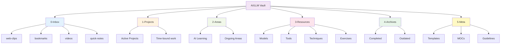

---
tags:
  - "#index"
  - "#navigation"
---

# AI & LLM Engineering Knowledge Vault

Welcome to your comprehensive AI and LLM engineering knowledge base. This vault combines PARA organization method with Zettelkasten principles for effective learning and knowledge management.

---

## Structure Overview

This knowledge base uses **PARA Method + Zettelkasten** principles:

- **[0-Inbox](0-Inbox/README.md)** - Quick capture landing zone (process weekly)
  - [web-clips/](0-Inbox/web-clips/) - Articles and documentation
  - [bookmarks/](0-Inbox/bookmarks/) - Links to process
  - [videos/](0-Inbox/videos/) - Videos and talks
  - [quick-notes/](0-Inbox/quick-notes/) - Fleeting ideas
- **[1-Projects](1-Projects/README.md)** - Active, time-bound work with deadlines
- **[2-Areas](2-Areas/README.md)** - Ongoing responsibilities and interests
  - [AI/LLM Learning](2-Areas/AI-Learning/AI-Learning.md) - Continuous skill development
- **[3-Resources](3-Resources/README.md)** - Reference material and knowledge repository
  - [Models](3-Resources/models/README.md), [Tools](3-Resources/tools/README.md), [Techniques](3-Resources/techniques/README.md), [Exercises](3-Resources/exercises/README.md)
  - [Workshops](3-Resources/workshops/), [LLM Engineering](3-Resources/llm-engineering/)
- **[4-Archives](4-Archives/README.md)** - Completed or inactive content
- **[5-Meta](5-Meta/README.md)** - Templates, MOCs (Maps of Content), and vault management
  - [Templates](5-Meta/Templates/README.md) - Note templates for consistency
  - [MOCs](5-Meta/MOCs/README.md) - Navigation hubs for topics
  - [Processing Workflow](5-Meta/Guidelines/Processing-Workflow.md) - Capture → Process → Link

---

## Quick Capture

**Add Content:**
- **Browser:** Use Obsidian Web Clipper extension → Save to [0-Inbox/](0-Inbox/)
- **Quick note:** Create from template → Save to [0-Inbox/quick-notes/](0-Inbox/quick-notes/)
- **Bookmark:** Use [bookmark template](5-Meta/Templates/bookmark-template.md) → Save to [0-Inbox/bookmarks/](0-Inbox/bookmarks/)
- **Video:** Use [video template](5-Meta/Templates/video-template.md) → Save to [0-Inbox/videos/](0-Inbox/videos/)

**Process Inbox:**
- **Weekly review:** Every Friday/Sunday (see [Processing Workflow](5-Meta/Guidelines/Processing-Workflow.md))
- **Goal:** Inbox empty or <10 items

---

## Quick Navigation

### 🎓 Workshops

Start here for structured learning paths:
- **Workshop Materials** - [Workshops](3-Resources/workshops/)
  - Workshop 1: LLM Basics (Previous workshop notes)
  - Workshop 2: [Coding Assistants Workshop](3-Resources/workshops/Coding%20Assistants%20Workshop%20-%20Plan.md)
  - Workshop 3: [Building Coding Agents Workshop](3-Resources/workshops/building-coding-agents-workshop.md) ⭐ NEW - Hands-on agent development

### 📚 Core Concepts

Fundamental knowledge organized by topic:
- **[LLM Engineering Overview](3-Resources/llm-engineering/LLM%20engineering.md)** - Models, tools, and techniques
- **[Models](3-Resources/llm-engineering/models.md)** - Understanding different LLM types
- **[Tools](3-Resources/llm-engineering/tools.md)** - Frameworks and platforms
- **[Techniques](3-Resources/llm-engineering/techniques.md)** - Prompting, RAG, agents

### 🤖 Models

AI model documentation and comparisons:

**Frontier Models** (Latest, cutting-edge)
- [Claude 4 Sonnet](3-Resources/models/frontier/Claude%204%20Sonnet.md) - Hybrid reasoning, 1M context, coding excellence
- [Claude 4 Opus](3-Resources/models/frontier/Claude%204%20Opus.md) - Maximum capability
- [GPT-o1](3-Resources/models/frontier/GPT-o1.md) & [GPT-o3](3-Resources/models/frontier/GPT-o3.md) - OpenAI reasoning models
- [DeepSeek-R1](3-Resources/models/frontier/DeepSeek-R1.md) - Open reasoning model

**Production Models** (Stable, reliable)
- [Claude 3.5 Sonnet](3-Resources/models/production/Claude%203.5%20Sonnet.md)
- [GPT-4o](3-Resources/models/production/GPT-4o.md)
- [Gemini Pro](3-Resources/models/production/Gemini%20Pro.md)

**Open Source Models**
- [Llama 3](3-Resources/models/open-source/Llama%203.md)
- [Mistral 7B](3-Resources/models/open-source/Mistral%207B.md)
- [Qwen3](3-Resources/models/open-source/Qwen3.md)
- [Code Llama](3-Resources/models/open-source/Code%20Llama.md)

**Deployment Tools**
- [Ollama](3-Resources/models/local%20deployment%20tools/Ollama.md)
- [LM Studio](3-Resources/models/local%20deployment%20tools/LM%20Studio.md)
- [Open WebUI](3-Resources/models/local%20deployment%20tools/Open%20WebUI.md)

### 🛠️ Tools & Frameworks

#### Coding Assistants
Full comparison: [Coding Assistants Overview](3-Resources/tools/coding-assistants/README.md)

**Agentic Systems:**
- [Claude Code](3-Resources/tools/coding-assistants/Claude%20Code.md) - Multi-step autonomous coding
- Devin - Full-stack AI developer
- [Amp](3-Resources/tools/coding-assistants/Amp.md) ⭐ NEW - Open source, transparent architecture (~400 lines)

**Copilot-Style:**
- GitHub Copilot - Line-level suggestions
- Amazon CodeWhisperer

**Hybrid:**
- Cursor - Autocomplete + agent mode
- Windsurf - Fast agentic coding
- Aider - Terminal-based AI pair programming

#### Agent Frameworks
- [LangChain](3-Resources/tools/frameworks/LangChain.md) - Comprehensive LLM framework
- LangGraph - Stateful multi-agent graphs
- AutoGen (Microsoft) - Multi-agent conversations
- CrewAI - Role-based agent teams
- [Fabric](3-Resources/tools/frameworks/Fabric.md) - CLI prompt management (300+ patterns)

#### Protocols & Standards
- [Model Context Protocol (MCP)](3-Resources/tools/protocols/MCP.md) - Standardized AI-tool integration

### 🎯 Techniques

Advanced AI engineering patterns:
- **[Techniques Overview](3-Resources/techniques/README.md)** - Complete guide to AI/LLM techniques
- **[Prompting](3-Resources/techniques/prompting/README.md)** - Effective prompt engineering techniques
  - [Prompting Basics](3-Resources/techniques/prompting/basics.md)
  - [System Prompts](3-Resources/techniques/prompting/system-prompts.md)
- **[Agents & Agentisation](3-Resources/techniques/agents/agents%20-%20agentisation.md)** - Autonomous AI systems overview
- **[Building Coding Agents](3-Resources/techniques/agents/building-coding-agents.md)** ⭐ NEW - Step-by-step guide to creating agents from scratch
- **[Context Engineering](3-Resources/techniques/context-engineering/context-engineering-coding-agents.md)** - Advanced context window management for coding agents
- **[RAG (Retrieval-Augmented Generation)](3-Resources/techniques/RAG/RAG.md)** - External knowledge integration

### 💻 Practical Exercises

Hands-on projects and implementations:

**Core LLM Engineering:**
1. [Basics](3-Resources/exercises/LLM%20Engineering%20-%20Basics.md) - Multi-provider integration, web summarization
2. [Gradio](3-Resources/exercises/LLM%20Engineering%20-%20Gradio.md) - Conversational AI interfaces
3. [Tools](3-Resources/exercises/LLM%20Engineering%20-%20Tools.md) - Multi-modal airline assistant
4. [Code Generation](3-Resources/exercises/LLM%20Engineering%20-%20Code%20Generation.md) - Python to C++ optimization

**Advanced Topics:**
5. [RAG](3-Resources/exercises/LLM%20Engineering%20-%20RAG.md) - Enterprise knowledge base system

**Agent Frameworks:**
6. [OpenAI SDK Agents](3-Resources/exercises/Agents%20-%20OpenAI%20SDK.md) - Multi-agent research system
7. [LangGraph](3-Resources/exercises/Agents%20-%20LangGraph.md) - State-based agent architecture

---

## Latest Updates (November 2025)

**Major Developments:**
- 🚀 Claude Opus 4.5 now available in GitHub Copilot
- 🏗️ GitHub AgentHQ platform announced
- 🔧 Claude Code 2.0 with checkpoints and subagents
- 🌐 OpenAI and Google DeepMind adopt Model Context Protocol
- ⚡ Cursor vs Windsurf competition heating up

---

## Maps of Content (MOCs)

High-level navigation hubs for exploring related topics:

- **[AI Models MOC](5-Meta/MOCs/AI-Models-MOC.md)** - Complete model landscape (frontier, production, open source)
- **[Coding Assistants MOC](5-Meta/MOCs/Coding-Assistants-MOC.md)** - Development tools and comparisons
- **[Prompting Techniques MOC](5-Meta/MOCs/Prompting-Techniques-MOC.md)** - Prompt engineering patterns
- **[Learning Path MOC](5-Meta/MOCs/Learning-Path-MOC.md)** - Structured learning progressions

See [MOCs folder](5-Meta/MOCs/README.md) for all maps of content.

---

## Vault Organization

This vault uses **PARA + Zettelkasten**:

**Workflow:** Capture (Inbox) → Process (Weekly) → Organize (Resources) → Link (Zettelkasten)

---

## Quick Reference

### Model Selection Guide

| Use Case | Recommended Model | Alternative |
|----------|------------------|-------------|
| **Coding (Complex)** | Claude 4 Sonnet | GPT-4o |
| **Reasoning** | GPT-o1 | DeepSeek-R1 |
| **Long Context** | Claude 4 Sonnet (1M) | Gemini Pro |
| **Cost-Effective** | Claude 3.5 Sonnet | Mistral 7B |
| **Local/Private** | Llama 3 + Ollama | Code Llama |

### Coding Assistant Selection

| Task Type | Recommended Tool | Why |
|-----------|-----------------|-----|
| **Autocomplete** | GitHub Copilot | Fast, non-intrusive |
| **Feature Development** | Claude Code | Multi-file, autonomous |
| **Quick Refactoring** | Cursor | Hybrid approach |
| **Learning Agents** | Amp | Transparent architecture |
| **Terminal-based** | Aider, Amp | Git-aware, CLI workflow |
| **Interactive Chat** | ChatGPT/Claude | Interactive explanations |

### Agent Framework Selection

| Scenario | Framework | Reason |
|----------|-----------|--------|
| **Complex State** | LangGraph | Graph-based control |
| **Conversations** | AutoGen | Multi-agent dialogue |
| **Role-Based Teams** | CrewAI | Collaborative agents |
| **General Purpose** | LangChain | Comprehensive toolkit |

---

## Getting Started

### New to AI/LLMs?
1. Start with [LLM Engineering Overview](3-Resources/llm-engineering/LLM%20engineering.md)
2. Follow [Learning Path MOC](5-Meta/MOCs/Learning-Path-MOC.md)
3. Complete [Basics Exercise](3-Resources/exercises/LLM%20Engineering%20-%20Basics.md)
4. Explore [production models](3-Resources/models/production/Claude%203.5%20Sonnet.md)

### New to This Vault?
1. Read this README and [Meta folder overview](5-Meta/README.md)
2. Set up [Inbox](0-Inbox/README.md) for capturing content
3. Review [Processing Workflow](5-Meta/Guidelines/Processing-Workflow.md)
4. Install Obsidian Web Clipper for easy content capture

### Preparing for Workshop?
1. Review [Workshop Plan](3-Resources/workshops/Coding%20Assistants%20Workshop%20-%20Plan.md)
2. Install Claude Code or chosen tool
3. Complete setup exercises
4. Create a [project note](1-Projects/README.md) to track your progress

### Building AI Applications?
1. Review [RAG](3-Resources/techniques/RAG/RAG.md) or [Agents](3-Resources/techniques/agents/agents%20-%20agentisation.md)
2. Explore [RAG Exercise](3-Resources/exercises/LLM%20Engineering%20-%20RAG.md)
3. Try [LangGraph Exercise](3-Resources/exercises/Agents%20-%20LangGraph.md)
4. Use [project template](5-Meta/Templates/project-template.md) to organize your work

### Want to Build Your Own Agent?
1. Read [Building Coding Agents](3-Resources/techniques/agents/building-coding-agents.md)
2. Complete [Building Agents Workshop](3-Resources/workshops/building-coding-agents-workshop.md)
3. Study [Amp](3-Resources/tools/coding-assistants/Amp.md) architecture

---

## Resources

**Vault Documentation:**
- [Meta Folder](5-Meta/README.md) - Templates, MOCs, guidelines
- [Content Guidelines](5-Meta/Guidelines/Knowledge-Base-Guidelines.md) - Quality standards
- [Processing Workflow](5-Meta/Guidelines/Processing-Workflow.md) - How to maintain the vault
- [CLAUDE.md](CLAUDE.md) - Instructions for AI assistants

**Official Documentation:**
- [Anthropic Claude Docs](https://docs.anthropic.com)
- [OpenAI API Docs](https://platform.openai.com/docs)
- [Model Context Protocol](https://modelcontextprotocol.io)
- [LangChain Docs](https://python.langchain.com)

**Community:**
- Claude Code Discord
- LangChain Community
- AI Engineering Subreddit

---

## Maintenance

**Last Updated:** 2025-12-23
**Next Review:** 2026-01-23

**Changelog:**
- 2025-12-23: **MAJOR UPDATE** - Implemented PARA + Zettelkasten structure
  - Added 0-Inbox for quick capture
  - Added 1-Projects and 2-Areas folders
  - Added 5-Meta with Templates, MOCs, and Guidelines
  - Created Processing Workflow documentation
  - Created 6 note templates for consistency
  - Created comprehensive README files for all folders
  - Updated vault organization and navigation
- 2025-12-01: Added Building Coding Agents workshop, Amp tool profile, comprehensive agent tutorials
- 2025-11-30: Vault restructured, coding assistants workshop added
- Previous: LLM basics workshop materials

---

*This vault combines PARA organization with Zettelkasten linking for effective knowledge management and continuous learning in AI/LLM engineering.*
