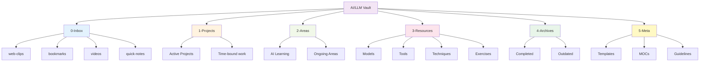

---
tags:
  - "#index"
  - "#navigation"
---

# AI & LLM Engineering Knowledge Vault

Welcome to your comprehensive AI and LLM engineering knowledge base. This vault combines PARA organization method with Zettelkasten principles for effective learning and knowledge management.

---

## Structure Overview

This knowledge base uses **PARA Method + Zettelkasten** principles:

- **[[0-Inbox/README|0-Inbox]]** - Quick capture landing zone (process weekly)
  - [[0-Inbox/web-clips/|web-clips/]] - Articles and documentation
  - [[0-Inbox/bookmarks/|bookmarks/]] - Links to process
  - [[0-Inbox/videos/|videos/]] - Videos and talks
  - [[0-Inbox/quick-notes/|quick-notes/]] - Fleeting ideas
- **[[1-Projects/README|1-Projects]]** - Active, time-bound work with deadlines
- **[[2-Areas/README|2-Areas]]** - Ongoing responsibilities and interests
  - [[2-Areas/AI-Learning/AI-Learning|AI/LLM Learning]] - Continuous skill development
- **[[3-Resources/README|3-Resources]]** - Reference material and knowledge repository
  - [[3-Resources/models/README|Models]], [[3-Resources/tools/README|Tools]], [[3-Resources/techniques/README|Techniques]], [[3-Resources/exercises/README|Exercises]]
  - [[3-Resources/workshops/|Workshops]], [[3-Resources/llm-engineering/|LLM Engineering]]
- **[[4-Archives/README|4-Archives]]** - Completed or inactive content
- **[[5-Meta/README|5-Meta]]** - Templates, MOCs (Maps of Content), and vault management
  - [[5-Meta/Templates/README|Templates]] - Note templates for consistency
  - [[5-Meta/MOCs/README|MOCs]] - Navigation hubs for topics
  - [[5-Meta/Guidelines/Processing-Workflow|Processing Workflow]] - Capture → Process → Link

---

## Quick Capture

**Add Content:**
- **Browser:** Use Obsidian Web Clipper extension → Save to [[0-Inbox/]]
- **Quick note:** Create from template → Save to [[0-Inbox/quick-notes/]]
- **Bookmark:** Use [[5-Meta/Templates/bookmark-template|bookmark template]] → Save to [[0-Inbox/bookmarks/]]
- **Video:** Use [[5-Meta/Templates/video-template|video template]] → Save to [[0-Inbox/videos/]]

**Process Inbox:**
- **Weekly review:** Every Friday/Sunday (see [[5-Meta/Guidelines/Processing-Workflow|Processing Workflow]])
- **Goal:** Inbox empty or <10 items

---

## Quick Navigation

### 🎓 Workshops

Start here for structured learning paths:
- **Workshop Materials** - [[3-Resources/workshops/|Workshops]]
  - Workshop 1: LLM Basics (Previous workshop notes)
  - Workshop 2: [[3-Resources/workshops/Coding Assistants Workshop - Plan|Coding Assistants Workshop]]
  - Workshop 3: [[3-Resources/workshops/building-coding-agents-workshop|Building Coding Agents Workshop]] ⭐ NEW - Hands-on agent development

### 📚 Core Concepts

Fundamental knowledge organized by topic:
- **[[3-Resources/llm-engineering/LLM engineering|LLM Engineering Overview]]** - Models, tools, and techniques
- **[[3-Resources/llm-engineering/models|Models]]** - Understanding different LLM types
- **[[3-Resources/llm-engineering/tools|Tools]]** - Frameworks and platforms
- **[[3-Resources/llm-engineering/techniques|Techniques]]** - Prompting, RAG, agents

### 🤖 Models

AI model documentation and comparisons:

**Frontier Models** (Latest, cutting-edge)
- [[3-Resources/models/frontier/Claude 4 Sonnet|Claude 4 Sonnet]] - Hybrid reasoning, 1M context, coding excellence
- [[3-Resources/models/frontier/Claude 4 Opus|Claude 4 Opus]] - Maximum capability
- [[3-Resources/models/frontier/GPT-o1|GPT-o1]] & [[3-Resources/models/frontier/GPT-o3|GPT-o3]] - OpenAI reasoning models
- [[3-Resources/models/frontier/DeepSeek-R1|DeepSeek-R1]] - Open reasoning model

**Production Models** (Stable, reliable)
- [[3-Resources/models/production/Claude 3.5 Sonnet|Claude 3.5 Sonnet]]
- [[3-Resources/models/production/GPT-4o|GPT-4o]]
- [[3-Resources/models/production/Gemini Pro|Gemini Pro]]

**Open Source Models**
- [[3-Resources/models/open-source/Llama 3|Llama 3]]
- [[3-Resources/models/open-source/Mistral 7B|Mistral 7B]]
- [[3-Resources/models/open-source/Qwen3|Qwen3]]
- [[3-Resources/models/open-source/Code Llama|Code Llama]]

**Deployment Tools**
- [[3-Resources/models/local deployment tools/Ollama|Ollama]]
- [[3-Resources/models/local deployment tools/LM Studio|LM Studio]]
- [[3-Resources/models/local deployment tools/Open WebUI|Open WebUI]]

### 🛠️ Tools & Frameworks

#### Coding Assistants
Full comparison: [[3-Resources/tools/coding-assistants/README|Coding Assistants Overview]]

**Agentic Systems:**
- [[3-Resources/tools/coding-assistants/Claude Code|Claude Code]] - Multi-step autonomous coding
- Devin - Full-stack AI developer
- [[3-Resources/tools/coding-assistants/Amp|Amp]] ⭐ NEW - Open source, transparent architecture (~400 lines)

**Copilot-Style:**
- GitHub Copilot - Line-level suggestions
- Amazon CodeWhisperer

**Hybrid:**
- Cursor - Autocomplete + agent mode
- Windsurf - Fast agentic coding
- [[3-Resources/tools/coding-assistants/Aider|Aider]] - Terminal-based AI pair programming

#### Agent Frameworks
- [[3-Resources/tools/frameworks/LangChain|LangChain]] - Comprehensive LLM framework
- LangGraph - Stateful multi-agent graphs
- AutoGen (Microsoft) - Multi-agent conversations
- CrewAI - Role-based agent teams
- [[3-Resources/tools/frameworks/Fabric|Fabric]] - CLI prompt management (300+ patterns)

#### Protocols & Standards
- [[3-Resources/tools/protocols/MCP|Model Context Protocol (MCP)]] - Standardized AI-tool integration

### 🎯 Techniques

Advanced AI engineering patterns:
- **[[3-Resources/techniques/README|Techniques Overview]]** - Complete guide to AI/LLM techniques
- **[[3-Resources/techniques/prompting/README|Prompting]]** - Effective prompt engineering techniques
  - [[3-Resources/techniques/prompting/basics|Prompting Basics]]
  - [[3-Resources/techniques/prompting/system-prompts|System Prompts]]
- **[[3-Resources/techniques/agents/agents - agentisation|Agents & Agentisation]]** - Autonomous AI systems overview
- **[[3-Resources/techniques/agents/building-coding-agents|Building Coding Agents]]** ⭐ NEW - Step-by-step guide to creating agents from scratch
- **[[3-Resources/techniques/context-engineering/context-engineering-coding-agents|Context Engineering]]** - Advanced context window management for coding agents
- **[[3-Resources/techniques/RAG/RAG|RAG (Retrieval-Augmented Generation)]]** - External knowledge integration

### 💻 Practical Exercises

Hands-on projects and implementations:

**Core LLM Engineering:**
1. [[3-Resources/exercises/LLM Engineering - Basics|Basics]] - Multi-provider integration, web summarization
2. [[3-Resources/exercises/LLM Engineering - Gradio|Gradio]] - Conversational AI interfaces
3. [[3-Resources/exercises/LLM Engineering - Tools|Tools]] - Multi-modal airline assistant
4. [[3-Resources/exercises/LLM Engineering - Code Generation|Code Generation]] - Python to C++ optimization

**Advanced Topics:**
5. [[3-Resources/exercises/LLM Engineering - RAG|RAG]] - Enterprise knowledge base system

**Agent Frameworks:**
6. [[3-Resources/exercises/Agents - OpenAI SDK|OpenAI SDK Agents]] - Multi-agent research system
7. [[3-Resources/exercises/Agents - LangGraph|LangGraph]] - State-based agent architecture

---

## Latest Updates (November 2025)

**Major Developments:**
- 🚀 Claude Opus 4.5 now available in GitHub Copilot
- 🏗️ GitHub AgentHQ platform announced
- 🔧 Claude Code 2.0 with checkpoints and subagents
- 🌐 OpenAI and Google DeepMind adopt Model Context Protocol
- ⚡ Cursor vs Windsurf competition heating up

See [[3-Resources/resources/news/2025-11-updates|November 2025 News]] for details.

---

## Maps of Content (MOCs)

High-level navigation hubs for exploring related topics:

- **[[5-Meta/MOCs/AI-Models-MOC|AI Models MOC]]** - Complete model landscape (frontier, production, open source)
- **[[5-Meta/MOCs/Coding-Assistants-MOC|Coding Assistants MOC]]** - Development tools and comparisons
- **[[5-Meta/MOCs/Prompting-Techniques-MOC|Prompting Techniques MOC]]** - Prompt engineering patterns
- **[[5-Meta/MOCs/Learning-Path-MOC|Learning Path MOC]]** - Structured learning progressions

See [[5-Meta/MOCs/README|MOCs folder]] for all maps of content.

---

## Vault Organization

This vault uses **PARA + Zettelkasten**:

**Workflow:** Capture (Inbox) → Process (Weekly) → Organize (Resources) → Link (Zettelkasten)

---

## Quick Reference

### Model Selection Guide

| Use Case | Recommended Model | Alternative |
|----------|------------------|-------------|
| **Coding (Complex)** | Claude 4 Sonnet | GPT-4o |
| **Reasoning** | GPT-o1 | DeepSeek-R1 |
| **Long Context** | Claude 4 Sonnet (1M) | Gemini Pro |
| **Cost-Effective** | Claude 3.5 Sonnet | Mistral 7B |
| **Local/Private** | Llama 3 + Ollama | Code Llama |

### Coding Assistant Selection

| Task Type | Recommended Tool | Why |
|-----------|-----------------|-----|
| **Autocomplete** | GitHub Copilot | Fast, non-intrusive |
| **Feature Development** | Claude Code | Multi-file, autonomous |
| **Quick Refactoring** | Cursor | Hybrid approach |
| **Learning Agents** | Amp | Transparent architecture |
| **Terminal-based** | Aider, Amp | Git-aware, CLI workflow |
| **Interactive Chat** | ChatGPT/Claude | Interactive explanations |

### Agent Framework Selection

| Scenario | Framework | Reason |
|----------|-----------|--------|
| **Complex State** | LangGraph | Graph-based control |
| **Conversations** | AutoGen | Multi-agent dialogue |
| **Role-Based Teams** | CrewAI | Collaborative agents |
| **General Purpose** | LangChain | Comprehensive toolkit |

---

## Getting Started

### New to AI/LLMs?
1. Start with [[3-Resources/llm-engineering/LLM engineering|LLM Engineering Overview]]
2. Follow [[5-Meta/MOCs/Learning-Path-MOC|Learning Path MOC]]
3. Complete [[3-Resources/exercises/LLM Engineering - Basics|Basics Exercise]]
4. Explore [[3-Resources/models/production/Claude 3.5 Sonnet|production models]]

### New to This Vault?
1. Read this README and [[5-Meta/README|Meta folder overview]]
2. Set up [[0-Inbox/README|Inbox]] for capturing content
3. Review [[5-Meta/Guidelines/Processing-Workflow|Processing Workflow]]
4. Install Obsidian Web Clipper for easy content capture

### Preparing for Workshop?
1. Review [[3-Resources/workshops/Coding Assistants Workshop - Plan|Workshop Plan]]
2. Install Claude Code or chosen tool
3. Complete setup exercises
4. Create a [[1-Projects/README|project note]] to track your progress

### Building AI Applications?
1. Review [[3-Resources/techniques/RAG/RAG|RAG]] or [[3-Resources/techniques/agents/agents - agentisation|Agents]]
2. Explore [[3-Resources/exercises/LLM Engineering - RAG|RAG Exercise]]
3. Try [[3-Resources/exercises/Agents - LangGraph|LangGraph Exercise]]
4. Use [[5-Meta/Templates/project-template|project template]] to organize your work

### Want to Build Your Own Agent?
1. Read [[3-Resources/techniques/agents/building-coding-agents|Building Coding Agents]]
2. Complete [[3-Resources/workshops/building-coding-agents-workshop|Building Agents Workshop]]
3. Study [[3-Resources/tools/coding-assistants/Amp|Amp]] architecture

---

## Resources

**Vault Documentation:**
- [[5-Meta/README|Meta Folder]] - Templates, MOCs, guidelines
- [[5-Meta/Guidelines/Knowledge-Base-Guidelines|Content Guidelines]] - Quality standards
- [[5-Meta/Guidelines/Processing-Workflow|Processing Workflow]] - How to maintain the vault
- [[CLAUDE|CLAUDE.md]] - Instructions for AI assistants

**Official Documentation:**
- [Anthropic Claude Docs](https://docs.anthropic.com)
- [OpenAI API Docs](https://platform.openai.com/docs)
- [Model Context Protocol](https://modelcontextprotocol.io)
- [LangChain Docs](https://python.langchain.com)

**Community:**
- Claude Code Discord
- LangChain Community
- AI Engineering Subreddit

---

## Maintenance

**Last Updated:** 2025-12-23
**Next Review:** 2026-01-23

**Changelog:**
- 2025-12-23: **MAJOR UPDATE** - Implemented PARA + Zettelkasten structure
  - Added 0-Inbox for quick capture
  - Added 1-Projects and 2-Areas folders
  - Added 5-Meta with Templates, MOCs, and Guidelines
  - Created Processing Workflow documentation
  - Created 6 note templates for consistency
  - Created comprehensive README files for all folders
  - Updated vault organization and navigation
- 2025-12-01: Added Building Coding Agents workshop, Amp tool profile, comprehensive agent tutorials
- 2025-11-30: Vault restructured, coding assistants workshop added
- Previous: LLM basics workshop materials

---

*This vault combines PARA organization with Zettelkasten linking for effective knowledge management and continuous learning in AI/LLM engineering.*
